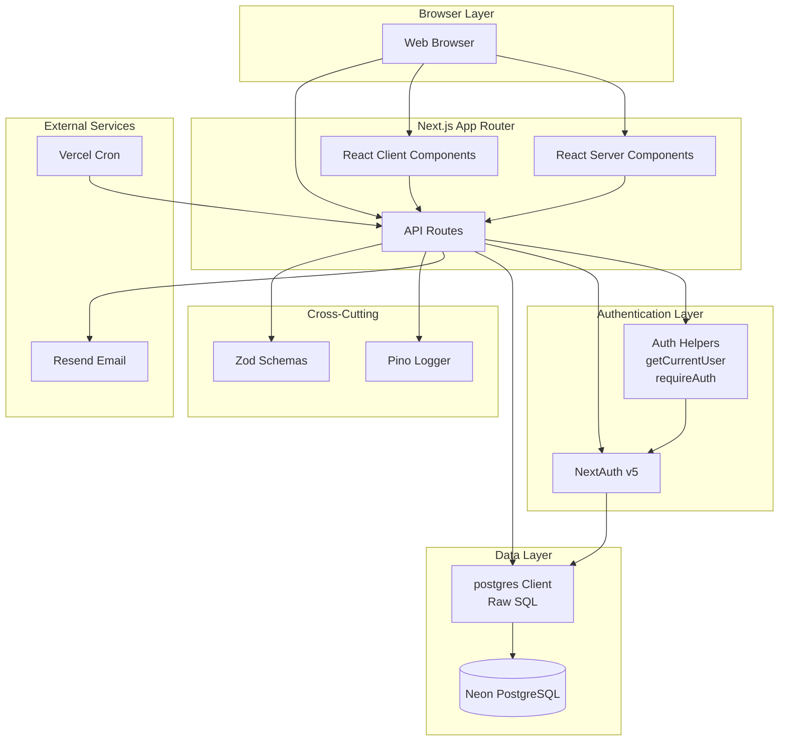
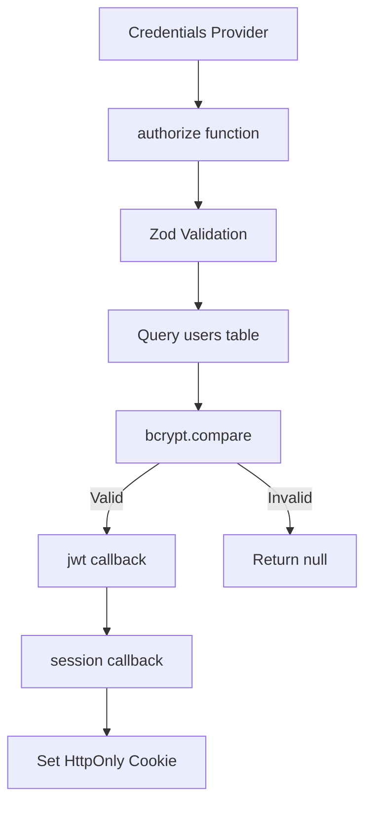
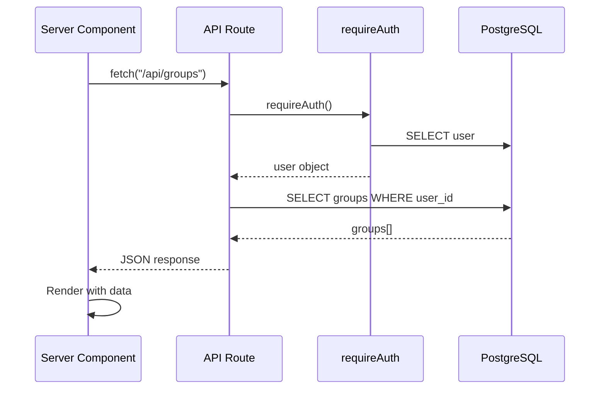
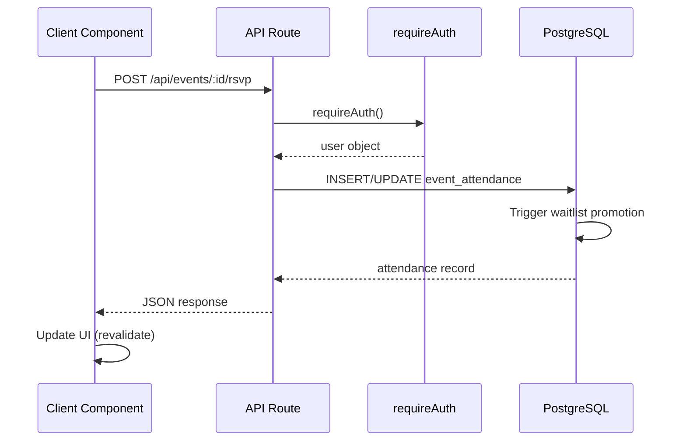
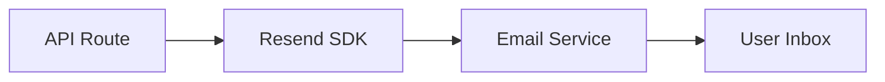
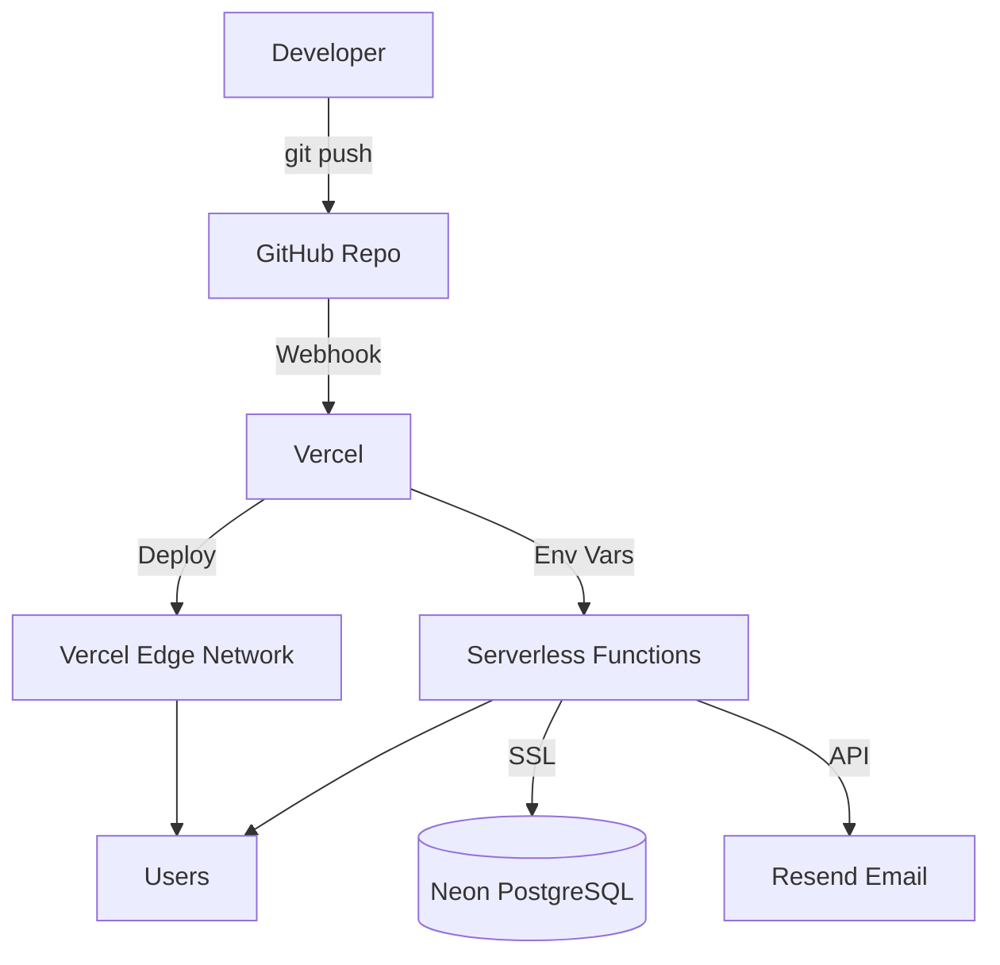

# 04_ARCHITECTURE_FROM_CODE.md
**Checkpoint Date**: 2026-03-15 (UTC-3)
**Commit**: dad0911079482b15ff5c43e9ef73a44b4c752699
**Branch**: main

---

## Architecture Overview

Convoca segue a arquitetura **App Router do Next.js 16** com **Server Components por padrão** e **Client Components quando necessário**.



---

## Layered Architecture

### Presentation Layer

**Pages (UI)**:
- `src/app/page.tsx` - Landing
- `src/app/dashboard/page.tsx` - Dashboard
- `src/app/groups/[groupId]/page.tsx` - Group detail
- `src/app/groups/[groupId]/events/[eventId]/page.tsx` - Event detail
- etc.

**Components**:
- `src/components/ui/` - shadcn/ui primitives
- `src/components/dashboard/` - Dashboard-specific components
- `src/components/events/` - Event management components
- `src/components/groups/` - Group management components
- `src/components/payments/` - Payment components
- `src/components/layout/` - Layout components

**State Management**: Zustand (client-side)

---

### API Layer

**API Routes**:
- `src/app/api/auth/` - Authentication endpoints
- `src/app/api/groups/` - Group CRUD + nested resources
- `src/app/api/events/` - Event CRUD + nested resources
- `src/app/api/cron/` - Scheduled jobs
- `src/app/api/users/` - User utilities

**Standard Pattern**:

```typescript
export async function METHOD(request: NextRequest) {
  try {
    // 1. Authentication
    const user = await requireAuth();

    // 2. Validation (Zod)
    const validation = schema.safeParse(body);
    if (!validation.success) {
      return NextResponse.json({ error, details }, { status: 400 });
    }

    // 3. Authorization
    // Check permissions (admin, member, ownership)

    // 4. Business Logic
    const result = await sql`...`;

    // 5. Logging
    logger.info({ ... }, "Operation completed");

    // 6. Response
    return NextResponse.json({ data: result });
  } catch (error) {
    // Error handling
    if (error.message === "Não autenticado") {
      return NextResponse.json({ error }, { status: 401 });
    }
    logger.error(error, "Error message");
    return NextResponse.json({ error }, { status: 500 });
  }
}
```

---

### Authentication Layer

**NextAuth v5 Configuration**:

**Evidência**: `src/lib/auth.ts`



**Auth Helpers**:

- `getCurrentUser()`: Returns user or null
- `requireAuth()`: Returns user or throws "Não autenticado"

**Session Strategy**: JWT (30 days expiry)

---

### Data Access Layer

**Database Client**: `postgres@3.4.8` (serverless-compatible)

**Evidência**: `src/db/client.ts`

```typescript
import postgres from "postgres";

export const sql = postgres(process.env.DATABASE_URL, {
  ssl: "require",
  prepare: false, // Required for Neon PgBouncer
});
```

**Pattern**: Raw SQL queries via tagged template literals.

**Example**:

```typescript
const users = await sql`
  SELECT * FROM users WHERE email = ${email}
`;
```

**✅ SQL Injection Protection**: Template literals automatically escape parameters.

---

### Validation Layer

**Zod Schemas**: `src/lib/validations.ts`

**Schemas**:
- `createGroupSchema`
- `createEventSchema`
- `createRecurrenceSchema`
- `rsvpSchema`
- `eventActionSchema`
- `playerRatingSchema`

**Usage**:

```typescript
const validation = createGroupSchema.safeParse(body);
if (!validation.success) {
  return NextResponse.json({
    error: "Dados inválidos",
    details: validation.error.flatten()
  }, { status: 400 });
}
```

---

### Logging Layer

**Pino Logger**: `src/lib/logger.ts`

**Development**: Console logging with prefixes
**Production**: Structured JSON logging

**Usage**:

```typescript
import logger from "@/lib/logger";

logger.info({ userId, action }, "User action");
logger.error({ error, context }, "Error occurred");
```

---

## Data Flow Patterns

### Server Component → API → Database



### Client Component → API → Database



---

## Component Architecture

### Server Components (Default)

**Files WITHOUT** `'use client'`:

- All `page.tsx` that only fetch data
- Layouts that only wrap children
- Static components

**Benefits**:
- Zero JS to client
- Direct database access
- SEO-friendly

### Client Components

**Files WITH** `'use client'`:

**Evidência**: Found in components requiring:
- React hooks (useState, useEffect)
- Browser APIs (localStorage, window)
- Event handlers (onClick, onChange)
- Third-party client libraries

**Examples**:
- `src/components/events/event-rsvp-form.tsx`
- `src/components/groups/create-group-form.tsx`
- `src/components/dashboard/groups-card.tsx`

**Pattern**: Client components call API routes, not database directly.

---

## Database Architecture

### Schema Design

**Normalization**: 3NF (Third Normal Form)

**Key Patterns**:

1. **UUID Primary Keys**: All tables use `uuid_generate_v4()`
2. **Soft References**: Some FKs with `ON DELETE SET NULL`
3. **Hard Deletes**: Most FKs with `ON DELETE CASCADE`
4. **Timestamps**: `created_at`, `updated_at` on mutable tables
5. **Check Constraints**: Enum-like fields (status, role, privacy)
6. **Unique Constraints**: Prevent duplicates (user+group, event+user)

### Performance Optimizations

**Indexes** (14 total):

- Covering user/group relationships
- Event filtering (status, starts_at)
- Attendance lookups
- Actions by event/type
- Ratings by event/user
- Charges by user/status/date

**Materialized View**: `mv_event_scoreboard`

- Pre-aggregates goals/assists per team
- Refreshed automatically via trigger
- UNIQUE index for CONCURRENT refresh

**Trigger**: `trigger_refresh_scoreboard`

- Fires on INSERT/UPDATE/DELETE on `event_actions`
- Refreshes materialized view concurrently

---

## Authentication & Authorization Architecture

### Authentication (AuthN)

**Who are you?**

- Handled by NextAuth v5
- Credentials provider (email/password)
- JWT-based sessions
- bcrypt password hashing (10 rounds)

### Authorization (AuthZ)

**What can you do?**

**Roles**: `admin` vs `member` (in `group_members.role`)

**Permission Checks**:

1. **Route-level**: `requireAuth()` in API routes
2. **Resource-level**: Ownership checks in code
3. **Role-level**: Admin checks for sensitive operations

**Example Authorization Pattern**:

```typescript
// 1. Authenticate
const user = await requireAuth();

// 2. Check membership
const [membership] = await sql`
  SELECT * FROM group_members
  WHERE group_id = ${groupId} AND user_id = ${user.id}
`;

if (!membership) {
  return NextResponse.json({ error: "Forbidden" }, { status: 403 });
}

// 3. Check role for admin operations
if (membership.role !== 'admin') {
  return NextResponse.json({ error: "Admin only" }, { status: 403 });
}
```

**❌ No Centralized Middleware**: Permission checks are inline in API routes.

---

## External Integrations Architecture

### Email Service (Resend)

**Purpose**: Password reset emails

**Flow**:



**Configuration**: `RESEND_API_KEY` environment variable

### Vercel Cron Jobs

**Jobs**:
1. Generate monthly charges (monthly)
2. Generate recurring events (daily)

**Flow**:

```mermaid
flowchart LR
    Vercel[Vercel Cron] -->|POST| CronAPI[/api/cron/*]
    CronAPI --> DB[(Database)]
```

**⚠️ Security**: Verify if cron endpoints validate Vercel Cron secret.

---

## Architectural Decisions (ADRs - Inferred)

### 1. Raw SQL vs ORM

**Decision**: Use raw SQL via `postgres` package.

**Rationale**:
- Maximum performance
- Full control over queries
- No ORM abstraction overhead
- Serverless-friendly

**Trade-offs**:
- No automatic type safety from schema
- More boilerplate
- Manual migration management

---

### 2. JWT Sessions vs Database Sessions

**Decision**: JWT-based sessions.

**Rationale**:
- Stateless (serverless-friendly)
- No database lookup on each request
- Scalable

**Trade-offs**:
- Cannot revoke sessions easily
- Token size (sent on every request)
- No session listing/management

---

### 3. Server Components First

**Decision**: Default to Server Components, use Client Components only when needed.

**Rationale**:
- Better performance (less JS to client)
- Better SEO
- Direct data fetching
- Next.js 13+ recommendation

**Trade-offs**:
- Need to think about component boundaries
- Some patterns less familiar

---

### 4. Materialized View for Scoreboard

**Decision**: Use materialized view with auto-refresh trigger.

**Rationale**:
- Fast reads (pre-aggregated)
- Consistent scoreboard
- Offload computation from API layer

**Trade-offs**:
- Write overhead (trigger on every action)
- Eventual consistency (brief delay)
- More complex schema

---

### 5. UUID Primary Keys

**Decision**: Use UUIDs for all primary keys.

**Rationale**:
- Distributed-friendly (no collisions)
- No sequential enumeration
- Harder to guess IDs (mild security benefit)

**Trade-offs**:
- Larger storage (16 bytes vs 4/8)
- Slower joins (compared to integers)
- Less human-readable

---

## Scalability Considerations

### Current Architecture Supports

✅ **Horizontal Scaling**: Stateless API (JWT sessions)
✅ **Database Scaling**: Neon serverless auto-scales
✅ **CDN**: Static assets via Vercel Edge Network
✅ **Serverless Functions**: All API routes are serverless-ready

### Potential Bottlenecks

⚠️ **Materialized View Refresh**: Could slow down with high write volume
⚠️ **No Caching Layer**: Every request hits database
⚠️ **No Pagination**: Large lists could timeout
⚠️ **Waitlist Promotion Logic**: Potential race conditions

### Future Improvements for Scale

1. **Add Redis**: Cache frequently accessed data (rankings, stats)
2. **Pagination**: Cursor-based or offset pagination
3. **Read Replicas**: Separate read/write workloads
4. **Background Jobs**: Move heavy computations to queues
5. **CDN for API**: Edge functions for cacheable API responses

---

## Security Architecture

### Defense in Depth Layers

| Layer | Mechanism | Status |
|-------|-----------|--------|
| **Network** | HTTPS (Vercel) | ✅ |
| **Transport** | SSL to database | ✅ |
| **Authentication** | NextAuth + bcrypt | ✅ |
| **Session** | HttpOnly cookies | ✅ |
| **Input Validation** | Zod schemas | ✅ |
| **SQL Injection** | Parameterized queries | ✅ |
| **Rate Limiting** | - | ❌ |
| **CSRF** | NextAuth built-in | ✅ |
| **XSS** | React escaping | ✅ (partial) |
| **Authorization** | Code-level checks | ⚠️ (not centralized) |

---

## Error Handling Architecture

### Layers

1. **Client-Side**: React error boundaries (implicit)
2. **API Routes**: try/catch with typed error handling
3. **Database**: postgres client error handling
4. **Logging**: Pino structured logging

### Standard Error Response

```typescript
{
  "error": "User-friendly message in Portuguese",
  "details": { /* Zod validation errors */ }
}
```

### HTTP Status Codes Used

- `200` - Success
- `201` - Created
- `400` - Bad Request (validation)
- `401` - Unauthorized (not authenticated)
- `403` - Forbidden (not authorized)
- `404` - Not Found
- `409` - Conflict (duplicate)
- `500` - Internal Server Error

---

## Configuration Architecture

### Environment-Based Config

**Development**: `.env.local`
**Production**: Vercel environment variables

### Config Files

| File | Purpose |
|------|---------|
| `next.config.ts` | Next.js configuration |
| `tsconfig.json` | TypeScript compiler options |
| `tailwind.config.ts` | Tailwind CSS configuration |
| `components.json` | shadcn/ui configuration |
| `package.json` | Dependencies and scripts |

### Feature Flags

❌ **Not Implemented**: No feature flag system.

🔍 **Recommendation**: Consider adding feature flags for gradual rollouts.

---

## Deployment Architecture



**Flow**:
1. Developer pushes to `main` branch
2. GitHub webhook triggers Vercel
3. Vercel builds Next.js app
4. Static assets deployed to Edge Network
5. API routes deployed as serverless functions
6. Environment variables injected
7. Functions connect to Neon database

---

## Observability Architecture

### Logging

**Development**: Console logs
**Production**: Structured JSON (Pino)

**⚠️ Gap**: No centralized log aggregation (Datadog, Logtail, etc.)

### Monitoring

**Vercel Analytics**: Available but status unknown
**Error Tracking**: ❌ Not implemented (recommend Sentry)
**Performance Monitoring**: ❌ Not implemented

### Metrics

**Database**: Neon Console provides query metrics
**Application**: ❌ No custom metrics (APM)

---

## Conclusion

**Architecture Strengths**:
- Modern, scalable stack
- Clean separation of concerns
- Type-safe with TypeScript + Zod
- Serverless-ready
- Well-structured database

**Architecture Weaknesses**:
- No centralized authorization
- No middleware for route protection
- No rate limiting
- No caching layer
- No comprehensive error tracking

**Recommended Next Steps**:
1. Add `middleware.ts` for centralized auth/authz
2. Implement rate limiting
3. Add Sentry for error tracking
4. Consider Redis for caching
5. Implement feature flags system
