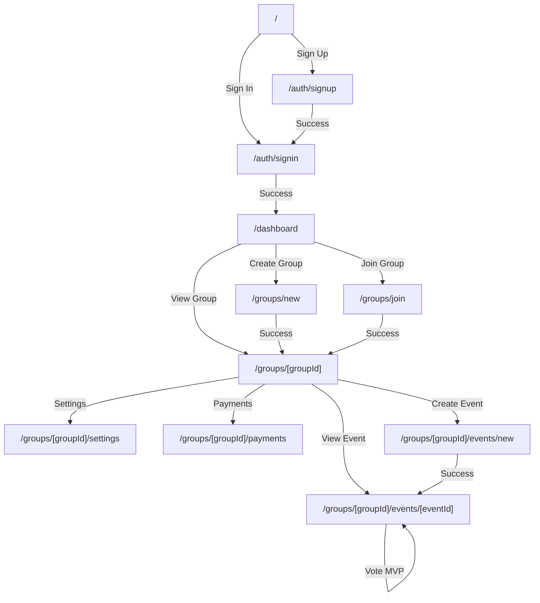

# 05_ROUTES_MAP.md
**Checkpoint Date**: 2026-03-15 (UTC-3)
**Commit**: dad0911079482b15ff5c43e9ef73a44b4c752699
**Branch**: main

---

## Pages (UI Routes)

### Authentication Pages

| Route | File | Auth Required | Purpose |
|-------|------|---------------|---------|
| `/auth/signin` | `src/app/auth/signin/page.tsx` | ❌ Public | Login page |
| `/auth/signup` | `src/app/auth/signup/page.tsx` | ❌ Public | Registration page |
| `/auth/forgot-password` | `src/app/auth/forgot-password/page.tsx` | ❌ Public | Password reset request |
| `/auth/reset-password` | `src/app/auth/reset-password/page.tsx` | ❌ Public | Password reset confirmation |
| `/auth/error` | `src/app/auth/error/page.tsx` | ❌ Public | Auth error page |

### Main Pages

| Route | File | Auth Required | Purpose |
|-------|------|---------------|---------|
| `/` | `src/app/page.tsx` | ❌ Public | Landing page |
| `/simple-test` | `src/app/simple-test/page.tsx` | ❌ Public | Test page |
| `/dashboard` | `src/app/dashboard/page.tsx` | ✅ Protected | User dashboard |

### Group Pages

| Route | File | Auth Required | Purpose |
|-------|------|---------------|---------|
| `/groups/new` | `src/app/groups/new/page.tsx` | ✅ Protected | Create new group |
| `/groups/join` | `src/app/groups/join/page.tsx` | ✅ Protected | Join group with code |
| `/groups/[groupId]` | `src/app/groups/[groupId]/page.tsx` | ✅ Protected | Group detail page |
| `/groups/[groupId]/settings` | `src/app/groups/[groupId]/settings/page.tsx` | ✅ Protected (Admin) | Group settings |
| `/groups/[groupId]/payments` | `src/app/groups/[groupId]/payments/page.tsx` | ✅ Protected | Group payments/finances |
| `/groups/[groupId]/events/new` | `src/app/groups/[groupId]/events/new/page.tsx` | ✅ Protected (Admin) | Create event |
| `/groups/[groupId]/events/[eventId]` | `src/app/groups/[groupId]/events/[eventId]/page.tsx` | ✅ Protected | Event detail page |

### Event Pages

| Route | File | Auth Required | Purpose |
|-------|------|---------------|---------|
| `/events/[eventId]` | `src/app/events/[eventId]/page.tsx` | ✅ Protected | Event detail (standalone) |

---

## API Routes

### Authentication

| Method | Route | Auth | Purpose | Evidência |
|--------|-------|------|---------|-----------|
| POST | `/api/auth/signup` | ❌ | User registration | `src/app/api/auth/signup/route.ts` |
| * | `/api/auth/[...nextauth]` | - | NextAuth handler | `src/app/api/auth/[...nextauth]/route.ts` |
| POST | `/api/auth/forgot-password` | ❌ | Request password reset | `src/app/api/auth/forgot-password/route.ts` |
| POST | `/api/auth/reset-password` | ❌ | Confirm password reset | `src/app/api/auth/reset-password/route.ts` |

### Groups

| Method | Route | Auth | Purpose | Evidência |
|--------|-------|------|---------|-----------|
| GET | `/api/groups` | ✅ | List user's groups | `src/app/api/groups/route.ts:9` |
| POST | `/api/groups` | ✅ | Create group | `src/app/api/groups/route.ts:42` |
| GET | `/api/groups/[groupId]` | ✅ | Get group details | `src/app/api/groups/[groupId]/route.ts` |
| PATCH | `/api/groups/[groupId]` | ✅ Admin | Update group | `src/app/api/groups/[groupId]/route.ts` |
| DELETE | `/api/groups/[groupId]` | ✅ Admin | Delete group | `src/app/api/groups/[groupId]/route.ts` |
| POST | `/api/groups/join` | ✅ | Join group with code | `src/app/api/groups/join/route.ts` |

### Group Members

| Method | Route | Auth | Purpose | Evidência |
|--------|-------|------|---------|-----------|
| GET | `/api/groups/[groupId]/members` | ✅ | List members | `src/app/api/groups/[groupId]/members/route.ts` |
| POST | `/api/groups/[groupId]/members/create-user` | ✅ Admin | Create user and add to group | `src/app/api/groups/[groupId]/members/create-user/route.ts` |
| PATCH | `/api/groups/[groupId]/members/[userId]` | ✅ Admin | Update member | `src/app/api/groups/[groupId]/members/[userId]/route.ts` |
| DELETE | `/api/groups/[groupId]/members/[userId]` | ✅ Admin | Remove member | `src/app/api/groups/[groupId]/members/[userId]/route.ts` |

### Group Invites

| Method | Route | Auth | Purpose | Evidência |
|--------|-------|------|---------|-----------|
| GET | `/api/groups/[groupId]/invites` | ✅ Admin | List invites | `src/app/api/groups/[groupId]/invites/route.ts` |
| POST | `/api/groups/[groupId]/invites` | ✅ Admin | Create invite | `src/app/api/groups/[groupId]/invites/route.ts` |
| DELETE | `/api/groups/[groupId]/invites/[inviteId]` | ✅ Admin | Delete invite | `src/app/api/groups/[groupId]/invites/[inviteId]/route.ts` |

### Group Stats & Rankings

| Method | Route | Auth | Purpose | Evidência |
|--------|-------|------|---------|-----------|
| GET | `/api/groups/[groupId]/stats` | ✅ | Group statistics | `src/app/api/groups/[groupId]/stats/route.ts` |
| GET | `/api/groups/[groupId]/my-stats` | ✅ | Current user stats | `src/app/api/groups/[groupId]/my-stats/route.ts` |
| GET | `/api/groups/[groupId]/rankings` | ✅ | Player rankings | `src/app/api/groups/[groupId]/rankings/route.ts` |

### Group Config

| Method | Route | Auth | Purpose | Evidência |
|--------|-------|------|---------|-----------|
| GET | `/api/groups/[groupId]/draw-config` | ✅ | Get draw config | `src/app/api/groups/[groupId]/draw-config/route.ts` |
| PATCH | `/api/groups/[groupId]/draw-config` | ✅ Admin | Update draw config | `src/app/api/groups/[groupId]/draw-config/route.ts` |
| GET | `/api/groups/[groupId]/event-settings` | ✅ | Get event settings | `src/app/api/groups/[groupId]/event-settings/route.ts` |
| PATCH | `/api/groups/[groupId]/event-settings` | ✅ Admin | Update event settings | `src/app/api/groups/[groupId]/event-settings/route.ts` |
| GET | `/api/groups/[groupId]/scoring-config` | ✅ | Get scoring config | `src/app/api/groups/[groupId]/scoring-config/route.ts` |
| PATCH | `/api/groups/[groupId]/scoring-config` | ✅ Admin | Update scoring config | `src/app/api/groups/[groupId]/scoring-config/route.ts` |

### Group Finances

| Method | Route | Auth | Purpose | Evidência |
|--------|-------|------|---------|-----------|
| GET | `/api/groups/[groupId]/charges` | ✅ | List charges | `src/app/api/groups/[groupId]/charges/route.ts` |
| POST | `/api/groups/[groupId]/charges` | ✅ Admin | Create charge | `src/app/api/groups/[groupId]/charges/route.ts` |
| GET | `/api/groups/[groupId]/charges/[chargeId]` | ✅ | Get charge | `src/app/api/groups/[groupId]/charges/[chargeId]/route.ts` |
| PATCH | `/api/groups/[groupId]/charges/[chargeId]` | ✅ Admin | Update charge | `src/app/api/groups/[groupId]/charges/[chargeId]/route.ts` |
| DELETE | `/api/groups/[groupId]/charges/[chargeId]` | ✅ Admin | Delete charge | `src/app/api/groups/[groupId]/charges/[chargeId]/route.ts` |
| GET | `/api/groups/[groupId]/expenses` | ✅ | List expenses | `src/app/api/groups/[groupId]/expenses/route.ts` |
| POST | `/api/groups/[groupId]/expenses` | ✅ Admin | Create expense | `src/app/api/groups/[groupId]/expenses/route.ts` |
| PATCH | `/api/groups/[groupId]/expenses/[expenseId]` | ✅ Admin | Update expense | `src/app/api/groups/[groupId]/expenses/[expenseId]/route.ts` |
| DELETE | `/api/groups/[groupId]/expenses/[expenseId]` | ✅ Admin | Delete expense | `src/app/api/groups/[groupId]/expenses/[expenseId]/route.ts` |

### Group Recurrences

| Method | Route | Auth | Purpose | Evidência |
|--------|-------|------|---------|-----------|
| GET | `/api/groups/[groupId]/recurrences` | ✅ | List recurrences | `src/app/api/groups/[groupId]/recurrences/route.ts` |
| POST | `/api/groups/[groupId]/recurrences` | ✅ Admin | Create recurrence | `src/app/api/groups/[groupId]/recurrences/route.ts` |
| PATCH | `/api/groups/[groupId]/recurrences/[recurrenceId]` | ✅ Admin | Update recurrence | `src/app/api/groups/[groupId]/recurrences/[recurrenceId]/route.ts` |
| DELETE | `/api/groups/[groupId]/recurrences/[recurrenceId]` | ✅ Admin | Delete recurrence | `src/app/api/groups/[groupId]/recurrences/[recurrenceId]/route.ts` |

### Events

| Method | Route | Auth | Purpose | Evidência |
|--------|-------|------|---------|-----------|
| GET | `/api/events` | ✅ | List events | `src/app/api/events/route.ts` |
| POST | `/api/events` | ✅ Admin | Create event | `src/app/api/events/route.ts` |
| GET | `/api/events/[eventId]` | ✅ | Get event | `src/app/api/events/[eventId]/route.ts` |
| PATCH | `/api/events/[eventId]` | ✅ Admin | Update event | `src/app/api/events/[eventId]/route.ts` |
| DELETE | `/api/events/[eventId]` | ✅ Admin | Delete event | `src/app/api/events/[eventId]/route.ts` |

### Event RSVP

| Method | Route | Auth | Purpose | Evidência |
|--------|-------|------|---------|-----------|
| POST | `/api/events/[eventId]/rsvp` | ✅ | User RSVP | `src/app/api/events/[eventId]/rsvp/route.ts:10` |
| POST | `/api/events/[eventId]/admin-rsvp` | ✅ Admin | Admin manages RSVP | `src/app/api/events/[eventId]/admin-rsvp/route.ts` |

### Event Teams

| Method | Route | Auth | Purpose | Evidência |
|--------|-------|------|---------|-----------|
| POST | `/api/events/[eventId]/draw` | ✅ Admin | Draw teams | `src/app/api/events/[eventId]/draw/route.ts` |
| GET | `/api/events/[eventId]/teams` | ✅ | Get teams | `src/app/api/events/[eventId]/teams/route.ts` |
| POST | `/api/events/[eventId]/teams/swap` | ✅ Admin | Swap players | `src/app/api/events/[eventId]/teams/swap/route.ts` |
| PATCH | `/api/events/[eventId]/teams/[teamId]` | ✅ Admin | Update team | `src/app/api/events/[eventId]/teams/[teamId]/route.ts` |

### Event Actions (Match)

| Method | Route | Auth | Purpose | Evidência |
|--------|-------|------|---------|-----------|
| GET | `/api/events/[eventId]/actions` | ✅ | List actions | `src/app/api/events/[eventId]/actions/route.ts` |
| POST | `/api/events/[eventId]/actions` | ✅ | Record action | `src/app/api/events/[eventId]/actions/route.ts` |
| DELETE | `/api/events/[eventId]/actions` | ✅ Admin | Delete action | `src/app/api/events/[eventId]/actions/route.ts` |

### Event Ratings (Voting)

| Method | Route | Auth | Purpose | Evidência |
|--------|-------|------|---------|-----------|
| GET | `/api/events/[eventId]/ratings` | ✅ | Get ratings | `src/app/api/events/[eventId]/ratings/route.ts` |
| POST | `/api/events/[eventId]/ratings` | ✅ | Vote for player | `src/app/api/events/[eventId]/ratings/route.ts` |
| POST | `/api/events/[eventId]/ratings/finalize` | ✅ Admin | Finalize voting | `src/app/api/events/[eventId]/ratings/finalize/route.ts` |
| GET | `/api/events/[eventId]/ratings/tiebreaker` | ✅ | Get tiebreaker status | `src/app/api/events/[eventId]/ratings/tiebreaker/route.ts` |
| POST | `/api/events/[eventId]/ratings/tiebreaker/vote` | ✅ | Vote in tiebreaker | `src/app/api/events/[eventId]/ratings/tiebreaker/vote/route.ts` |
| POST | `/api/events/[eventId]/ratings/tiebreaker/decide` | ✅ Admin | Admin decides tiebreaker | `src/app/api/events/[eventId]/ratings/tiebreaker/decide/route.ts` |

### Users

| Method | Route | Auth | Purpose | Evidência |
|--------|-------|------|---------|-----------|
| GET | `/api/users/search` | ✅ | Search users | `src/app/api/users/search/route.ts` |
| GET | `/api/users/me/pending-charges-count` | ✅ | Get pending charges count | `src/app/api/users/me/pending-charges-count/route.ts` |

### Cron Jobs

| Method | Route | Auth | Purpose | Evidência |
|--------|-------|------|---------|-----------|
| POST | `/api/cron/generate-monthly-charges` | 🔒 Vercel | Generate monthly charges | `src/app/api/cron/generate-monthly-charges/route.ts` |
| POST | `/api/cron/generate-recurring-events` | 🔒 Vercel | Generate recurring events | `src/app/api/cron/generate-recurring-events/route.ts` |

### Debug

| Method | Route | Auth | Purpose | Evidência |
|--------|-------|------|---------|-----------|
| GET | `/api/debug` | ❌ | Debug endpoint | `src/app/api/debug/route.ts` |

---

## Navigation Map

### Main User Flows

---

## Total API Endpoints: 61+

**Breakdown**:
- Auth: 4
- Groups: 6
- Members: 4
- Invites: 3
- Stats/Rankings: 3
- Config: 6
- Finances: 10
- Recurrences: 4
- Events: 5
- RSVP: 2
- Teams: 4
- Actions: 3
- Ratings: 6
- Users: 2
- Cron: 2
- Debug: 1

---

## Middleware Protection

❌ **NÃO ENCONTRADO**: Arquivo `middleware.ts` não existe na raiz do projeto.

🔍 **INFERÊNCIA**: Proteção de rotas provavelmente gerenciada via:
1. NextAuth internamente
2. `requireAuth()` em API routes
3. Client-side redirects em pages

💡 **RECOMENDAÇÃO**: Adicionar middleware para proteção centralizada de rotas.
