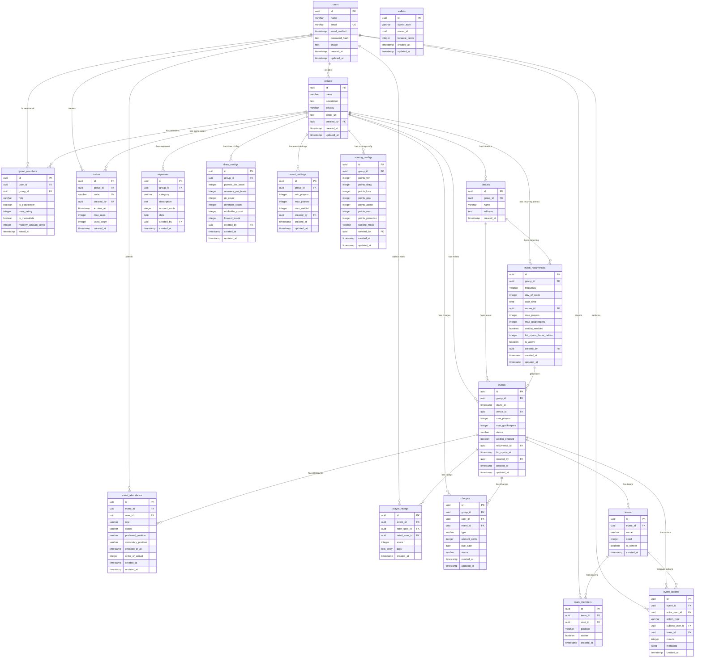

# 08_DATABASE_SCHEMA_COMPLETE.md
**Checkpoint Date**: 2026-03-15 (UTC-3)
**Commit**: dad0911079482b15ff5c43e9ef73a44b4c752699
**Branch**: main

---

## Schema Source

**Evidência**: `src/db/migrations/schema.sql`

✅ **FATO**: Schema completo extraído do arquivo de migration principal.

---

## Extensions

**Evidência**: `src/db/migrations/schema.sql:5`
```sql
CREATE EXTENSION IF NOT EXISTS "uuid-ossp";
```

✅ PostgreSQL extension para geração de UUIDs (v4).

---

## Tables Overview

| # | Tabela | Propósito | Linhas Est. |
|---|--------|-----------|-------------|
| 1 | `users` | Usuários do sistema | N/A |
| 2 | `groups` | Grupos de futebol | N/A |
| 3 | `group_members` | Membros dos grupos (com roles) | N/A |
| 4 | `venues` | Locais de jogo (quadras) | N/A |
| 5 | `event_recurrences` | Eventos recorrentes | N/A |
| 6 | `events` | Partidas/peladas | N/A |
| 7 | `event_attendance` | RSVP e check-in | N/A |
| 8 | `teams` | Times sorteados | N/A |
| 9 | `team_members` | Jogadores em cada time | N/A |
| 10 | `event_actions` | Ações da partida (gols, assists, cards) | N/A |
| 11 | `player_ratings` | Avaliações pós-jogo | N/A |
| 12 | `invites` | Convites para grupos | N/A |
| 13 | `wallets` | Carteiras (grupo e usuário) | N/A |
| 14 | `charges` | Cobranças financeiras | N/A |
| 15 | `expenses` | Despesas do grupo | N/A |
| 16 | `draw_configs` | Configurações de sorteio | N/A |
| 17 | `event_settings` | Configurações de evento por grupo | N/A |
| 18 | `scoring_configs` | Configurações de pontuação/ranking | N/A |

---

## Entity Relationship Diagram (ERD)



---

## Table Details

### 1. users

**Evidência**: `src/db/migrations/schema.sql:8-17`

| Coluna | Tipo | Nullable | Default | Constraints |
|--------|------|----------|---------|-------------|
| id | UUID | NOT NULL | uuid_generate_v4() | PRIMARY KEY |
| name | VARCHAR(255) | NOT NULL | - | - |
| email | VARCHAR(255) | NOT NULL | - | UNIQUE |
| email_verified | TIMESTAMP | NULL | - | - |
| password_hash | TEXT | NULL | - | - |
| image | TEXT | NULL | - | - |
| created_at | TIMESTAMP | NULL | NOW() | - |
| updated_at | TIMESTAMP | NULL | NOW() | - |

**Purpose**: Armazena usuários do sistema com autenticação via password.

---

### 2. groups

**Evidência**: `src/db/migrations/schema.sql:19-29`

| Coluna | Tipo | Nullable | Default | Constraints |
|--------|------|----------|---------|-------------|
| id | UUID | NOT NULL | uuid_generate_v4() | PRIMARY KEY |
| name | VARCHAR(255) | NOT NULL | - | - |
| description | TEXT | NULL | - | - |
| privacy | VARCHAR(20) | NULL | 'private' | CHECK IN ('private', 'public') |
| photo_url | TEXT | NULL | - | - |
| created_by | UUID | NULL | - | FK → users(id) ON DELETE SET NULL |
| created_at | TIMESTAMP | NULL | NOW() | - |
| updated_at | TIMESTAMP | NULL | NOW() | - |

**Purpose**: Grupos de futebol (peladas).

---

### 3. group_members

**Evidência**: `src/db/migrations/schema.sql:32-43`

| Coluna | Tipo | Nullable | Default | Constraints |
|--------|------|----------|---------|-------------|
| id | UUID | NOT NULL | uuid_generate_v4() | PRIMARY KEY |
| user_id | UUID | NOT NULL | - | FK → users(id) ON DELETE CASCADE |
| group_id | UUID | NOT NULL | - | FK → groups(id) ON DELETE CASCADE |
| role | VARCHAR(20) | NULL | 'member' | CHECK IN ('admin', 'member') |
| is_goalkeeper | BOOLEAN | NULL | FALSE | - |
| base_rating | INTEGER | NULL | 5 | CHECK >= 0 AND <= 10 |
| is_mensalista | BOOLEAN | NULL | FALSE | - |
| monthly_amount_cents | INTEGER | NULL | 0 | - |
| joined_at | TIMESTAMP | NULL | NOW() | - |

**Constraints**:
- UNIQUE(user_id, group_id)

**Purpose**: Membros dos grupos com roles (admin/member) e configurações.

---

### 4. venues

**Evidência**: `src/db/migrations/schema.sql:46-52`

| Coluna | Tipo | Nullable | Default | Constraints |
|--------|------|----------|---------|-------------|
| id | UUID | NOT NULL | uuid_generate_v4() | PRIMARY KEY |
| group_id | UUID | NULL | - | FK → groups(id) ON DELETE CASCADE |
| name | VARCHAR(255) | NOT NULL | - | - |
| address | TEXT | NULL | - | - |
| created_at | TIMESTAMP | NULL | NOW() | - |

**Purpose**: Locais de jogo (quadras).

---

### 5. event_recurrences

**Evidência**: `src/db/migrations/schema.sql:55-70`

| Coluna | Tipo | Nullable | Default | Constraints |
|--------|------|----------|---------|-------------|
| id | UUID | NOT NULL | uuid_generate_v4() | PRIMARY KEY |
| group_id | UUID | NOT NULL | - | FK → groups(id) ON DELETE CASCADE |
| frequency | VARCHAR(20) | NOT NULL | - | CHECK IN ('weekly', 'biweekly', 'monthly') |
| day_of_week | INTEGER | NOT NULL | - | CHECK >= 0 AND <= 6 (0=Sunday) |
| start_time | TIME | NOT NULL | - | - |
| venue_id | UUID | NULL | - | FK → venues(id) ON DELETE SET NULL |
| max_players | INTEGER | NULL | 10 | - |
| max_goalkeepers | INTEGER | NULL | 2 | - |
| waitlist_enabled | BOOLEAN | NULL | TRUE | - |
| list_opens_hours_before | INTEGER | NULL | 48 | - |
| is_active | BOOLEAN | NULL | TRUE | - |
| created_by | UUID | NULL | - | FK → users(id) ON DELETE SET NULL |
| created_at | TIMESTAMP | NULL | NOW() | - |
| updated_at | TIMESTAMP | NULL | NOW() | - |

**Purpose**: Configuração de eventos recorrentes (peladas semanais, quinzenais, mensais).

---

### 6. events

**Evidência**: `src/db/migrations/schema.sql:73-87`

| Coluna | Tipo | Nullable | Default | Constraints |
|--------|------|----------|---------|-------------|
| id | UUID | NOT NULL | uuid_generate_v4() | PRIMARY KEY |
| group_id | UUID | NOT NULL | - | FK → groups(id) ON DELETE CASCADE |
| starts_at | TIMESTAMP | NOT NULL | - | - |
| venue_id | UUID | NULL | - | FK → venues(id) ON DELETE SET NULL |
| max_players | INTEGER | NULL | 10 | - |
| max_goalkeepers | INTEGER | NULL | 2 | - |
| status | VARCHAR(20) | NULL | 'scheduled' | CHECK IN ('scheduled', 'live', 'finished', 'canceled') |
| waitlist_enabled | BOOLEAN | NULL | TRUE | - |
| recurrence_id | UUID | NULL | - | FK → event_recurrences(id) ON DELETE SET NULL |
| list_opens_at | TIMESTAMP | NULL | - | - |
| created_by | UUID | NULL | - | FK → users(id) ON DELETE SET NULL |
| created_at | TIMESTAMP | NULL | NOW() | - |
| updated_at | TIMESTAMP | NULL | NOW() | - |

**Purpose**: Partidas/peladas individuais.

**Status Flow**: scheduled → live → finished (ou canceled)

---

### 7. event_attendance

**Evidência**: `src/db/migrations/schema.sql:90-103`

| Coluna | Tipo | Nullable | Default | Constraints |
|--------|------|----------|---------|-------------|
| id | UUID | NOT NULL | uuid_generate_v4() | PRIMARY KEY |
| event_id | UUID | NOT NULL | - | FK → events(id) ON DELETE CASCADE |
| user_id | UUID | NOT NULL | - | FK → users(id) ON DELETE CASCADE |
| role | VARCHAR(20) | NULL | 'line' | CHECK IN ('gk', 'line') |
| status | VARCHAR(20) | NULL | 'no' | CHECK IN ('yes', 'no', 'waitlist', 'dm') |
| preferred_position | VARCHAR(20) | NULL | - | CHECK IN ('gk', 'defender', 'midfielder', 'forward') |
| secondary_position | VARCHAR(20) | NULL | - | CHECK IN ('gk', 'defender', 'midfielder', 'forward') |
| checked_in_at | TIMESTAMP | NULL | - | - |
| order_of_arrival | INTEGER | NULL | - | - |
| created_at | TIMESTAMP | NULL | NOW() | - |
| updated_at | TIMESTAMP | NULL | NOW() | - |

**Constraints**:
- UNIQUE(event_id, user_id)

**Purpose**: Sistema de RSVP com waitlist e check-in.

**Status Values**:
- `yes`: Confirmado
- `no`: Não vai
- `waitlist`: Lista de espera
- `dm`: Decisão pendente (provavelmente "depende")

---

### 8. teams

**Evidência**: `src/db/migrations/schema.sql:106-113`

| Coluna | Tipo | Nullable | Default | Constraints |
|--------|------|----------|---------|-------------|
| id | UUID | NOT NULL | uuid_generate_v4() | PRIMARY KEY |
| event_id | UUID | NOT NULL | - | FK → events(id) ON DELETE CASCADE |
| name | VARCHAR(50) | NOT NULL | - | - |
| seed | INTEGER | NULL | 0 | - |
| is_winner | BOOLEAN | NULL | - | - |
| created_at | TIMESTAMP | NULL | NOW() | - |

**Purpose**: Times sorteados para cada evento.

---

### 9. team_members

**Evidência**: `src/db/migrations/schema.sql:116-124`

| Coluna | Tipo | Nullable | Default | Constraints |
|--------|------|----------|---------|-------------|
| id | UUID | NOT NULL | uuid_generate_v4() | PRIMARY KEY |
| team_id | UUID | NOT NULL | - | FK → teams(id) ON DELETE CASCADE |
| user_id | UUID | NOT NULL | - | FK → users(id) ON DELETE CASCADE |
| position | VARCHAR(20) | NULL | 'line' | CHECK IN ('gk', 'defender', 'midfielder', 'forward', 'line') |
| starter | BOOLEAN | NULL | TRUE | - |
| created_at | TIMESTAMP | NULL | NOW() | - |

**Constraints**:
- UNIQUE(team_id, user_id)

**Purpose**: Jogadores em cada time sorteado.

---

### 10. event_actions

**Evidência**: `src/db/migrations/schema.sql:127-140`

| Coluna | Tipo | Nullable | Default | Constraints |
|--------|------|----------|---------|-------------|
| id | UUID | NOT NULL | uuid_generate_v4() | PRIMARY KEY |
| event_id | UUID | NOT NULL | - | FK → events(id) ON DELETE CASCADE |
| actor_user_id | UUID | NOT NULL | - | FK → users(id) ON DELETE CASCADE |
| action_type | VARCHAR(30) | NOT NULL | - | CHECK IN ('goal', 'assist', 'save', 'tackle', 'error', 'yellow_card', 'red_card', 'period_start', 'period_end') |
| subject_user_id | UUID | NULL | - | FK → users(id) ON DELETE SET NULL |
| team_id | UUID | NULL | - | FK → teams(id) ON DELETE SET NULL |
| minute | INTEGER | NULL | - | - |
| metadata | JSONB | NULL | - | - |
| created_at | TIMESTAMP | NULL | NOW() | - |

**Purpose**: Ações da partida (gols, assistências, cartões, etc).

**Action Types**:
- `goal`: Gol
- `assist`: Assistência
- `save`: Defesa (goleiro)
- `tackle`: Desarme
- `error`: Erro
- `yellow_card`: Cartão amarelo
- `red_card`: Cartão vermelho
- `period_start`: Início de período
- `period_end`: Fim de período

---

### 11. player_ratings

**Evidência**: `src/db/migrations/schema.sql:143-152`

| Coluna | Tipo | Nullable | Default | Constraints |
|--------|------|----------|---------|-------------|
| id | UUID | NOT NULL | uuid_generate_v4() | PRIMARY KEY |
| event_id | UUID | NOT NULL | - | FK → events(id) ON DELETE CASCADE |
| rater_user_id | UUID | NOT NULL | - | FK → users(id) ON DELETE CASCADE |
| rated_user_id | UUID | NOT NULL | - | FK → users(id) ON DELETE CASCADE |
| score | INTEGER | NULL | - | CHECK >= 0 AND <= 10 |
| tags | TEXT[] | NULL | - | - |
| created_at | TIMESTAMP | NULL | NOW() | - |

**Constraints**:
- UNIQUE(event_id, rater_user_id, rated_user_id)

**Purpose**: Avaliações pós-jogo (votação para MVP).

**Tag Examples**: 'mvp', 'pereba', 'paredao', 'garcom'

---

### 12. invites

**Evidência**: `src/db/migrations/schema.sql:155-164`

| Coluna | Tipo | Nullable | Default | Constraints |
|--------|------|----------|---------|-------------|
| id | UUID | NOT NULL | uuid_generate_v4() | PRIMARY KEY |
| group_id | UUID | NOT NULL | - | FK → groups(id) ON DELETE CASCADE |
| code | VARCHAR(20) | NOT NULL | - | UNIQUE |
| created_by | UUID | NULL | - | FK → users(id) ON DELETE SET NULL |
| expires_at | TIMESTAMP | NULL | - | - |
| max_uses | INTEGER | NULL | - | - |
| used_count | INTEGER | NULL | 0 | - |
| created_at | TIMESTAMP | NULL | NOW() | - |

**Purpose**: Códigos de convite para grupos.

---

### 13. wallets

**Evidência**: `src/db/migrations/schema.sql:167-174`

| Coluna | Tipo | Nullable | Default | Constraints |
|--------|------|----------|---------|-------------|
| id | UUID | NOT NULL | uuid_generate_v4() | PRIMARY KEY |
| owner_type | VARCHAR(10) | NULL | - | CHECK IN ('group', 'user') |
| owner_id | UUID | NOT NULL | - | - |
| balance_cents | INTEGER | NULL | 0 | - |
| created_at | TIMESTAMP | NULL | NOW() | - |
| updated_at | TIMESTAMP | NULL | NOW() | - |

**Purpose**: Carteiras financeiras (tanto de grupos quanto de usuários).

**Note**: owner_id pode referenciar groups.id ou users.id dependendo de owner_type.

---

### 14. charges

**Evidência**: `src/db/migrations/schema.sql:177-188`

| Coluna | Tipo | Nullable | Default | Constraints |
|--------|------|----------|---------|-------------|
| id | UUID | NOT NULL | uuid_generate_v4() | PRIMARY KEY |
| group_id | UUID | NOT NULL | - | FK → groups(id) ON DELETE CASCADE |
| user_id | UUID | NOT NULL | - | FK → users(id) ON DELETE CASCADE |
| event_id | UUID | NULL | - | FK → events(id) ON DELETE SET NULL |
| type | VARCHAR(20) | NULL | - | CHECK IN ('monthly', 'daily', 'fine', 'other') |
| amount_cents | INTEGER | NOT NULL | - | - |
| due_date | DATE | NULL | - | - |
| status | VARCHAR(20) | NULL | 'pending' | CHECK IN ('pending', 'paid', 'canceled') |
| created_at | TIMESTAMP | NULL | NOW() | - |
| updated_at | TIMESTAMP | NULL | NOW() | - |

**Purpose**: Cobranças (mensalidades, diárias, multas).

**Charge Types**:
- `monthly`: Mensalidade
- `daily`: Diária de evento
- `fine`: Multa
- `other`: Outros

---

### 15. expenses

**Evidência**: `src/db/migrations/schema.sql:191-200`

| Coluna | Tipo | Nullable | Default | Constraints |
|--------|------|----------|---------|-------------|
| id | UUID | NOT NULL | uuid_generate_v4() | PRIMARY KEY |
| group_id | UUID | NOT NULL | - | FK → groups(id) ON DELETE CASCADE |
| category | VARCHAR(30) | NOT NULL | - | CHECK IN ('venue_rental', 'equipment', 'referee', 'other') |
| description | TEXT | NULL | - | - |
| amount_cents | INTEGER | NOT NULL | - | - |
| date | DATE | NOT NULL | CURRENT_DATE | - |
| created_by | UUID | NULL | - | FK → users(id) ON DELETE SET NULL |
| created_at | TIMESTAMP | NULL | NOW() | - |

**Purpose**: Despesas do grupo (aluguel de quadra, equipamentos, árbitro).

---

### 16. draw_configs

**Evidência**: `src/db/migrations/schema.sql:207-220`

| Coluna | Tipo | Nullable | Default | Constraints |
|--------|------|----------|---------|-------------|
| id | UUID | NOT NULL | uuid_generate_v4() | PRIMARY KEY |
| group_id | UUID | NOT NULL | - | FK → groups(id) ON DELETE CASCADE |
| players_per_team | INTEGER | NULL | 7 | CHECK >= 1 AND <= 22 |
| reserves_per_team | INTEGER | NULL | 2 | CHECK >= 0 AND <= 11 |
| gk_count | INTEGER | NULL | 1 | CHECK >= 0 AND <= 5 |
| defender_count | INTEGER | NULL | 2 | CHECK >= 0 AND <= 11 |
| midfielder_count | INTEGER | NULL | 2 | CHECK >= 0 AND <= 11 |
| forward_count | INTEGER | NULL | 2 | CHECK >= 0 AND <= 11 |
| created_by | UUID | NULL | - | FK → users(id) ON DELETE SET NULL |
| created_at | TIMESTAMP | NULL | NOW() | - |
| updated_at | TIMESTAMP | NULL | NOW() | - |

**Constraints**:
- UNIQUE(group_id)

**Purpose**: Configurações de sorteio de times por grupo.

---

### 17. event_settings

**Evidência**: `src/db/migrations/schema.sql:239-249`

| Coluna | Tipo | Nullable | Default | Constraints |
|--------|------|----------|---------|-------------|
| id | UUID | NOT NULL | uuid_generate_v4() | PRIMARY KEY |
| group_id | UUID | NOT NULL | - | FK → groups(id) ON DELETE CASCADE |
| min_players | INTEGER | NULL | 4 | CHECK >= 1 AND <= 22 |
| max_players | INTEGER | NULL | 22 | CHECK >= 1 AND <= 50 |
| max_waitlist | INTEGER | NULL | 10 | CHECK >= 0 AND <= 50 |
| created_by | UUID | NULL | - | FK → users(id) ON DELETE SET NULL |
| created_at | TIMESTAMP | NULL | NOW() | - |
| updated_at | TIMESTAMP | NULL | NOW() | - |

**Constraints**:
- UNIQUE(group_id)

**Purpose**: Configurações padrão de eventos por grupo.

---

### 18. scoring_configs

**Evidência**: `src/db/migrations/schema.sql:252-271`

| Coluna | Tipo | Nullable | Default | Constraints |
|--------|------|----------|---------|-------------|
| id | UUID | NOT NULL | uuid_generate_v4() | PRIMARY KEY |
| group_id | UUID | NOT NULL | - | FK → groups(id) ON DELETE CASCADE |
| points_win | INTEGER | NULL | 3 | CHECK >= 0 AND <= 10 |
| points_draw | INTEGER | NULL | 1 | CHECK >= 0 AND <= 10 |
| points_loss | INTEGER | NULL | 0 | CHECK >= 0 AND <= 10 |
| points_goal | INTEGER | NULL | 0 | CHECK >= 0 AND <= 10 |
| points_assist | INTEGER | NULL | 0 | CHECK >= 0 AND <= 10 |
| points_mvp | INTEGER | NULL | 0 | CHECK >= 0 AND <= 10 |
| points_presence | INTEGER | NULL | 0 | CHECK >= 0 AND <= 10 |
| ranking_mode | VARCHAR(20) | NULL | 'standard' | CHECK IN ('standard', 'complete') |
| created_by | UUID | NULL | - | FK → users(id) ON DELETE SET NULL |
| created_at | TIMESTAMP | NULL | NOW() | - |
| updated_at | TIMESTAMP | NULL | NOW() | - |

**Constraints**:
- UNIQUE(group_id)

**Purpose**: Configurações de pontuação para rankings.

**Ranking Modes**:
- `standard`: Apenas V/E/D (vitórias, empates, derrotas)
- `complete`: V/E/D + estatísticas individuais (gols, assists, MVP, presença)

---

## Indexes

**Evidência**: `src/db/migrations/schema.sql:223-236`

| Index | Tabela | Colunas | Purpose |
|-------|--------|---------|---------|
| `idx_group_members_user` | group_members | user_id | Performance: buscar grupos do usuário |
| `idx_group_members_group` | group_members | group_id | Performance: buscar membros do grupo |
| `idx_events_group` | events | group_id | Performance: eventos por grupo |
| `idx_events_status` | events | status | Performance: filtrar eventos por status |
| `idx_events_starts_at` | events | starts_at | Performance: ordenação temporal |
| `idx_event_attendance_event` | event_attendance | event_id | Performance: listar attendance de evento |
| `idx_event_attendance_user` | event_attendance | user_id | Performance: eventos do usuário |
| `idx_event_actions_event` | event_actions | event_id | Performance: ações de um evento |
| `idx_event_actions_type` | event_actions | action_type | Performance: filtrar por tipo de ação |
| `idx_player_ratings_event` | player_ratings | event_id | Performance: ratings de evento |
| `idx_player_ratings_rated` | player_ratings | rated_user_id | Performance: ratings recebidas por usuário |
| `idx_charges_user_status` | charges | user_id, status | Performance: cobranças pendentes do usuário |
| `idx_charges_due_date` | charges | due_date | Performance: cobranças por vencimento |
| `idx_charges_event` | charges | event_id | Performance: cobranças de um evento |

✅ **FATO**: Indexes bem definidos para queries comuns.

---

## Materialized View: mv_event_scoreboard

**Evidência**: `src/db/migrations/schema.sql:279-289`

```sql
CREATE MATERIALIZED VIEW IF NOT EXISTS mv_event_scoreboard AS
SELECT
  ea.event_id,
  ea.team_id,
  t.name AS team_name,
  COUNT(CASE WHEN ea.action_type = 'goal' THEN 1 END) AS goals,
  COUNT(CASE WHEN ea.action_type = 'assist' THEN 1 END) AS assists
FROM event_actions ea
LEFT JOIN teams t ON ea.team_id = t.id
WHERE ea.action_type IN ('goal', 'assist')
GROUP BY ea.event_id, ea.team_id, t.name;
```

**Index**: UNIQUE INDEX `idx_mv_scoreboard_event_team` ON (event_id, team_id)

**Purpose**: Placar em tempo real dos eventos.

---

## Triggers

**Evidência**: `src/db/migrations/schema.sql:294-306`

### Function: refresh_event_scoreboard()

```sql
CREATE OR REPLACE FUNCTION refresh_event_scoreboard()
RETURNS TRIGGER AS $$
BEGIN
  REFRESH MATERIALIZED VIEW CONCURRENTLY mv_event_scoreboard;
  RETURN NULL;
END;
$$ LANGUAGE plpgsql;
```

### Trigger: trigger_refresh_scoreboard

```sql
CREATE OR REPLACE TRIGGER trigger_refresh_scoreboard
AFTER INSERT OR UPDATE OR DELETE ON event_actions
FOR EACH STATEMENT
EXECUTE FUNCTION refresh_event_scoreboard();
```

**Purpose**: Auto-atualizar o placar sempre que event_actions mudar.

---

## Key Relationships Summary

### Core Entities

1. **User → Groups**: Via group_members (N:M)
2. **Group → Events**: 1:N
3. **Event → Attendance**: 1:N (via event_attendance)
4. **Event → Teams**: 1:N
5. **Team → Players**: Via team_members (N:M)
6. **Event → Actions**: 1:N

### Financial

1. **Group → Charges**: 1:N
2. **User → Charges**: 1:N
3. **Group → Expenses**: 1:N
4. **Group/User → Wallet**: 1:1 (via wallets.owner_id)

### Configuration

1. **Group → DrawConfig**: 1:1
2. **Group → EventSettings**: 1:1
3. **Group → ScoringConfig**: 1:1

---

## Data Integrity Rules

### CASCADE Deletes

✅ **FATO**: As seguintes relações usam ON DELETE CASCADE:
- group_members quando user/group deletado
- venues quando group deletado
- event_recurrences quando group deletado
- events quando group deletado
- event_attendance quando event/user deletado
- teams quando event deletado
- team_members quando team/user deletado
- event_actions quando event/user deletado
- player_ratings quando event deletado
- invites quando group deletado
- charges quando group/user deletado
- expenses quando group deletado
- draw_configs quando group deletado
- event_settings quando group deletado
- scoring_configs quando group deletado

### SET NULL

✅ **FATO**: As seguintes relações usam ON DELETE SET NULL:
- groups.created_by quando user deletado
- venues.group_id quando group deletado
- event_recurrences.venue_id quando venue deletado
- events.venue_id quando venue deletado
- events.created_by quando user deletado
- event_actions.subject_user_id quando user deletado
- invites.created_by quando user deletado

---

## Observations

### ✅ Strengths

1. UUID como PK para todas tabelas (boa prática para sistemas distribuídos)
2. Timestamps (created_at, updated_at) em tabelas principais
3. Indexes bem posicionados para queries comuns
4. Materialized view com trigger para performance
5. Check constraints para validação de dados
6. Unique constraints para prevenir duplicatas

### ⚠️ Potential Issues

1. **wallets.owner_id**: Não tem FK explícita (referência polimórfica - pode causar data integrity issues)
2. **Falta de audit trail**: Não há tabelas de auditoria para tracking de mudanças críticas
3. **player_ratings.tags**: Usando ARRAY - pode ser difícil de query (considerar tabela normalizada)

### 💡 Opportunities

1. Adicionar soft deletes para tabelas críticas (users, groups, events)
2. Criar tabela de audit log
3. Adicionar partial indexes para queries específicas (ex: events WHERE status = 'live')
4. Considerar partitioning para event_actions (por data) se volume crescer muito

---

## Storage Estimates

🔍 **INFERÊNCIA**: Para 1000 usuários, 100 grupos, 500 eventos:

| Tabela | Est. Rows | Est. Size |
|--------|-----------|-----------|
| users | 1,000 | ~200 KB |
| groups | 100 | ~20 KB |
| group_members | 5,000 | ~1 MB |
| events | 500 | ~100 KB |
| event_attendance | 10,000 | ~2 MB |
| teams | 1,000 | ~50 KB |
| team_members | 14,000 | ~3 MB |
| event_actions | 50,000 | ~10 MB |
| player_ratings | 100,000 | ~20 MB |
| charges | 10,000 | ~2 MB |

**Total**: ~40 MB para dataset inicial (sem contar indexes)

---

## Conclusion

✅ Schema bem estruturado e normalizado
✅ Performance otimizada com indexes e materialized views
✅ Data integrity garantida por FKs e constraints
⚠️ Alguns gaps de auditoria e soft delete
💡 Espaço para otimizações futuras conforme escala
