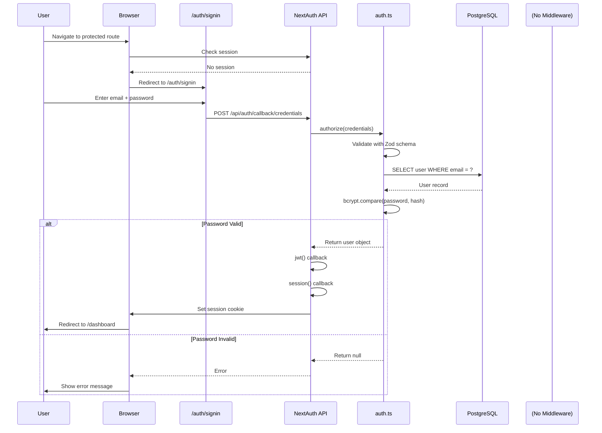
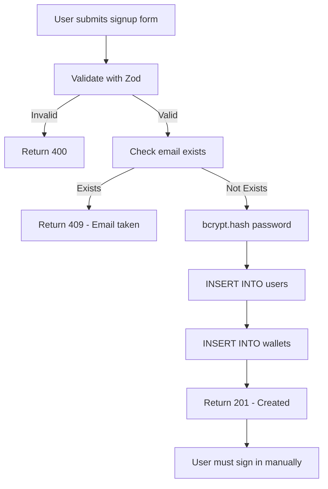
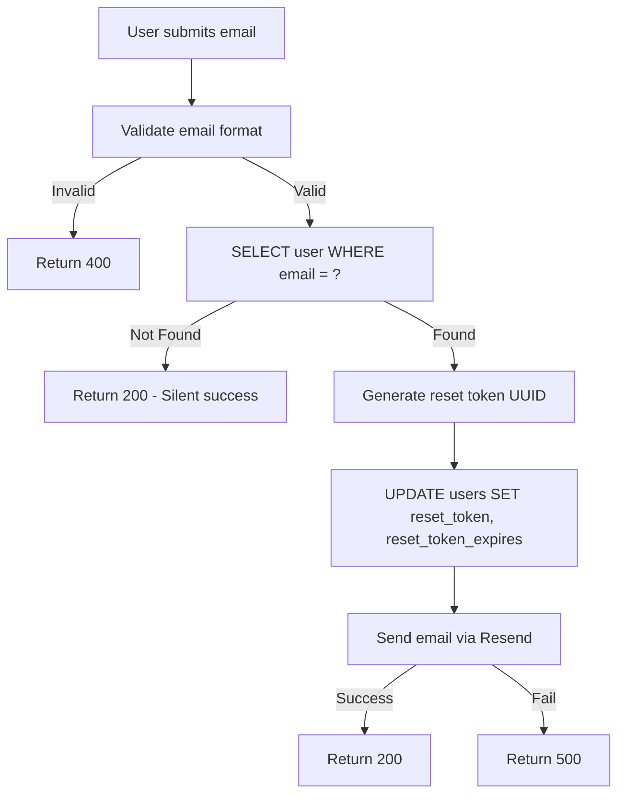
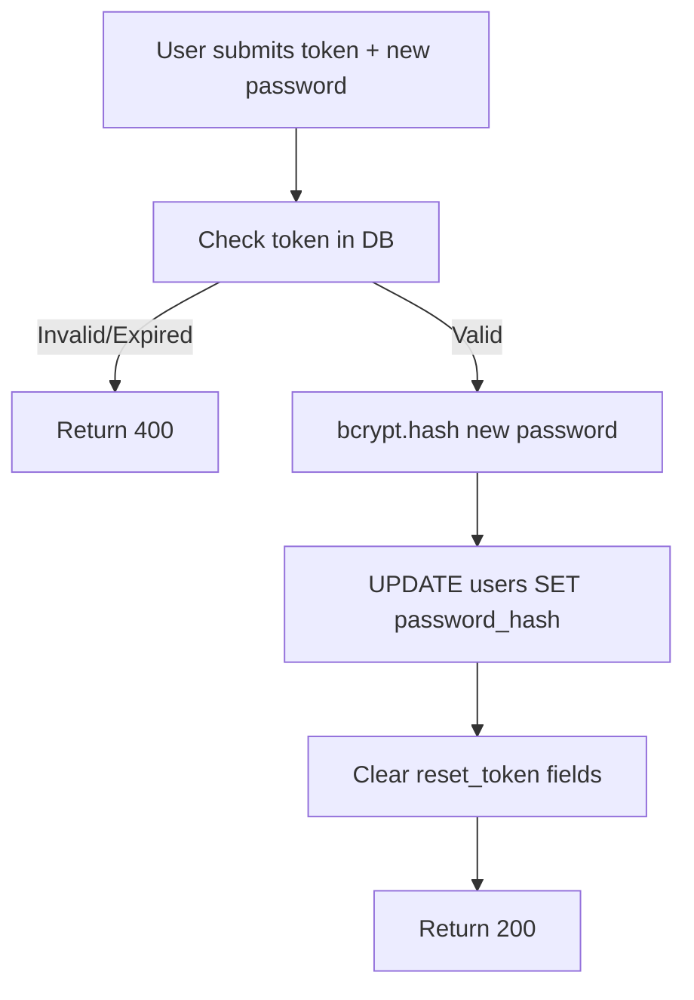

# 10_AUTH_FLOW_COMPLETE.md
**Checkpoint Date**: 2026-03-15 (UTC-3)
**Commit**: dad0911079482b15ff5c43e9ef73a44b4c752699
**Branch**: main

---

## Authentication Stack

**Evidência**: `src/lib/auth.ts`, `src/lib/auth-helpers.ts`

✅ **NextAuth v5** (Auth.js beta.25)
✅ **Credentials Provider** (email/password)
✅ **JWT Session Strategy**
✅ **bcryptjs** for password hashing (10 rounds - default)

---

## Complete Authentication Flow Diagram



---

## Signup Flow

**Evidência**: `src/app/api/auth/signup/route.ts`



**Key Implementation**:

**Evidência**: `src/app/api/auth/signup/route.ts:42-67`
```typescript
// Hash password with bcrypt (10 rounds - default)
const hashedPassword = await bcrypt.hash(password, 10);

// Insert user
const [user] = await sql`
  INSERT INTO users (name, email, password_hash)
  VALUES (${name}, ${email.toLowerCase()}, ${hashedPassword})
  RETURNING id, name, email, created_at
`;

// Create user wallet
await sql`
  INSERT INTO wallets (owner_type, owner_id, balance_cents)
  VALUES ('user', ${user.id}, 0)
`;
```

✅ **FATO**: Signup NÃO faz auto-login. Usuário precisa fazer signin manualmente.

---

## Signin Flow

**Evidência**: `src/lib/auth.ts:42-96`

### NextAuth Configuration

```typescript
export const { handlers, signIn, signOut, auth } = NextAuth({
  providers: [Credentials({ ... })],
  session: { strategy: "jwt", maxAge: 30 * 24 * 60 * 60 }, // 30 days
  callbacks: { jwt, session },
  cookies: { ... }
});
```

### Credentials Validation

**Evidência**: `src/lib/auth.ts:49-95`

```typescript
async authorize(credentials) {
  // 1. Validate with Zod
  const { email, password } = credentialsSchema.parse(credentials);

  // 2. Query database
  const result = await sql`
    SELECT id, name, email, password_hash
    FROM users
    WHERE email = ${email.toLowerCase()}
  `;

  if (result.length === 0) return null;

  const user = result[0];

  // 3. Verify password
  if (!user.password_hash) return null;

  const isValidPassword = await bcrypt.compare(
    password,
    user.password_hash
  );

  if (!isValidPassword) return null;

  // 4. Return user (triggers JWT callback)
  return {
    id: user.id,
    name: user.name,
    email: user.email,
    image: null,
  };
}
```

---

## JWT & Session Callbacks

**Evidência**: `src/lib/auth.ts:102-121`

### JWT Callback

```typescript
async jwt({ token, user }) {
  if (user) {
    token.id = user.id;
    token.name = user.name;
    token.email = user.email;
    token.picture = user.image;
  }
  return token;
}
```

**Purpose**: Adiciona user data ao JWT token.

### Session Callback

```typescript
async session({ session, token }) {
  if (token && session.user) {
    session.user.id = token.id as string;
    session.user.name = token.name as string;
    session.user.email = token.email as string;
    session.user.image = token.picture as string;
  }
  return session;
}
```

**Purpose**: Injeta dados do token na session disponível no client.

---

## Session Configuration

**Evidência**: `src/lib/auth.ts:122-160`

| Config | Value | Evidência |
|--------|-------|-----------|
| Strategy | `jwt` | linha 123 |
| Max Age | 30 days (2,592,000 seconds) | linha 124 |
| Session Cookie Name | `next-auth.session-token` (dev)<br/>`__Secure-next-auth.session-token` (prod) | linha 127-130 |
| HttpOnly | `true` | linha 132 |
| SameSite | `lax` | linha 133 |
| Secure | `false` (dev) / `true` (prod) | linha 135 |

✅ **FATO**: Cookies seguros em produção, relaxados em desenvolvimento.

---

## Password Reset Flow

### Step 1: Request Reset

**Evidência**: `src/app/api/auth/forgot-password/route.ts`



🔍 **INFERÊNCIA**: Token provavelmente armazenado em `users` table (adicionar coluna em migration).

### Step 2: Confirm Reset

**Evidência**: `src/app/api/auth/reset-password/route.ts`



---

## Auth Helpers

**Evidência**: `src/lib/auth-helpers.ts`

### getCurrentUser()

**Evidência**: `src/lib/auth-helpers.ts:8-38`

```typescript
export async function getCurrentUser() {
  const session = await auth();

  if (!session || !session.user) {
    return null;
  }

  // Buscar informações adicionais do usuário no banco
  const dbUser = await sql`
    SELECT id, name, email, image, created_at, updated_at
    FROM users
    WHERE id = ${session.user.id}
  `;

  if (dbUser.length > 0) {
    return {
      id: dbUser[0].id,
      email: dbUser[0].email,
      name: dbUser[0].name,
      image: dbUser[0].image,
    };
  }

  return null;
}
```

**Purpose**: Retorna usuário autenticado com dados do banco. Retorna `null` se não autenticado.

### requireAuth()

**Evidência**: `src/lib/auth-helpers.ts:44-52`

```typescript
export async function requireAuth() {
  const user = await getCurrentUser();

  if (!user) {
    throw new Error("Não autenticado");
  }

  return user;
}
```

**Purpose**: Garante autenticação. Lança erro "Não autenticado" se não houver usuário.

**Usage Pattern**: Em todas API routes protegidas.

---

## API Route Protection Pattern

**Evidência**: Visto em múltiplos `route.ts`

```typescript
export async function GET() {
  try {
    const user = await requireAuth();

    // Protected logic here...

    return NextResponse.json({ data });
  } catch (error) {
    if (error instanceof Error && error.message === "Não autenticado") {
      return NextResponse.json({ error: "Não autenticado" }, { status: 401 });
    }
    logger.error(error, "Error message");
    return NextResponse.json({ error: "Erro" }, { status: 500 });
  }
}
```

✅ **Padrão consistente** em todas as rotas protegidas.

---

## Middleware

❌ **NÃO ENCONTRADO**: Arquivo `middleware.ts` não existe.

🔍 **INFERÊNCIA**: Proteção de páginas provavelmente feita via:
1. Client-side redirects em `layout.tsx` ou `page.tsx`
2. Server components checando session via `auth()`

💡 **RECOMENDAÇÃO**: Criar `middleware.ts` para:
- Proteger rotas de forma centralizada
- Redirect não autenticados para `/auth/signin`
- Evitar flash de conteúdo não autorizado

**Exemplo sugerido**:
```typescript
// middleware.ts (SUGERIDO)
import { auth } from "@/lib/auth";
import { NextResponse } from "next/server";

export default auth((req) => {
  const isAuth = !!req.auth;
  const isAuthPage = req.nextUrl.pathname.startsWith("/auth");
  const isPublicPage = req.nextUrl.pathname === "/" ||
                       req.nextUrl.pathname === "/simple-test";

  if (!isAuth && !isAuthPage && !isPublicPage) {
    return NextResponse.redirect(new URL("/auth/signin", req.url));
  }

  if (isAuth && isAuthPage) {
    return NextResponse.redirect(new URL("/dashboard", req.url));
  }

  return NextResponse.next();
});

export const config = {
  matcher: ["/((?!api|_next/static|_next/image|favicon.ico).*)"],
};
```

---

## Environment Variables

**Evidência**: `.env.example`, `src/lib/auth.ts:8-35`

| Variable | Required | Purpose | Validation |
|----------|----------|---------|------------|
| `AUTH_SECRET` | ✅ | JWT signing secret | Checked at startup |
| `NEXTAUTH_SECRET` | ❌ | Legacy (fallback) | - |
| `NEXTAUTH_URL` | ✅ | App URL | - |
| `DATABASE_URL` | ✅ | PostgreSQL connection | Checked at DB init |

**Evidência**: `src/lib/auth.ts:8-35`
```typescript
if (!process.env.AUTH_SECRET && !process.env.NEXTAUTH_SECRET) {
  // Erro detalhado em desenvolvimento
  // Throw error em produção
}
```

---

## Security Observations

### ✅ Strengths

1. **Password Hashing**: bcrypt com 10 rounds (padrão seguro)
2. **JWT Sessions**: Stateless, escalável
3. **HttpOnly Cookies**: Previne XSS
4. **Secure Cookies**: HTTPS em produção
5. **Error Handling**: Não expõe PII em logs de desenvolvimento
6. **Email Lowercase**: Normalização de emails

### ⚠️ Potential Issues

1. **No Rate Limiting**: API de signup/signin vulnerável a brute force
2. **No Email Verification**: Usuários podem se registrar com emails falsos
3. **No MFA**: Sem autenticação de dois fatores
4. **Password Reset Token**: Schema unclear (precisa verificar se colunas existem)
5. **No Account Lockout**: Múltiplas tentativas falhas não bloqueiam conta
6. **Session Rotation**: JWT não é rotacionado (refresh tokens ausentes)

### 💡 Recommendations

1. Adicionar rate limiting (ex: usar Upstash Rate Limit)
2. Implementar email verification
3. Adicionar MFA opcional
4. Implementar account lockout após N tentativas
5. Adicionar refresh token rotation
6. Criar `middleware.ts` para proteção centralizada
7. Adicionar session management (listar/revogar sessões ativas)

---

## Error Handling

### Client Errors

| Error | Status | Message | Causa |
|-------|--------|---------|-------|
| Invalid credentials | 401 | (Redirect to error page) | Email/password incorretos |
| Email taken | 409 | "Email já cadastrado" | Signup com email existente |
| Invalid data | 400 | "Dados inválidos" | Zod validation falhou |

### Server Errors

| Error | Status | Message | Logging |
|-------|--------|---------|---------|
| Database error | 500 | "Erro ao processar" | ✅ Logged |
| Unknown error | 500 | "Erro ao processar" | ✅ Logged |

**Evidência**: Padrão consistente em todas rotas.

---

## Custom Pages

**Evidência**: `src/lib/auth.ts:98-101`

```typescript
pages: {
  signIn: "/auth/signin",
  error: "/auth/error",
}
```

✅ **Custom pages** para signin e error.
❌ **Missing**: signup page config (usa página custom independente).

---

## Complete User Journey

```mermaid
flowchart TD
    Start[New User] -->|1| SignupPage[/auth/signup]
    SignupPage -->|Submit form| SignupAPI[POST /api/auth/signup]
    SignupAPI -->|Success| SigninPage[/auth/signin]

    SignupPage -->|Forgot Password?| ForgotPage[/auth/forgot-password]
    ForgotPage -->|Submit email| ForgotAPI[POST /api/auth/forgot-password]
    ForgotAPI -->|Send email| EmailReceived[User receives email]
    EmailReceived -->|Click link| ResetPage[/auth/reset-password?token=xxx]
    ResetPage -->|Submit new password| ResetAPI[POST /api/auth/reset-password]
    ResetAPI -->|Success| SigninPage

    SigninPage -->|Submit credentials| NextAuthAPI[POST /api/auth/callback/credentials]
    NextAuthAPI -->|Success| Dashboard[/dashboard]
    NextAuthAPI -->|Fail| ErrorPage[/auth/error]

    Dashboard -->|Access protected route| CheckAuth{Has session?}
    CheckAuth -->|Yes| ProtectedContent[Show content]
    CheckAuth -->|No| SigninPage

    Dashboard -->|Sign out| SignOut[signOut]
    SignOut --> SigninPage
```

---

## Conclusion

✅ **Auth implementation** funcional e segura para MVP
✅ **Padrão consistente** de proteção em API routes
✅ **Password reset** implementado com Resend
⚠️ **Middleware ausente** - proteção de páginas não centralizada
⚠️ **Rate limiting ausente** - vulnerável a brute force
💡 **Espaço para melhorias**: MFA, email verification, session management
