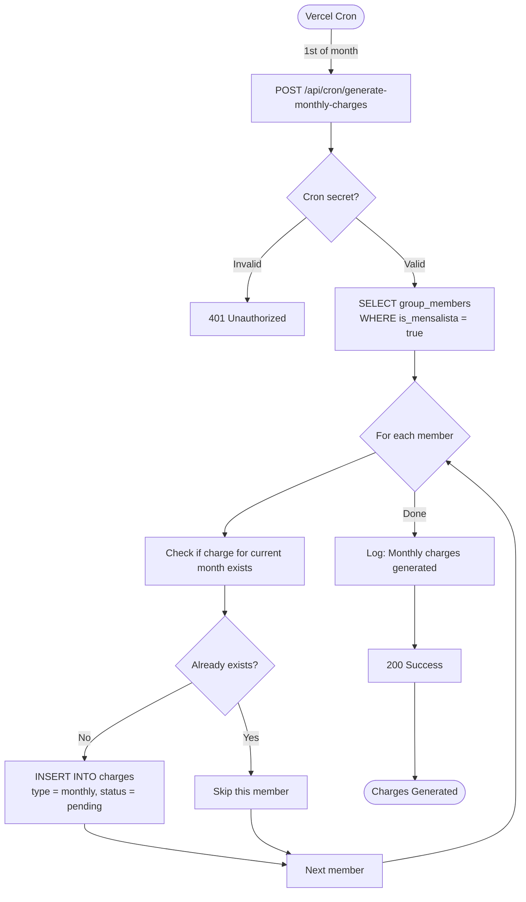
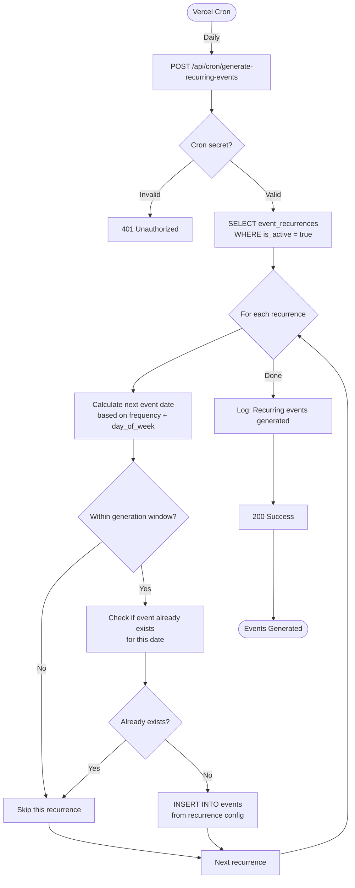

# 91_MAIN_FLOWS.md
**Checkpoint Date**: 2026-03-15 (UTC-3)
**Commit**: dad0911079482b15ff5c43e9ef73a44b4c752699
**Branch**: main

---

## Main Business Flows

Este documento mapeia os principais fluxos de negócio do Convoca.

---

## 1. User Onboarding Flow

```mermaid
flowchart TD
    Start([New User]) --> Landing[Landing Page]
    Landing -->|Click Sign Up| SignupPage[/auth/signup]

    SignupPage --> FillForm[Fill: name, email, password]
    FillForm --> SubmitSignup[POST /api/auth/signup]

    SubmitSignup -->|Validation| ValidateData{Valid?}
    ValidateData -->|No| ShowError1[Show validation errors]
    ShowError1 --> FillForm

    ValidateData -->|Yes| CheckEmail{Email exists?}
    CheckEmail -->|Yes| ShowError2[Show: Email already taken]
    ShowError2 --> FillForm

    CheckEmail -->|No| HashPassword[bcrypt.hash password]
    HashPassword --> CreateUser[INSERT INTO users]
    CreateUser --> CreateWallet[INSERT INTO wallets]
    CreateWallet --> Success1[Show: Success! Please sign in]

    Success1 --> SigninPage[/auth/signin]
    SigninPage --> EnterCreds[Enter email + password]
    EnterCreds --> SubmitSignin[POST /api/auth/callback/credentials]

    SubmitSignin --> AuthCheck{Valid?}
    AuthCheck -->|No| ShowError3[Show: Invalid credentials]
    ShowError3 --> EnterCreds

    AuthCheck -->|Yes| CreateSession[Create JWT session]
    CreateSession --> SetCookie[Set HttpOnly cookie]
    SetCookie --> Dashboard[Redirect to /dashboard]

    Dashboard --> End([User Logged In])
```

**Tables Affected**:
- `users` (INSERT)
- `wallets` (INSERT)

---

## 2. Create Group Flow

```mermaid
flowchart TD
    Start([Authenticated User]) --> Dashboard[/dashboard]
    Dashboard -->|Click Create Group| NewGroupPage[/groups/new]

    NewGroupPage --> FillForm[Fill: name, description, privacy]
    FillForm --> Submit[POST /api/groups]

    Submit --> Auth{Authenticated?}
    Auth -->|No| Return401[401 Unauthorized]
    Auth -->|Yes| Validate{Valid data?}

    Validate -->|No| Return400[400 Bad Request]
    Validate -->|Yes| BeginTx[BEGIN Transaction]

    BeginTx --> CreateGroup[INSERT INTO groups]
    CreateGroup --> AddAsAdmin[INSERT INTO group_members<br/>role = admin]
    AddAsAdmin --> CreateGroupWallet[INSERT INTO wallets<br/>owner_type = group]
    CreateGroupWallet --> GenInviteCode[Generate invite code]
    GenInviteCode --> CreateInvite[INSERT INTO invites]
    CreateInvite --> CommitTx[COMMIT Transaction]

    CommitTx --> Log[Log: Group created]
    Log --> Return201[201 Created with group + inviteCode]
    Return201 --> RedirectGroup[Redirect to /groups/[groupId]]

    RedirectGroup --> End([Group Created])
```

**Tables Affected**:
- `groups` (INSERT)
- `group_members` (INSERT)
- `wallets` (INSERT)
- `invites` (INSERT)

**⚠️ Current Implementation**: NOT wrapped in transaction (data integrity risk).

---

## 3. Join Group Flow

```mermaid
flowchart TD
    Start([Authenticated User]) --> Dashboard[/dashboard]
    Dashboard -->|Click Join Group| JoinPage[/groups/join]

    JoinPage --> EnterCode[Enter invite code]
    EnterCode --> Submit[POST /api/groups/join]

    Submit --> Auth{Authenticated?}
    Auth -->|No| Return401[401 Unauthorized]
    Auth -->|Yes| FindInvite[SELECT FROM invites<br/>WHERE code = ?]

    FindInvite --> InviteExists{Invite exists?}
    InviteExists -->|No| Return404[404 Not Found]
    InviteExists -->|Yes| CheckExpiry{Expired?}

    CheckExpiry -->|Yes| Return400[400 Invite expired]
    CheckExpiry -->|No| CheckMaxUses{Max uses reached?}

    CheckMaxUses -->|Yes| Return400B[400 Invite limit reached]
    CheckMaxUses -->|No| CheckMember{Already member?}

    CheckMember -->|Yes| Return409[409 Already member]
    CheckMember -->|No| AddMember[INSERT INTO group_members]

    AddMember --> IncrementUses[UPDATE invites<br/>used_count++]
    IncrementUses --> Log[Log: User joined group]
    Log --> Return200[200 Success]
    Return200 --> RedirectGroup[Redirect to /groups/[groupId]]

    RedirectGroup --> End([User Joined Group])
```

**Tables Affected**:
- `invites` (SELECT, UPDATE)
- `group_members` (INSERT)

---

## 4. Create Event Flow

```mermaid
flowchart TD
    Start([Group Admin]) --> GroupPage[/groups/[groupId]]
    GroupPage -->|Click Create Event| NewEventPage[/groups/[groupId]/events/new]

    NewEventPage --> FillForm[Fill: date, time, venue, max_players, etc.]
    FillForm --> Submit[POST /api/events]

    Submit --> Auth{Authenticated?}
    Auth -->|No| Return401[401 Unauthorized]
    Auth -->|Yes| Validate{Valid data?}

    Validate -->|No| Return400[400 Bad Request]
    Validate -->|Yes| CheckAdmin{Is admin?}

    CheckAdmin -->|No| Return403[403 Forbidden]
    CheckAdmin -->|Yes| CreateEvent[INSERT INTO events]

    CreateEvent --> Log[Log: Event created]
    Log --> Return201[201 Created]
    Return201 --> RedirectEvent[Redirect to /groups/[groupId]/events/[eventId]]

    RedirectEvent --> End([Event Created])
```

**Tables Affected**:
- `events` (INSERT)

---

## 5. RSVP Flow (Complex Waitlist Logic)

```mermaid
flowchart TD
    Start([Group Member]) --> EventPage[/groups/[groupId]/events/[eventId]]
    EventPage -->|Click Confirm| RSVPForm[Select role: GK or Line]
    RSVPForm --> Submit[POST /api/events/[eventId]/rsvp]

    Submit --> Auth{Authenticated?}
    Auth -->|No| Return401[401 Unauthorized]
    Auth -->|Yes| GetEvent[SELECT FROM events]

    GetEvent --> CheckStatus{Event status?}
    CheckStatus -->|Canceled| Return400A[400 Event canceled]
    CheckStatus -->|Finished| Return400B[400 Event finished]
    CheckStatus -->|Valid| CheckListOpen{List open?}

    CheckListOpen -->|No| Return400C[400 List not open yet]
    CheckListOpen -->|Yes| CheckMember{Is member?}

    CheckMember -->|No| Return403[403 Not a member]
    CheckMember -->|Yes| CountCurrent[COUNT current confirmations]

    CountCurrent --> DetermineStatus{Has space?}

    DetermineStatus -->|GK full| SetWaitlist1[status = waitlist]
    DetermineStatus -->|Event full| SetWaitlist2[status = waitlist]
    DetermineStatus -->|Has space| SetConfirmed[status = yes]

    SetWaitlist1 --> Upsert
    SetWaitlist2 --> Upsert
    SetConfirmed --> Upsert

    Upsert[UPSERT event_attendance]
    Upsert --> CheckSelfRemoval{Self-removal<br/>yes → no?}

    CheckSelfRemoval -->|Yes| PromoteWaitlist[Find first in waitlist]
    CheckSelfRemoval -->|No| Log

    PromoteWaitlist --> HasWaitlist{Waitlist exists?}
    HasWaitlist -->|Yes| RecountSpaces[Recount current spaces]
    HasWaitlist -->|No| Log

    RecountSpaces --> CanPromote{Can promote?}
    CanPromote -->|Yes| UpdateWaitlist[UPDATE waitlist player<br/>status = yes]
    CanPromote -->|No| Log

    UpdateWaitlist --> Log[Log: RSVP updated]
    Log --> Return200[200 Success with attendance]
    Return200 --> ReloadPage[Reload event page]

    ReloadPage --> End([RSVP Confirmed])
```

**Tables Affected**:
- `events` (SELECT)
- `group_members` (SELECT)
- `event_attendance` (SELECT, UPSERT, UPDATE for waitlist promotion)

**Complex Logic**:
- Checks max_players and max_goalkeepers
- Automatically assigns waitlist if full
- Promotes first waitlist player when someone leaves

---

## 6. Team Draw Flow

```mermaid
flowchart TD
    Start([Group Admin]) --> EventPage[/groups/[groupId]/events/[eventId]]
    EventPage -->|Event status = live| DrawButton[Click Draw Teams]
    DrawButton --> Submit[POST /api/events/[eventId]/draw]

    Submit --> Auth{Authenticated?}
    Auth -->|No| Return401[401 Unauthorized]
    Auth -->|Yes| CheckAdmin{Is admin?}

    CheckAdmin -->|No| Return403[403 Forbidden]
    CheckAdmin -->|Yes| GetPlayers[SELECT checked-in players]

    GetPlayers --> CheckCount{Enough players?}
    CheckCount -->|No| Return400[400 Not enough players]
    CheckCount -->|Yes| GetConfig[SELECT draw_configs]

    GetConfig --> Separate[Separate GKs from line players]
    Separate --> Shuffle[Shuffle players randomly]
    Shuffle --> Distribute[Distribute to Team A / Team B]

    Distribute --> CreateTeams[INSERT INTO teams<br/>name = Team A, Team B]
    CreateTeams --> CreateMembers[INSERT INTO team_members<br/>for each player]

    CreateMembers --> Log[Log: Teams drawn]
    Log --> Return200[200 Success with teams]
    Return200 --> ReloadPage[Show teams on page]

    ReloadPage --> End([Teams Drawn])
```

**Tables Affected**:
- `event_attendance` (SELECT checked-in only)
- `draw_configs` (SELECT)
- `teams` (DELETE old + INSERT new)
- `team_members` (DELETE old + INSERT new)

**Algorithm**: Currently random distribution.

**🔍 Future**: Could use `base_rating` from `group_members` for skill balancing.

---

## 7. Record Match Actions Flow

```mermaid
flowchart TD
    Start([User during match]) --> EventPage[/groups/[groupId]/events/[eventId]]
    EventPage -->|Event status = live| ActionPanel[Live Match Controls]
    ActionPanel -->|Click Record Goal| SelectPlayer[Select scorer]
    SelectPlayer --> Submit[POST /api/events/[eventId]/actions]

    Submit --> Auth{Authenticated?}
    Auth -->|No| Return401[401 Unauthorized]
    Auth -->|Yes| Validate{Valid data?}

    Validate -->|No| Return400[400 Bad Request]
    Validate -->|Yes| InsertAction[INSERT INTO event_actions<br/>type = goal, actor_user_id, team_id]

    InsertAction --> TriggerFires[Trigger: refresh_event_scoreboard]
    TriggerFires --> RefreshMV[REFRESH MATERIALIZED VIEW<br/>mv_event_scoreboard]

    RefreshMV --> Log[Log: Action recorded]
    Log --> Return201[201 Created]
    Return201 --> ReloadScoreboard[Reload scoreboard]

    ReloadScoreboard --> End([Action Recorded])
```

**Tables Affected**:
- `event_actions` (INSERT)
- `mv_event_scoreboard` (REFRESH via trigger)

**Action Types**:
- `goal` - Gol
- `assist` - Assistência
- `save` - Defesa
- `tackle` - Desarme
- `error` - Erro
- `yellow_card` - Cartão amarelo
- `red_card` - Cartão vermelho
- `period_start` - Início de período
- `period_end` - Fim de período

---

## 8. Post-Match Voting Flow

```mermaid
flowchart TD
    Start([Player after match]) --> EventPage[/groups/[groupId]/events/[eventId]]
    EventPage -->|Event status = finished| VotingTab[Open Voting Tab]
    VotingTab --> SelectPlayer[Select player to vote for]
    SelectPlayer --> Submit[POST /api/events/[eventId]/ratings]

    Submit --> Auth{Authenticated?}
    Auth -->|No| Return401[401 Unauthorized]
    Auth -->|Yes| CheckPlayed{User played?}

    CheckPlayed -->|No| Return403[403 Only players can vote]
    CheckPlayed -->|Yes| CheckSelfVote{Voting for self?}

    CheckSelfVote -->|Yes| Return400[400 Cannot vote for self]
    CheckSelfVote -->|No| UpsertVote[UPSERT player_ratings<br/>rater_user_id, rated_user_id]

    UpsertVote --> Log[Log: Vote recorded]
    Log --> Return200[200 Success]
    Return200 --> UpdateUI[Update voting UI]

    UpdateUI --> CheckAllVoted{All voted?}
    CheckAllVoted -->|No| End
    CheckAllVoted -->|Yes| CheckTie{Tie for MVP?}

    CheckTie -->|No| DeclareMVP[Declare MVP]
    CheckTie -->|Yes| TiebreakerFlow[Go to tiebreaker flow]

    DeclareMVP --> End([Voting Complete])
    TiebreakerFlow --> End
```

**Tables Affected**:
- `event_attendance` (SELECT to check played)
- `player_ratings` (UPSERT)

**Voting Rules** (inferred):
- Only players who played can vote
- Cannot vote for self
- One vote per player per event
- Most votes = MVP

---

## 9. Generate Monthly Charges Flow (Cron Job)



**Tables Affected**:
- `group_members` (SELECT)
- `charges` (INSERT)

**Schedule**: Monthly (1st of month, inferred)

**⚠️ Security**: Verify cron secret validation.

---

## 10. Generate Recurring Events Flow (Cron Job)



**Tables Affected**:
- `event_recurrences` (SELECT)
- `events` (INSERT)

**Schedule**: Daily (inferred)

**Logic**:
- Weekly: every 7 days on specific day_of_week
- Biweekly: every 14 days
- Monthly: specific day of month

---

## 11. Password Reset Flow

```mermaid
flowchart TD
    Start([User forgot password]) --> ForgotPage[/auth/forgot-password]
    ForgotPage --> EnterEmail[Enter email]
    EnterEmail --> Submit1[POST /api/auth/forgot-password]

    Submit1 --> Validate{Valid email?}
    Validate -->|No| Return400[400 Invalid email]
    Validate -->|Yes| FindUser[SELECT FROM users<br/>WHERE email = ?]

    FindUser --> UserExists{User exists?}
    UserExists -->|No| SilentSuccess[Return 200 - Silent success<br/>don't reveal if email exists]
    UserExists -->|Yes| GenToken[Generate reset token UUID]

    GenToken --> StoreToken[UPDATE users<br/>SET reset_token, reset_token_expires]
    StoreToken --> SendEmail[Send email via Resend<br/>with reset link]

    SendEmail --> EmailSent{Sent?}
    EmailSent -->|No| Return500[500 Email failed]
    EmailSent -->|Yes| Return200[200 Success]

    SilentSuccess --> UserWaits
    Return200 --> UserWaits[User checks email]
    UserWaits --> ClickLink[Click reset link]

    ClickLink --> ResetPage[/auth/reset-password?token=xxx]
    ResetPage --> EnterPassword[Enter new password]
    EnterPassword --> Submit2[POST /api/auth/reset-password]

    Submit2 --> FindToken[SELECT FROM users<br/>WHERE reset_token = ?]
    FindToken --> TokenValid{Valid & not expired?}

    TokenValid -->|No| Return400B[400 Invalid/expired token]
    TokenValid -->|Yes| HashPwd[bcrypt.hash new password]

    HashPwd --> UpdateUser[UPDATE users<br/>SET password_hash<br/>clear reset_token]
    UpdateUser --> Return200B[200 Success]
    Return200B --> RedirectSignin[Redirect to /auth/signin]

    RedirectSignin --> End([Password Reset])
```

**Tables Affected**:
- `users` (SELECT, UPDATE)

**Security**:
- ✅ Silent success (don't reveal if email exists)
- ✅ Token expiry
- ⚠️ Verify token expiry is enforced (check implementation)

---

## Flow Metrics Summary

| Flow | Complexity | Critical Path Length | Tables Touched |
|------|------------|----------------------|----------------|
| User Onboarding | Medium | 10 steps | 2 |
| Create Group | High | 12 steps | 4 |
| Join Group | Medium | 8 steps | 2 |
| Create Event | Low | 6 steps | 1 |
| RSVP | Very High | 15+ steps | 2-3 |
| Team Draw | Medium | 10 steps | 4 |
| Record Action | Low | 6 steps | 2 |
| Post-Match Voting | Medium | 12 steps | 2 |
| Monthly Charges | Medium | 8 steps | 2 |
| Recurring Events | Medium | 9 steps | 2 |
| Password Reset | High | 14 steps | 1 |

**Most Complex Flow**: RSVP (waitlist promotion logic)

---

## Error Handling Patterns

All flows follow similar error handling:

1. **Authentication Check**: Return 401 if not authenticated
2. **Validation**: Return 400 with details if invalid
3. **Authorization**: Return 403 if forbidden
4. **Business Logic**: Return 400 with message if business rule violated
5. **Not Found**: Return 404 if resource doesn't exist
6. **Conflict**: Return 409 if duplicate
7. **Server Error**: Return 500, log error

---

## Transaction Safety Analysis

| Flow | Atomic? | Risk if Partial Failure |
|------|---------|-------------------------|
| Create Group | ❌ No | Orphaned group without admin/wallet/invite |
| Create Event | ✅ Single INSERT | Low risk |
| RSVP | ⚠️ Multiple updates | Waitlist inconsistency |
| Team Draw | ⚠️ Multiple INSERTs | Partial teams |
| Record Action | ✅ Single INSERT | Low risk (MV refresh is separate) |
| Voting | ✅ Single UPSERT | Low risk |

**Recommendation**: Wrap Create Group and Team Draw in transactions.

---

**End of Main Flows Documentation**
