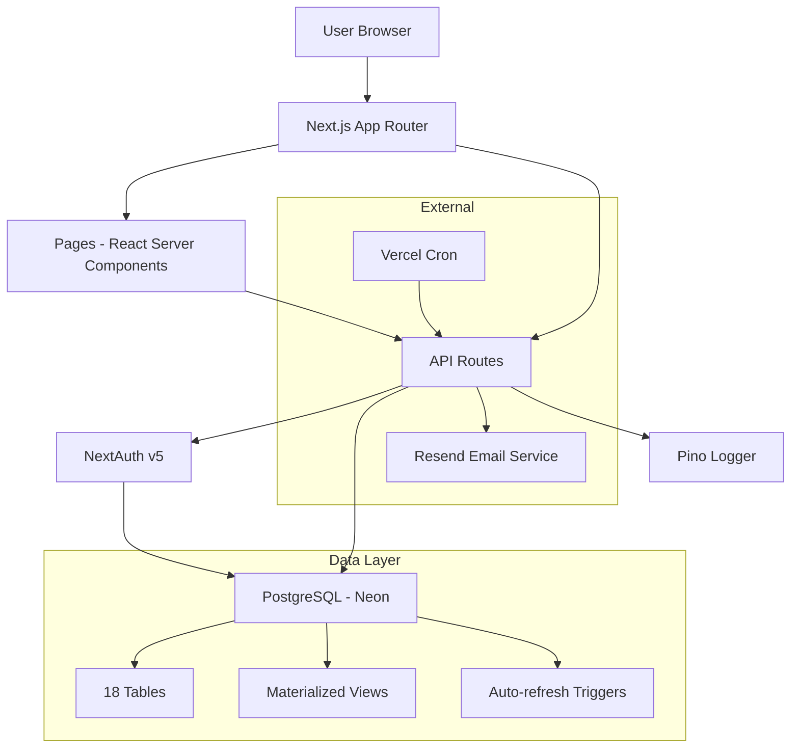

# 99_AI_CONTEXT_PACK.md
**Checkpoint Date**: 2026-03-15 (UTC-3)
**Commit**: dad0911079482b15ff5c43e9ef73a44b4c752699
**Branch**: main

---

## Resumo Executivo

**Convoca** é uma aplicação web para gerenciamento de peladas (partidas de futebol amador) construída com Next.js 16, React 19, PostgreSQL (Neon), e NextAuth v5. O projeto está em fase MVP com funcionalidades core implementadas mas com gaps significativos em testes, segurança e documentação.

### Stack Tecnológico

- **Framework**: Next.js 16.1.1 (App Router)
- **Frontend**: React 19.2.0, TypeScript 5, Tailwind CSS 3.4.1, shadcn/ui
- **Database**: Neon PostgreSQL Serverless (raw SQL via `postgres@3.4.8`)
- **Auth**: NextAuth v5.0.0-beta.25 (credentials provider)
- **State**: Zustand 5.0.8
- **Email**: Resend 6.9.3
- **Deployment**: Vercel

### Arquitetura Overview



### Módulos Funcionais

1. **Authentication** - Signup, Signin, Password Reset
2. **Groups** - CRUD de grupos de futebol
3. **Members** - Gestão de membros (admin/member roles)
4. **Events** - Criação e gestão de peladas
5. **RSVP** - Sistema de confirmação com waitlist
6. **Teams** - Sorteio de times (random)
7. **Match** - Registro de ações (gols, assists, cards)
8. **Voting** - Sistema de votação pós-jogo (MVP)
9. **Rankings** - Rankings e estatísticas
10. **Payments** - Cobranças e despesas
11. **Invites** - Sistema de convites para grupos
12. **Venues** - Locais de jogo
13. **Recurrences** - Eventos recorrentes

### Status do Projeto

✅ **Implementado**: Core MVP features (auth, groups, events, RSVP, teams, payments)
⚠️ **Em Beta**: NextAuth v5
❌ **Ausente**: Testes, middleware, rate limiting, email verification

---

## 1. PERGUNTAS EM ABERTO

### Comportamento da Aplicação

1. **Middleware Ausente**: Como as páginas protegidas estão sendo protegidas sem `middleware.ts`?
   - Verificar se há client-side redirects em `layout.tsx` ou `page.tsx`
   - Testar se há flash de conteúdo não autorizado

2. **Password Reset Schema**: Colunas `reset_token` e `reset_token_expires` existem na tabela `users`?
   - Arquivo `schema.sql` não mostra essas colunas
   - API de reset password referencia essas colunas
   - **Ação**: Verificar schema real no Neon Console

3. **Wallets Foreign Key**: Como `wallets.owner_id` referencia grupos/usuários sem FK explícita?
   - Possível data integrity issue
   - **Ação**: Testar deleção de grupo/usuário e verificar wallets órfãs

4. **RSVP Waitlist Logic**: O algoritmo de promoção de waitlist funciona corretamente em edge cases?
   - Múltiplos usuários saindo simultaneamente
   - Goleiros vs jogadores de linha
   - **Ação**: Teste de carga/concorrência

5. **Team Draw**: Algoritmo de sorteio é puramente random ou considera skill balancing?
   - Código sugere random, mas `base_rating` em `group_members` não é usado
   - **Ação**: Confirmar requisito de negócio

6. **Materialized View Refresh**: Trigger `CONCURRENTLY` pode falhar se não houver UNIQUE index?
   - Index existe: `idx_mv_scoreboard_event_team`
   - **Ação**: Verificar se refresh está funcionando em produção

7. **Cron Job Authorization**: Como endpoints `/api/cron/*` são protegidos?
   - Não vejo verificação de Vercel Cron secret
   - **Ação**: Verificar `vercel.json` e proteção de endpoints

8. **Event Status Transitions**: Quem/quando muda status de `scheduled` → `live` → `finished`?
   - Não encontrei endpoint automático
   - **Ação**: Verificar se é manual ou automático

9. **Scoring Config Impact**: Mudanças em `scoring_configs` recalculam rankings históricos?
   - **Ação**: Testar e documentar comportamento

10. **Soft Delete**: Grupos/eventos deletados são hard delete?
    - Perda de histórico de estatísticas
    - **Ação**: Considerar soft delete

### Integrações Externas

11. **Resend Email Templates**: Onde estão os templates de email?
    - Inline no código ou templates do Resend?

12. **Vercel Cron Schedule**: Qual a frequência dos cron jobs?
    - Não encontrei `vercel.json`

13. **Database Backups**: Script `src/db/backup-supabase.sh` funciona com Neon?
    - Neon não é Supabase
    - Nome do script pode ser legacy

### Performance

14. **N+1 Queries**: Endpoints de rankings/stats fazem múltiplas queries?
    - Verificar performance com dataset grande

15. **Pagination**: Endpoints de listagem têm paginação?
    - Não vi implementação em `/api/groups` ou `/api/events`

---

## 2. RISCOS CRÍTICOS

### Segurança

#### 🔴 CRÍTICO

1. **No Rate Limiting**
   - **Risco**: Brute force em `/api/auth/signup` e signin
   - **Impacto**: Account takeover, resource exhaustion
   - **Mitigação**: Implementar Upstash Rate Limit ou similar

2. **No Email Verification**
   - **Risco**: Usuários com emails falsos, spam
   - **Impacto**: Qualidade de dados, abuse
   - **Mitigação**: Email verification flow

3. **Middleware Ausente**
   - **Risco**: Flash de conteúdo não autorizado, rotas desprotegidas
   - **Impacto**: Information disclosure
   - **Mitigação**: Criar `middleware.ts`

4. **Cron Endpoints Desprotegidos (?)**
   - **Risco**: Qualquer pessoa pode triggerar cron jobs
   - **Impacto**: Resource exhaustion, data corruption
   - **Mitigação**: Verificar/adicionar Vercel Cron secret validation

5. **No SQL Injection Protection (?)**
   - **Risco**: Queries usando `sql` template literal devem ser seguras, mas precisa auditoria
   - **Impacto**: Data breach, data loss
   - **Mitigação**: Auditar todas queries, especialmente com user input

#### ⚠️ ALTO

6. **NextAuth v5 Beta**
   - **Risco**: Bugs, breaking changes, falta de suporte
   - **Impacto**: Auth failures, vulnerabilidades
   - **Mitigação**: Monitorar releases, planejar upgrade para stable

7. **No Account Lockout**
   - **Risco**: Brute force de passwords
   - **Impacto**: Account takeover
   - **Mitigação**: Implementar lockout após N tentativas

8. **No Session Management**
   - **Risco**: Sessões ativas não podem ser revogadas
   - **Impacto**: Impossível logout remoto após compromisso
   - **Mitigação**: Database sessions ou blacklist de JWTs

9. **Password Reset Token Storage (?)**
   - **Risco**: Se tokens não têm expiry curto, podem ser usados indefinidamente
   - **Impacto**: Account takeover
   - **Mitigação**: Verificar implementação, adicionar expiry de 1h

#### ⚠️ MÉDIO

10. **No CSRF Protection (além do padrão NextAuth)**
    - **Risco**: CSRF em endpoints que mudam estado
    - **Impacto**: Actions não autorizadas
    - **Mitigação**: Verificar se NextAuth CSRF token é suficiente

11. **No Input Sanitization**
    - **Risco**: XSS via campos de texto (description, metadata JSONB)
    - **Impacto**: XSS attacks
    - **Mitigação**: Sanitize inputs, use CSP headers

### Data Integrity

#### 🔴 CRÍTICO

12. **Wallets Orphan Risk**
    - **Risco**: `wallets.owner_id` sem FK pode criar wallets órfãs
    - **Impacto**: Data inconsistency, financial discrepancies
    - **Mitigação**: Adicionar lógica de cleanup ou FK + CHECK constraint

13. **No Transaction Wrapping**
    - **Risco**: Group creation cria grupo + member + wallet sem transação
    - **Impacto**: Partial failures deixam dados inconsistentes
    - **Mitigação**: Wrap em `BEGIN/COMMIT` ou usar `sql.begin()`

#### ⚠️ ALTO

14. **Concurrent RSVP Issues**
    - **Risco**: Race condition em waitlist promotion
    - **Impacto**: Overbooking ou underbooking
    - **Mitigação**: Row-level locking ou serializable transactions

15. **Event Actions Deletion**
    - **Risco**: Deletar goal/assist não recalcula scoreboard atomicamente
    - **Impacto**: Scoreboard desatualizado até próximo trigger
    - **Mitigação**: Trigger parece cobrir, mas testar edge cases

### Performance

#### ⚠️ ALTO

16. **No Pagination**
    - **Risco**: Endpoints listam TODOS os itens sem limite
    - **Impacto**: Timeout, high memory, poor UX
    - **Mitigação**: Implementar cursor-based pagination

17. **Materialized View Refresh Performance**
    - **Risco**: `REFRESH CONCURRENTLY` pode ser lento com muitos dados
    - **Impacto**: Slow writes em `event_actions`
    - **Mitigação**: Monitorar performance, considerar async refresh

18. **N+1 Queries em Rankings**
    - **Risco**: Endpoints de stats podem fazer múltiplas queries
    - **Impacto**: Slow response times
    - **Mitigação**: Auditar e otimizar com JOINs

### Operacional

#### ⚠️ ALTO

19. **No Testes**
    - **Risco**: Regressions não detectadas
    - **Impacto**: Bugs em produção, user frustration
    - **Mitigação**: Implementar testing suite (Vitest + Testing Library)

20. **No Monitoring/Alerting**
    - **Risco**: Erros em produção não são detectados rapidamente
    - **Impacto**: Poor UX, data loss
    - **Mitigação**: Implementar Sentry, Vercel Analytics, ou similar

21. **No Database Migrations Tooling**
    - **Risco**: Mudanças de schema são manuais e error-prone
    - **Impacto**: Schema drift, deployment failures
    - **Mitigação**: Implementar migration tool (ex: node-pg-migrate)

---

## 3. MAPA FEATURE → ROTAS → ENDPOINTS → TABELAS

### Authentication

| Feature | UI Route | API Endpoint | HTTP | Tables | Side Effects |
|---------|----------|--------------|------|--------|--------------|
| Signup | `/auth/signup` | `/api/auth/signup` | POST | `users`, `wallets` | Email lowercase, password hash |
| Signin | `/auth/signin` | `/api/auth/callback/credentials` | POST | `users` | JWT creation, cookie set |
| Forgot Password | `/auth/forgot-password` | `/api/auth/forgot-password` | POST | `users` | Reset token gen, email send |
| Reset Password | `/auth/reset-password` | `/api/auth/reset-password` | POST | `users` | Password hash, token clear |
| Get Current User | - | (via `requireAuth()`) | - | `users` | - |

### Groups

| Feature | UI Route | API Endpoint | HTTP | Tables | Side Effects |
|---------|----------|--------------|------|--------|--------------|
| List Groups | `/dashboard` | `/api/groups` | GET | `groups`, `group_members` | - |
| Create Group | `/groups/new` | `/api/groups` | POST | `groups`, `group_members`, `wallets`, `invites` | Creator = admin, wallet creation, invite code gen |
| View Group | `/groups/[groupId]` | `/api/groups/[groupId]` | GET | `groups`, `group_members` | - |
| Edit Group | `/groups/[groupId]/settings` | `/api/groups/[groupId]` | PATCH | `groups` | Admin only |
| Delete Group | - | `/api/groups/[groupId]` | DELETE | `groups` (CASCADE) | Deletes members, events, etc. |
| Join Group | `/groups/join` | `/api/groups/join` | POST | `invites`, `group_members` | Increment invite used_count |
| Group Stats | `/groups/[groupId]` | `/api/groups/[groupId]/stats` | GET | `events`, `event_attendance`, `event_actions`, `player_ratings` | Aggregate stats |
| My Stats | `/groups/[groupId]` | `/api/groups/[groupId]/my-stats` | GET | `events`, `event_attendance`, `event_actions`, `player_ratings` | User-specific stats |
| Rankings | `/groups/[groupId]` | `/api/groups/[groupId]/rankings` | GET | `group_members`, `events`, `teams`, `team_members`, `event_actions`, `player_ratings`, `scoring_configs` | Complex aggregation |

### Members

| Feature | UI Route | API Endpoint | HTTP | Tables | Side Effects |
|---------|----------|--------------|------|--------|--------------|
| List Members | `/groups/[groupId]/settings` | `/api/groups/[groupId]/members` | GET | `group_members`, `users` | - |
| Create User + Add | `/groups/[groupId]/settings` | `/api/groups/[groupId]/members/create-user` | POST | `users`, `group_members`, `wallets` | Password gen, email send (?) |
| Update Member | `/groups/[groupId]/settings` | `/api/groups/[groupId]/members/[userId]` | PATCH | `group_members` | Role change, rating change |
| Remove Member | `/groups/[groupId]/settings` | `/api/groups/[groupId]/members/[userId]` | DELETE | `group_members` | - |

### Invites

| Feature | UI Route | API Endpoint | HTTP | Tables | Side Effects |
|---------|----------|--------------|------|--------|--------------|
| List Invites | `/groups/[groupId]/settings` | `/api/groups/[groupId]/invites` | GET | `invites` | - |
| Create Invite | `/groups/[groupId]/settings` | `/api/groups/[groupId]/invites` | POST | `invites` | Code generation |
| Delete Invite | `/groups/[groupId]/settings` | `/api/groups/[groupId]/invites/[inviteId]` | DELETE | `invites` | - |

### Events

| Feature | UI Route | API Endpoint | HTTP | Tables | Side Effects |
|---------|----------|--------------|------|--------|--------------|
| List Events | `/dashboard`, `/groups/[groupId]` | `/api/events` | GET | `events`, `venues` | - |
| Create Event | `/groups/[groupId]/events/new` | `/api/events` | POST | `events` | - |
| View Event | `/groups/[groupId]/events/[eventId]` | `/api/events/[eventId]` | GET | `events`, `venues`, `event_attendance`, `teams`, `team_members` | - |
| Update Event | `/groups/[groupId]/events/[eventId]` | `/api/events/[eventId]` | PATCH | `events` | Admin only |
| Delete Event | - | `/api/events/[eventId]` | DELETE | `events` (CASCADE) | Deletes attendance, teams, etc. |
| RSVP | `/groups/[groupId]/events/[eventId]` | `/api/events/[eventId]/rsvp` | POST | `event_attendance` | Waitlist logic, promotion |
| Admin RSVP | `/groups/[groupId]/events/[eventId]` | `/api/events/[eventId]/admin-rsvp` | POST | `event_attendance` | Admin manages user RSVP |

### Teams (Draw)

| Feature | UI Route | API Endpoint | HTTP | Tables | Side Effects |
|---------|----------|--------------|------|--------|--------------|
| Draw Teams | `/groups/[groupId]/events/[eventId]` | `/api/events/[eventId]/draw` | POST | `teams`, `team_members`, `draw_configs` | Random assignment |
| View Teams | `/groups/[groupId]/events/[eventId]` | `/api/events/[eventId]/teams` | GET | `teams`, `team_members`, `users` | - |
| Swap Players | `/groups/[groupId]/events/[eventId]` | `/api/events/[eventId]/teams/swap` | POST | `team_members` | Update team assignments |
| Update Team | - | `/api/events/[eventId]/teams/[teamId]` | PATCH | `teams` | Name/winner change |

### Match Actions

| Feature | UI Route | API Endpoint | HTTP | Tables | Side Effects |
|---------|----------|--------------|------|--------|--------------|
| List Actions | `/groups/[groupId]/events/[eventId]` | `/api/events/[eventId]/actions` | GET | `event_actions`, `users` | - |
| Record Action | `/groups/[groupId]/events/[eventId]` | `/api/events/[eventId]/actions` | POST | `event_actions` | Trigger scoreboard refresh |
| Delete Action | - | `/api/events/[eventId]/actions` | DELETE | `event_actions` | Trigger scoreboard refresh |
| View Scoreboard | `/groups/[groupId]/events/[eventId]` | (via MV) | GET | `mv_event_scoreboard` | - |

### Voting/Ratings

| Feature | UI Route | API Endpoint | HTTP | Tables | Side Effects |
|---------|----------|--------------|------|--------|--------------|
| Vote for Player | `/groups/[groupId]/events/[eventId]` | `/api/events/[eventId]/ratings` | POST | `player_ratings` | Upsert vote |
| Get Ratings | `/groups/[groupId]/events/[eventId]` | `/api/events/[eventId]/ratings` | GET | `player_ratings`, `users` | Aggregate votes |
| Finalize Voting | - | `/api/events/[eventId]/ratings/finalize` | POST | `player_ratings` (?) | Lock voting |
| Tiebreaker Status | - | `/api/events/[eventId]/ratings/tiebreaker` | GET | `player_ratings` | Check for ties |
| Tiebreaker Vote | - | `/api/events/[eventId]/ratings/tiebreaker/vote` | POST | (?) | Secondary voting |
| Admin Decide Tiebreaker | - | `/api/events/[eventId]/ratings/tiebreaker/decide` | POST | (?) | Admin breaks tie |

### Finances

| Feature | UI Route | API Endpoint | HTTP | Tables | Side Effects |
|---------|----------|--------------|------|--------|--------------|
| List Charges | `/groups/[groupId]/payments` | `/api/groups/[groupId]/charges` | GET | `charges`, `users` | - |
| Create Charge | `/groups/[groupId]/payments` | `/api/groups/[groupId]/charges` | POST | `charges` | - |
| Update Charge | `/groups/[groupId]/payments` | `/api/groups/[groupId]/charges/[chargeId]` | PATCH | `charges` | Status change (paid) |
| Delete Charge | `/groups/[groupId]/payments` | `/api/groups/[groupId]/charges/[chargeId]` | DELETE | `charges` | - |
| List Expenses | `/groups/[groupId]/payments` | `/api/groups/[groupId]/expenses` | GET | `expenses` | - |
| Create Expense | `/groups/[groupId]/payments` | `/api/groups/[groupId]/expenses` | POST | `expenses` | - |
| Update Expense | - | `/api/groups/[groupId]/expenses/[expenseId]` | PATCH | `expenses` | - |
| Delete Expense | - | `/api/groups/[groupId]/expenses/[expenseId]` | DELETE | `expenses` | - |
| Pending Charges Count | (Dashboard) | `/api/users/me/pending-charges-count` | GET | `charges` | Badge count |

### Recurrences

| Feature | UI Route | API Endpoint | HTTP | Tables | Side Effects |
|---------|----------|--------------|------|--------|--------------|
| List Recurrences | `/groups/[groupId]/settings` | `/api/groups/[groupId]/recurrences` | GET | `event_recurrences`, `venues` | - |
| Create Recurrence | `/groups/[groupId]/settings` | `/api/groups/[groupId]/recurrences` | POST | `event_recurrences` | - |
| Update Recurrence | `/groups/[groupId]/settings` | `/api/groups/[groupId]/recurrences/[recurrenceId]` | PATCH | `event_recurrences` | - |
| Delete Recurrence | `/groups/[groupId]/settings` | `/api/groups/[groupId]/recurrences/[recurrenceId]` | DELETE | `event_recurrences` | - |

### Cron Jobs

| Feature | UI Route | API Endpoint | HTTP | Tables | Side Effects |
|---------|----------|--------------|------|--------|--------------|
| Generate Monthly Charges | - | `/api/cron/generate-monthly-charges` | POST | `charges`, `group_members` | Bulk insert monthly charges |
| Generate Recurring Events | - | `/api/cron/generate-recurring-events` | POST | `events`, `event_recurrences` | Create events from recurrences |

### Config

| Feature | UI Route | API Endpoint | HTTP | Tables | Side Effects |
|---------|----------|--------------|------|--------|--------------|
| Draw Config | `/groups/[groupId]/settings` | `/api/groups/[groupId]/draw-config` | GET/PATCH | `draw_configs` | - |
| Event Settings | `/groups/[groupId]/settings` | `/api/groups/[groupId]/event-settings` | GET/PATCH | `event_settings` | - |
| Scoring Config | `/groups/[groupId]/settings` | `/api/groups/[groupId]/scoring-config` | GET/PATCH | `scoring_configs` | Affects rankings calculation |

### Users

| Feature | UI Route | API Endpoint | HTTP | Tables | Side Effects |
|---------|----------|--------------|------|--------|--------------|
| Search Users | `/groups/[groupId]/settings` | `/api/users/search` | GET | `users` | Fuzzy search by email/name |

---

## 4. RECOMENDAÇÕES PRIORITIZADAS

### 🔴 PRIORIDADE CRÍTICA (P0) - Fazer AGORA

| # | Recomendação | Impacto | Esforço | Justificativa |
|---|--------------|---------|---------|---------------|
| 1 | **Criar `middleware.ts`** | 🔴 Alto | 🟢 Baixo | Proteção centralizada de rotas, prevenir flash de conteúdo não autorizado |
| 2 | **Adicionar Rate Limiting** | 🔴 Alto | 🟡 Médio | Prevenir brute force em auth endpoints |
| 3 | **Validar/Proteger Cron Endpoints** | 🔴 Alto | 🟢 Baixo | Prevenir execução não autorizada de cron jobs |
| 4 | **Wrap Multi-Step Operations em Transactions** | 🔴 Alto | 🟡 Médio | Garantir data integrity (ex: group creation) |
| 5 | **Adicionar Monitoring (Sentry)** | 🔴 Alto | 🟡 Médio | Detectar erros em produção rapidamente |

### ⚠️ PRIORIDADE ALTA (P1) - Próximos 30 dias

| # | Recomendação | Impacto | Esforço | Justificativa |
|---|--------------|---------|---------|---------------|
| 6 | **Implementar Testing Suite** | 🟠 Alto | 🔴 Alto | Prevenir regressions, aumentar confiabilidade |
| 7 | **Adicionar Pagination** | 🟠 Alto | 🟡 Médio | Performance e UX em listas longas |
| 8 | **Email Verification** | 🟠 Alto | 🟡 Médio | Qualidade de dados, prevenir abuse |
| 9 | **Account Lockout** | 🟠 Alto | 🟢 Baixo | Adicional proteção contra brute force |
| 10 | **Database Migration Tooling** | 🟠 Alto | 🟡 Médio | Deployment reliability, schema versioning |
| 11 | **Auditar SQL Injection Risks** | 🟠 Alto | 🟡 Médio | Garantir que template literals são seguros |
| 12 | **Fix Wallets FK Issue** | 🟠 Alto | 🟢 Baixo | Data integrity, prevenir orphaned wallets |

### 🟡 PRIORIDADE MÉDIA (P2) - Próximos 90 dias

| # | Recomendação | Impacto | Esforço | Justificativa |
|---|--------------|---------|---------|---------------|
| 13 | **Planejar Upgrade NextAuth v5 Stable** | 🟡 Médio | 🟡 Médio | Segurança e suporte |
| 14 | **Implementar Soft Delete** | 🟡 Médio | 🟡 Médio | Preservar histórico, reversibilidade |
| 15 | **Session Management UI** | 🟡 Médio | 🟡 Médio | Segurança, allow users to revoke sessions |
| 16 | **Optimize Rankings Queries** | 🟡 Médio | 🟡 Médio | Performance com grandes datasets |
| 17 | **Add MFA (Optional)** | 🟡 Médio | 🔴 Alto | Enhanced security for admins |
| 18 | **CSP Headers** | 🟡 Médio | 🟢 Baixo | XSS protection |
| 19 | **Input Sanitization Library** | 🟡 Médio | 🟢 Baixo | XSS protection |
| 20 | **Database Backups Automation** | 🟡 Médio | 🟡 Médio | Disaster recovery |

### 🟢 PRIORIDADE BAIXA (P3) - Backlog

| # | Recomendação | Impacto | Esforço | Justificativa |
|---|--------------|---------|---------|---------------|
| 21 | **Refresh Token Rotation** | 🟢 Baixo | 🔴 Alto | Enhanced security (overkill para MVP) |
| 22 | **Audit Log Table** | 🟢 Baixo | 🟡 Médio | Compliance, debugging |
| 23 | **Partial Indexes** | 🟢 Baixo | 🟢 Baixo | Performance optimization (premature?) |
| 24 | **Table Partitioning** | 🟢 Baixo | 🔴 Alto | Performance (only if scale demands) |
| 25 | **Normalize player_ratings.tags** | 🟢 Baixo | 🟡 Médio | Query flexibility (low priority) |

---

## 5. PRINCIPAIS ACHADOS

### ✅ Pontos Fortes

1. **Stack Moderno**: Next.js 16, React 19, PostgreSQL - excelente escolha
2. **Raw SQL**: Sem ORM, máximo controle e performance
3. **Schema Bem Estruturado**: Normalizado, com FKs e constraints
4. **Indexes Apropriados**: Performance otimizada para queries comuns
5. **Materialized View**: Scoreboard em tempo real com auto-refresh
6. **API Padrão Consistente**: `requireAuth()`, error handling, logging
7. **Modular**: Componentes shadcn/ui bem organizados
8. **Type Safety**: TypeScript + Zod validation
9. **Serverless-Ready**: Neon PostgreSQL, Vercel deployment

### ⚠️ Gaps Críticos

1. **Testes Ausentes**: Zero cobertura de testes
2. **Middleware Ausente**: Proteção de rotas não centralizada
3. **Rate Limiting Ausente**: Vulnerável a brute force
4. **No Email Verification**: Qualidade de dados comprometida
5. **NextAuth Beta**: Potencial instabilidade
6. **No Pagination**: Performance issues com dados crescentes
7. **Transaction Safety**: Operações multi-step não atômicas
8. **Monitoring Gaps**: Sem Sentry ou similar

### 💡 Oportunidades de Melhoria

1. **Smart Team Draw**: Usar `base_rating` para balanceamento
2. **Real-time Updates**: WebSockets para scoreboard live
3. **Mobile App**: React Native com shared API
4. **Advanced Analytics**: Dashboards de performance
5. **Gamification**: Badges, achievements, leaderboards
6. **Social Features**: Share results, player profiles
7. **Payment Integration**: Stripe/Pagar.me para cobranças
8. **Push Notifications**: Lembretes de eventos

---

## 6. PRÓXIMOS PASSOS RECOMENDADOS

### Imediato (Esta Semana)

1. **Criar `middleware.ts`** para proteção de rotas
2. **Adicionar Vercel Cron secret validation** nos endpoints de cron
3. **Verificar se password reset schema está completo** (colunas `reset_token*`)
4. **Wrap group creation em transaction**

### Curto Prazo (Próximas 2 Semanas)

5. **Implementar Upstash Rate Limit** em auth endpoints
6. **Adicionar Sentry** para error tracking
7. **Iniciar test suite** (começar por utils e validations)
8. **Adicionar pagination** em `/api/groups` e `/api/events`

### Médio Prazo (Próximo Mês)

9. **Email verification flow**
10. **Account lockout** após tentativas falhas
11. **Database migration tooling** (ex: node-pg-migrate)
12. **Auditar todas queries SQL** para injection risks

### Longo Prazo (Próximos 3 Meses)

13. **Soft delete** para grupos e eventos
14. **MFA opcional** para admins
15. **Session management UI**
16. **Performance optimization** (rankings queries, MV refresh)
17. **Planejar upgrade NextAuth v5 stable**

---

## 7. MÉTRICAS DE QUALIDADE

| Métrica | Status | Objetivo |
|---------|--------|----------|
| **Code Coverage** | 0% ❌ | > 80% ✅ |
| **TypeScript Strict** | ✅ | ✅ |
| **ESLint Errors** | ? | 0 ✅ |
| **Build Warnings** | ? | 0 ✅ |
| **Security Audit** | ❌ Not Done | ✅ Pass |
| **Performance (Lighthouse)** | ? | > 90 ✅ |
| **Accessibility** | ? | > 90 ✅ |

---

## 8. ARQUITETURA DECISIONS LOG (ADRs Inferidas)

| # | Decision | Rationale | Trade-offs |
|---|----------|-----------|------------|
| 1 | **Raw SQL (No ORM)** | Máximo controle, performance | Mais código boilerplate, sem type safety automático |
| 2 | **NextAuth v5 Beta** | Latest features, melhor DX | Instabilidade potencial, breaking changes |
| 3 | **JWT Sessions** | Stateless, escalável | Não pode revogar (sem database sessions) |
| 4 | **Zustand (não React Query)** | Simplicidade, menos boilerplate | Sem cache/refetch automático de API |
| 5 | **Materialized View** | Performance do scoreboard | Overhead de refresh, eventual consistency |
| 6 | **UUID PKs** | Distribuído-friendly, sem collisions | Maior storage, indices maiores |
| 7 | **Vercel Deployment** | Serverless, fácil deploy | Vendor lock-in, cold starts |
| 8 | **Neon PostgreSQL** | Serverless, autoscaling | Custo, vendor lock-in |
| 9 | **shadcn/ui** | Customizável, own components | Mais setup que lib pronta |
| 10 | **Credentials Auth (não OAuth)** | Simplicidade, controle total | Sem social login (pode ser adicionado depois) |

---

## 9. GLOSSÁRIO DE TERMOS DO DOMÍNIO

| Termo PT-BR | Inglês | Descrição |
|-------------|--------|-----------|
| Pelada | Pickup Game | Partida de futebol amador informal |
| Goleiro | Goalkeeper (GK) | Posição de goleiro |
| Linha | Line Player | Jogador de linha (não goleiro) |
| Sorteio | Draw | Sorteio de times |
| Lista de Espera | Waitlist | Fila de jogadores quando evento lotado |
| Mensalista | Monthly Member | Membro que paga mensalidade fixa |
| Diária | Daily Fee | Taxa por jogo individual |
| Garçom | "Waiter" (Assister) | Jogador que dá muitas assistências |
| Paredão | "Wall" (GK) | Goleiro que defende muito |
| Pereba | "Noob" | Jogador ruim (tag negativa) |
| MVP | MVP | Melhor jogador da partida |

---

## 10. CONTACT POINTS PARA OUTRA IA

Se você é uma IA trabalhando neste projeto após este checkpoint:

### Arquivos Críticos para Entender o Sistema

1. **`src/db/migrations/schema.sql`** - Schema completo do banco
2. **`src/lib/auth.ts`** - Autenticação NextAuth
3. **`src/lib/auth-helpers.ts`** - getCurrentUser(), requireAuth()
4. **`src/lib/validations.ts`** - Zod schemas
5. **`src/app/api/groups/route.ts`** - Exemplo de padrão de API route
6. **`src/app/api/events/[eventId]/rsvp/route.ts`** - Lógica complexa de RSVP

### Padrões de Código a Seguir

- **API Routes**: Sempre usar `requireAuth()`, try/catch, logger
- **Validação**: Zod schemas em `validations.ts`
- **Queries**: Raw SQL via `sql` template literal
- **Erros**: Portuguese messages, appropriate HTTP status
- **Logging**: Pino logger (structured logging)

### Comandos Importantes

```bash
pnpm dev          # Dev server
pnpm build        # Build (DEVE passar)
pnpm lint         # Linter
```

### Variáveis de Ambiente Necessárias

```bash
DATABASE_URL      # Neon PostgreSQL
AUTH_SECRET       # NextAuth secret
NEXTAUTH_URL      # App URL
RESEND_API_KEY    # Email service (?)
```

### Warnings Importantes

- ❌ **NUNCA** adicionar ORM (regra absoluta do projeto)
- ❌ **NUNCA** fazer force push
- ✅ **SEMPRE** testar `pnpm build` antes de commit
- ✅ **SEMPRE** usar português em mensagens de erro user-facing
- ✅ **SEMPRE** usar inglês no código (nomes de variáveis, funções)

---

**Fim do AI Context Pack**
**Data**: 2026-03-15
**Status**: ✅ Checkpoint Completo
