# COMPARATIVO VISUAL — Convoca App (2026-04-11)

> Comparação entre o que o **CLAUDE.md documenta** vs o que o **código realmente implementa**,  
> com diagramas Mermaid para visualização da arquitetura real.

---

## 1. STACK — CLAUDE.md vs Código Real

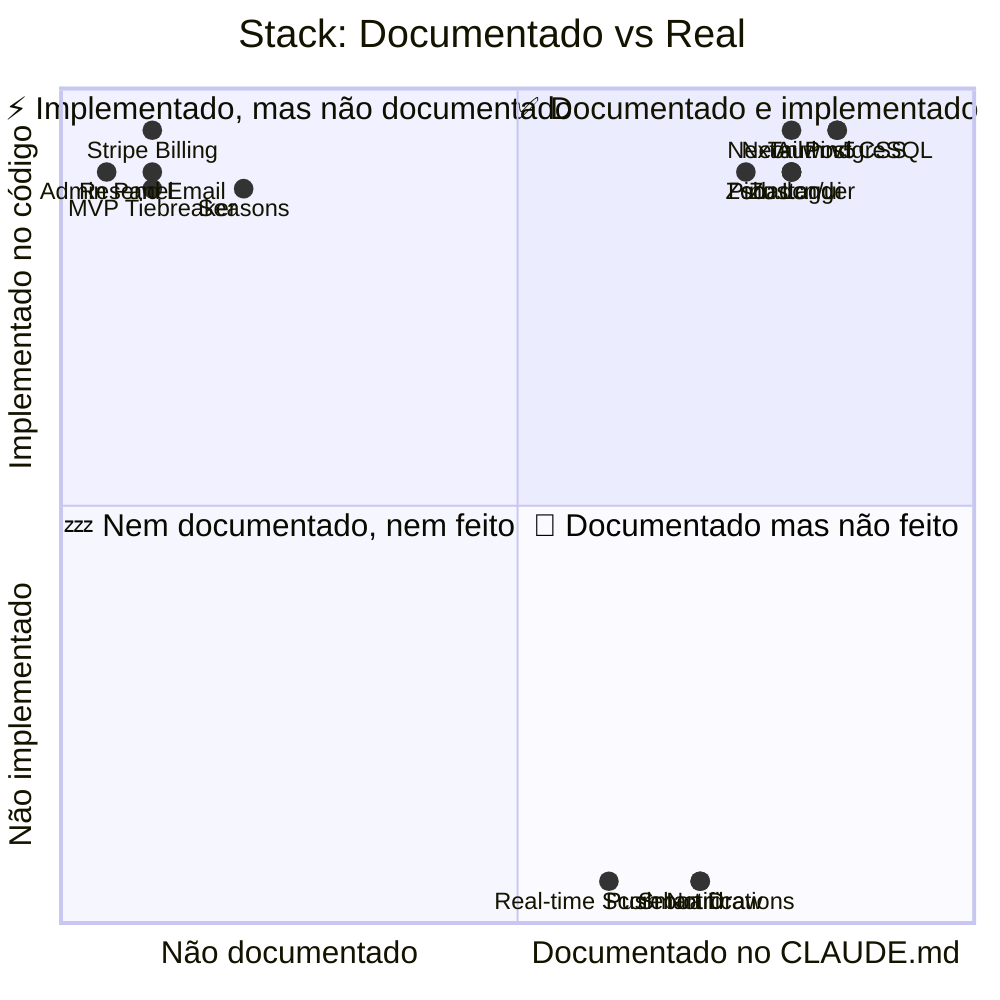

---

## 2. ARQUITETURA GERAL DO SISTEMA

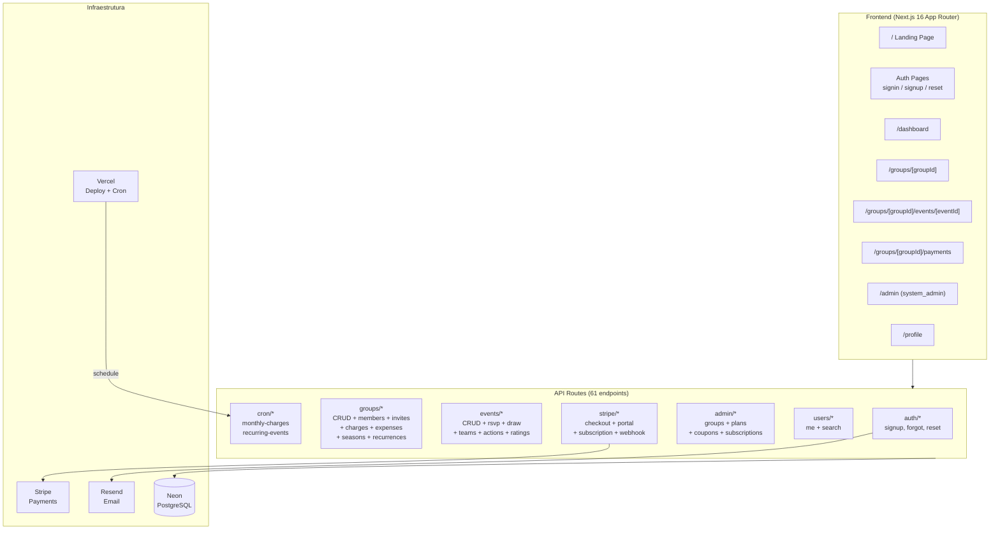

---

## 3. MODELO DE DADOS — ENTIDADES E RELACIONAMENTOS

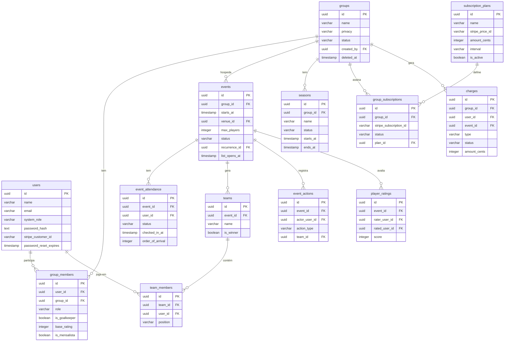

---

## 4. FLUXO DE AUTENTICAÇÃO E ACESSO

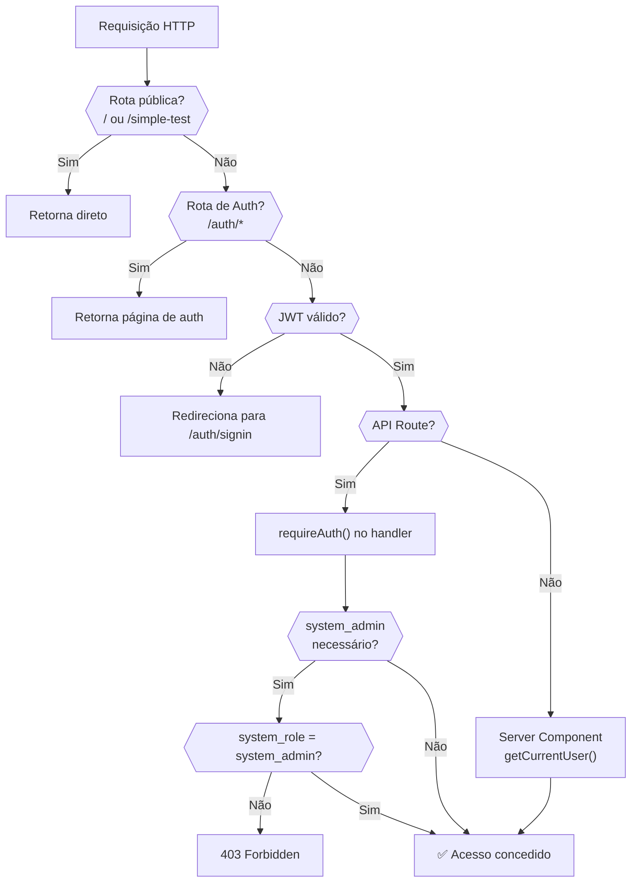

---

## 5. FLUXO COMPLETO DE BILLING (STRIPE)

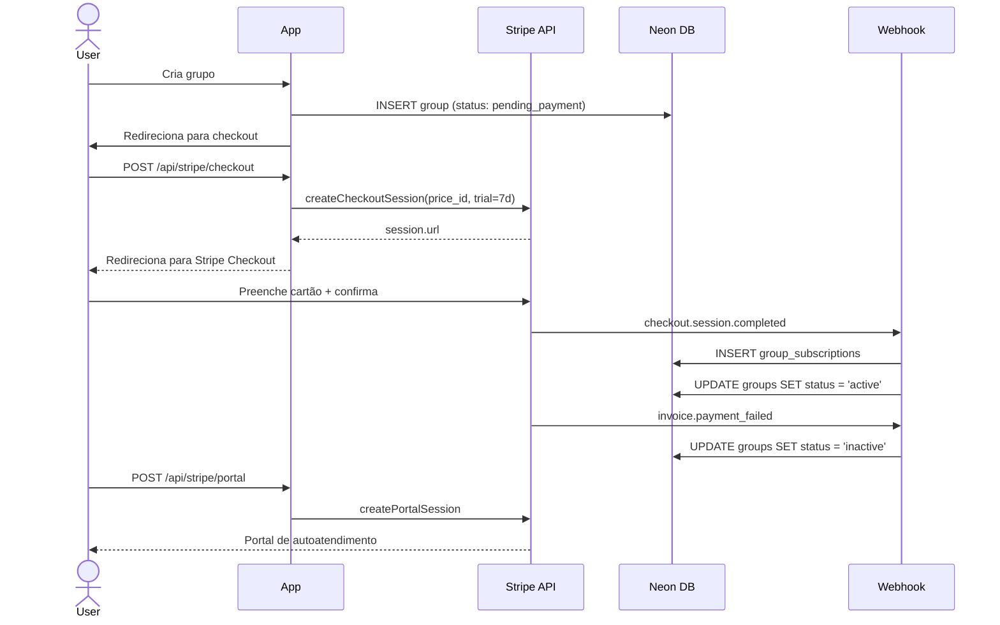

---

## 6. FLUXO DE EVENTO: DO RSVP AO SORTEIO

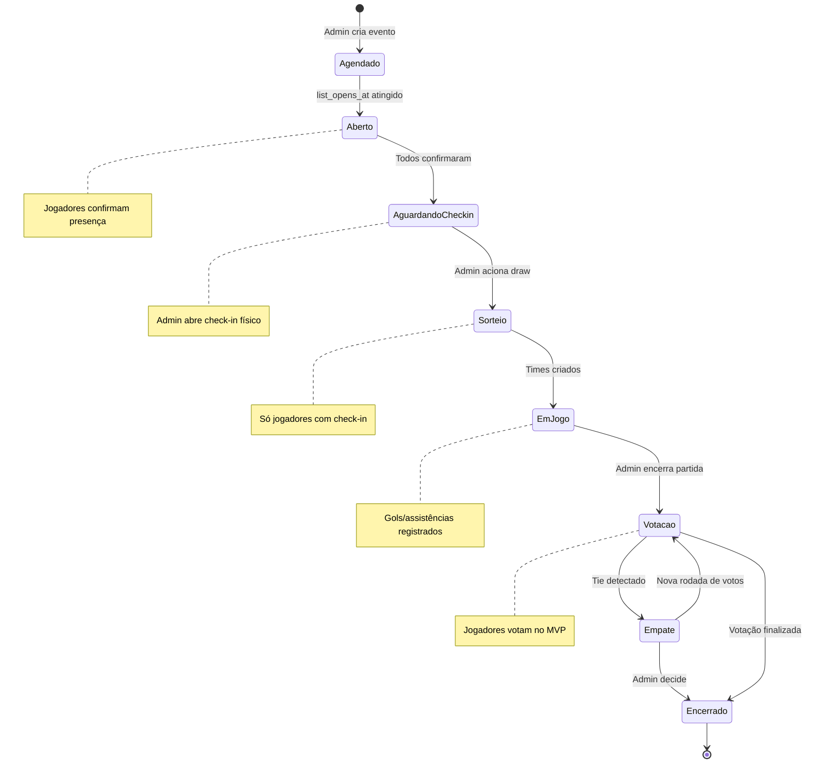

---

## 7. COMPARATIVO CLAUDE.md vs REALIDADE — STATUS POR MÓDULO

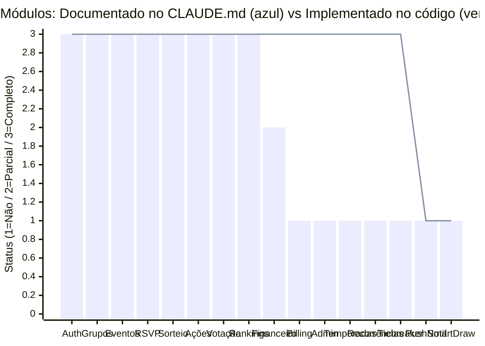

> **Legenda:** Barras = documentado no CLAUDE.md | Linha = implementado no código  
> 1 = não presente | 2 = parcialmente | 3 = completo

---

## 8. MAPA DE DEPENDÊNCIAS CRÍTICAS

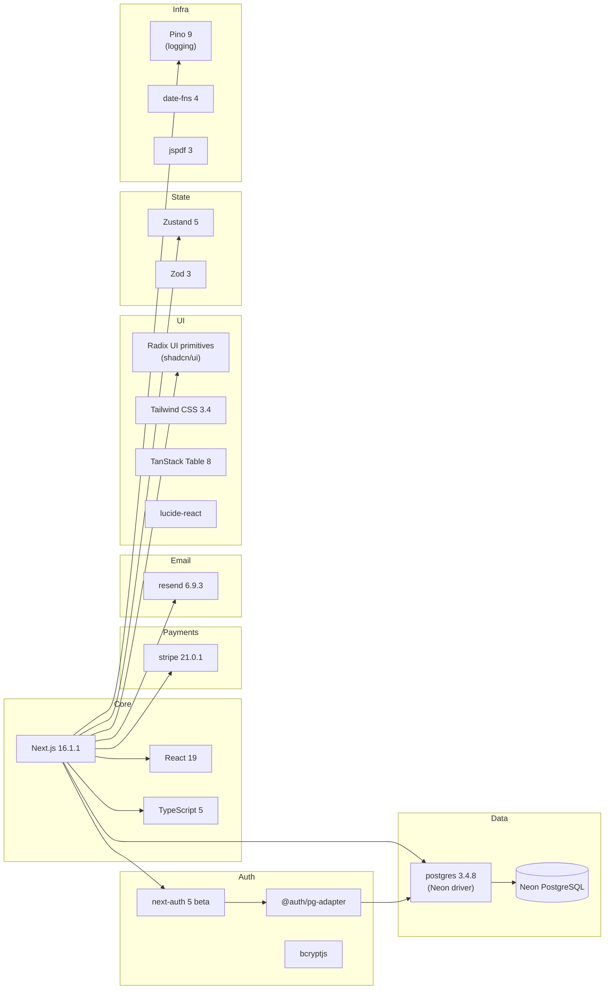

---

## 9. ARQUITETURA DE COMPONENTES (FRONTEND)

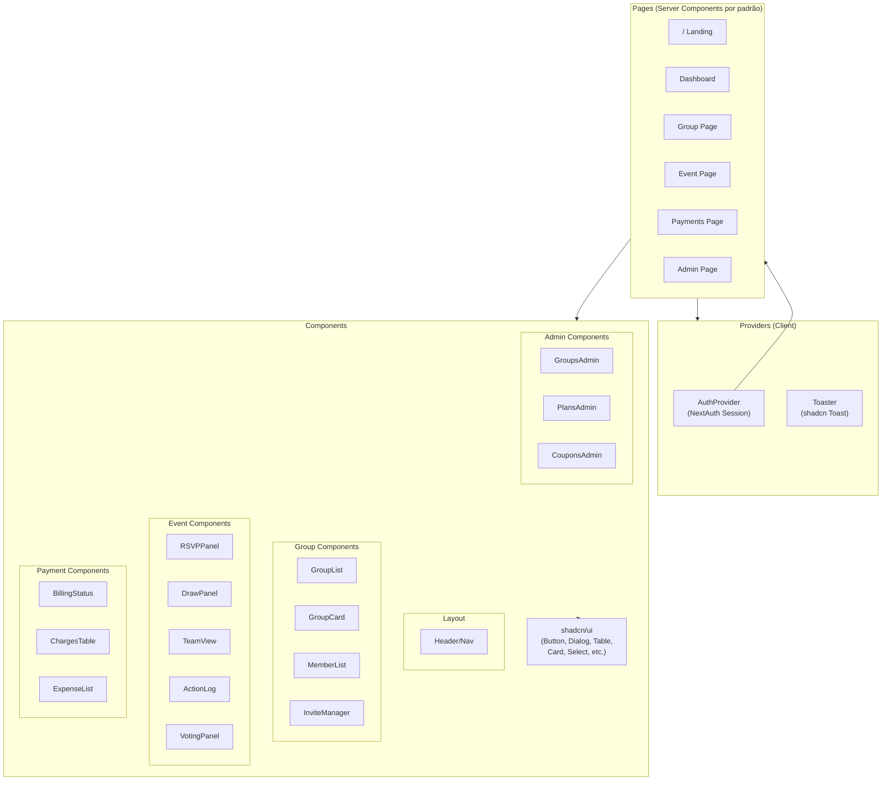

---

## 10. RESUMO EXECUTIVO

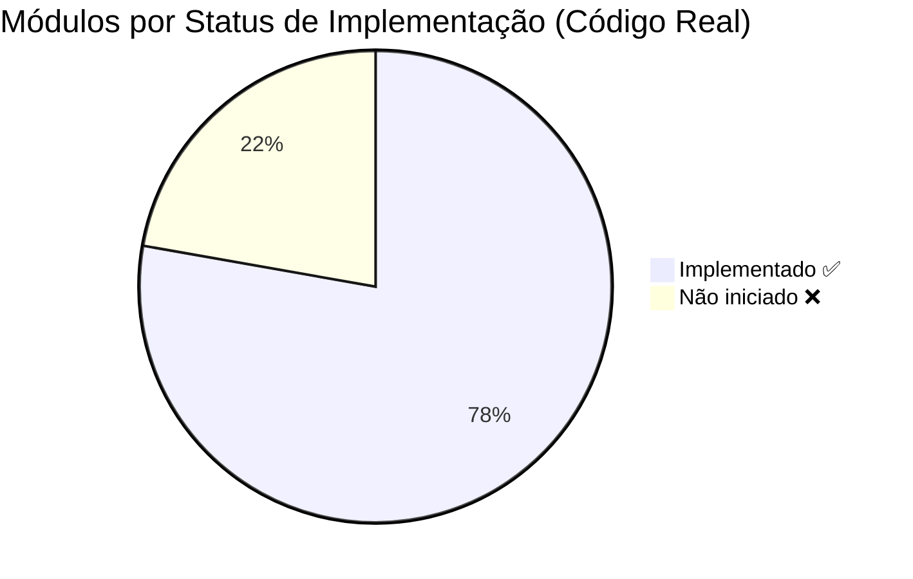

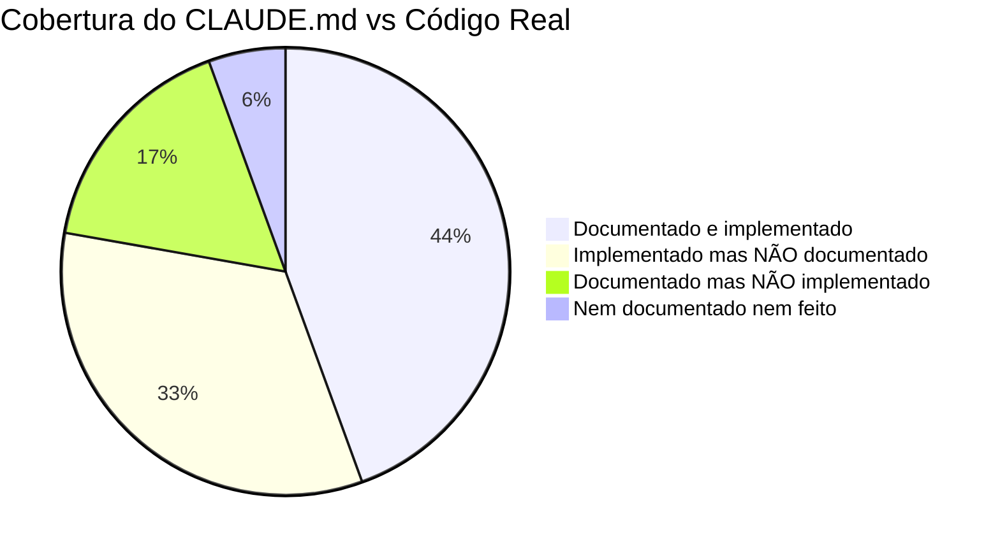

---

### Conclusão

O projeto **Convoca** está **significativamente mais avançado** do que o `CLAUDE.md` descreve.

Os módulos de **Billing (Stripe)**, **Admin Panel**, **Temporadas**, **Recorrências**, **MVP Tiebreaker** e **Scoring configurável** estão todos implementados e funcionando, mas não estão documentados no CLAUDE.md.

O arquivo CLAUDE.md precisa ser atualizado para refletir o estado real do MVP, que está **bem além do "Phase 1"** original.

---

*Comparativo gerado por reverse engineering em 2026-04-11.*
