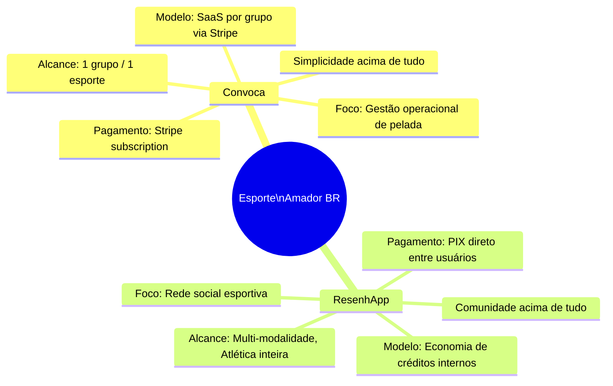
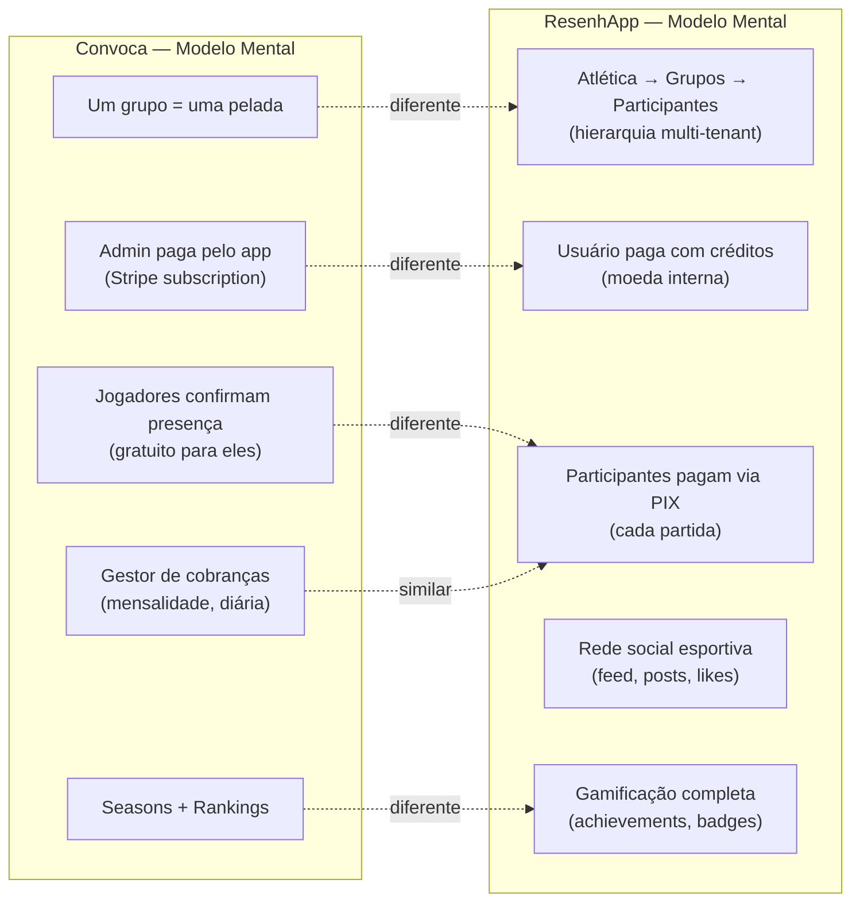
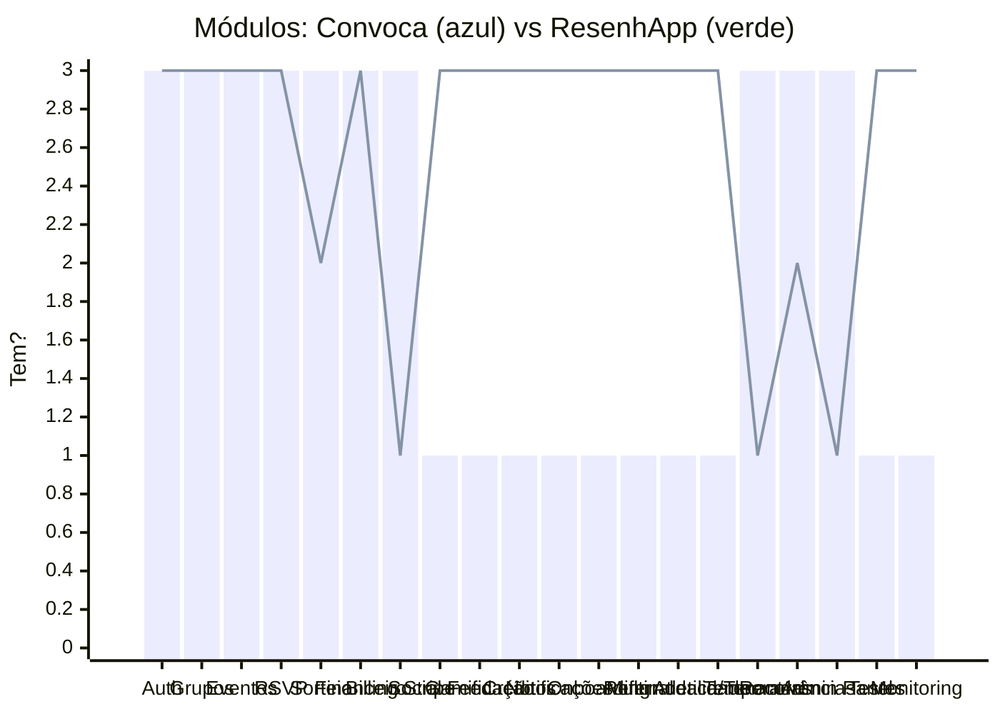
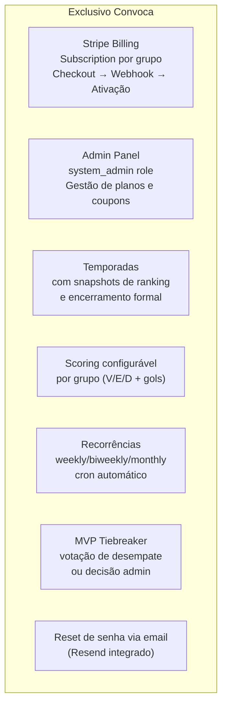
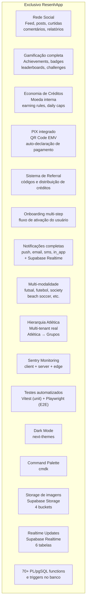
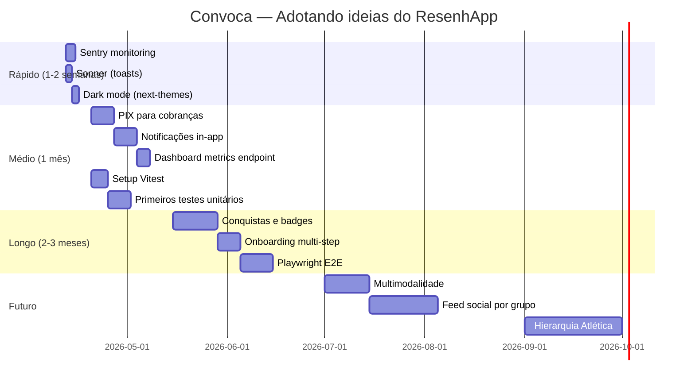
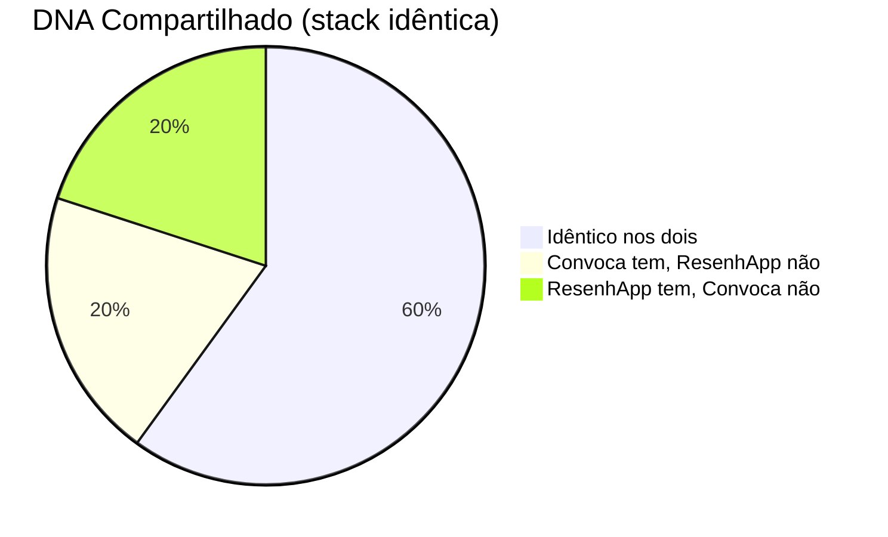
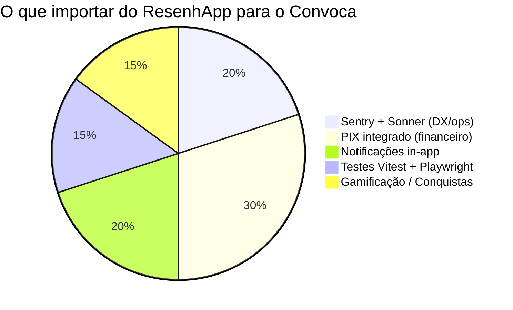

# COMPARATIVO: Convoca vs ResenhApp — Diferenças e Convergência

**Data:** 2026-04-11  
**Fonte Convoca:** Reverse engineering do código (2026-04-11)  
**Fonte ResenhApp:** Checkpoint existente em `checkpoints/2026-02-17_resenhapp/` (25 arquivos)

> ResenhApp e Convoca são **irmãos de DNA**: mesma stack base, mesmo domínio (peladas/esporte), mas com **filosofias de produto radicalmente diferentes**.

---

## 1. IDENTIDADE DOS PRODUTOS



---

## 2. COMPARATIVO DE STACK

| Camada | Convoca | ResenhApp |
|---|---|---|
| Framework | Next.js 16.1.1 | Next.js 16.1.1 |
| React | 19.2.0 | 19.2.0 |
| TypeScript | 5.x | 5.x |
| Package manager | pnpm@10.18.1 | pnpm@10.18.1 |
| Auth | NextAuth v5 beta (credentials) | NextAuth v5 beta (credentials) |
| Auth adapter | @auth/pg-adapter | @auth/pg-adapter |
| DB client | postgres@3.4.8 (Neon) | postgres@3.4.8 (Supabase) |
| Database | **Neon PostgreSQL** (raw SQL) | **Supabase PostgreSQL** (RLS + functions + realtime + storage) |
| ORM | Nenhum | Nenhum |
| Pagamentos | **Stripe** (subscriptions) | **PIX** (QR Code EMV manual) |
| UI | shadcn/ui + Tailwind 3.x | shadcn/ui + Tailwind 3.x |
| Icons | lucide-react | lucide-react |
| State | Zustand 5 | Zustand 5 + GroupContext + DirectModeContext |
| Validação | Zod 3 | Zod 3 |
| Logging | Pino 9 | Pino 9 |
| Monitoring | **Nenhum** | **Sentry** (client + server + edge) |
| Testes | **Nenhum** | **Vitest + Playwright** |
| Toasts | shadcn toast | **Sonner** |
| Themes | Nenhum | **next-themes** (dark mode) |
| Command palette | Nenhum | **cmdk** |
| QR Code | Nenhum | **qrcode** (PIX QR) |
| API routes | 61 | 72 |
| Tabelas DB | ~24 | **47 aplicadas + 8 pendentes** |
| Funções Postgres | Nenhuma | **~70 funções PL/pgSQL** |
| Triggers Postgres | Nenhum | **Múltiplos triggers** |
| Realtime | Nenhum | **Supabase Realtime** (6 tabelas) |
| Storage | Nenhum | **Supabase Storage** (4 buckets) |
| Cron jobs | 2 (monthly-charges, recurring-events) | 3 (metrics, reminders, cleanup) |
| Email | Resend (reset de senha) | Infraestrutura existe, sender não |
| Export | jsPDF | jsPDF |
| Deploy | Vercel | Vercel + Cloudflare CDN |

---

## 3. DIFERENÇAS CONCEITUAIS FUNDAMENTAIS



---

## 4. MÓDULOS: QUEM TEM O QUÊ



> 1 = não tem | 2 = parcial | 3 = completo  
> **Barras** = Convoca | **Linha** = ResenhApp

---

## 5. O QUE CADA APP TEM QUE O OUTRO NÃO TEM

### 5.1 Só no Convoca ✅



### 5.2 Só no ResenhApp ✅



---

## 6. ANÁLISE DO SISTEMA FINANCEIRO (Maior Divergência)

```mermaid
graph TB
    subgraph Convoca_Fin["Convoca — Financeiro"]
        CF1["Admin assina o app\nvia Stripe\nR$ X/mês por grupo"]
        CF2["Admin cria cobranças\npara jogadores\n(mensalidade, diária, multa)"]
        CF3["Jogador marca como pago\nAdmin confirma\n(sem integração bancária)"]
        CF4["Despesas do grupo\ncategorizadas"]
        CF5["Wallets por grupo/usuário\n(saldo em centavos)"]
    end

    subgraph ResenhApp_Fin["ResenhApp — Financeiro"]
        RF1["Usuário compra créditos\n(moeda interna)\npara criar grupos"]
        RF2["Admin configura chave PIX\n(CPF, CNPJ, email, etc.)"]
        RF3["Evento tem preço\nRSVP gera cobrança automática"]
        RF4["QR Code PIX gerado\npelo sistema (EMV BR Code)"]
        RF5["Participante paga via PIX\ne auto-declara pagamento"]
        RF6["Admin confirma recebimento\nmanualmente"]
    end

    CF1 -->|"Modelo SaaS"| note1["💡 Convoca cobra do admin pelo software"]
    RF1 -->|"Modelo Freemium"| note2["💡 ResenhApp cobra créditos por funcionalidades"]
    CF3 -->|"Sem PIX"| gap1["❌ Convoca não tem PIX"]
    RF4 -->|"Sem Stripe"| gap2["❌ ResenhApp não tem subscription billing"]
```



---

## 7. BANCO DE DADOS — COMPLEXIDADE COMPARADA

| Aspecto | Convoca | ResenhApp |
|---|---|---|
| Tabelas | ~24 | 47 aplicadas + 8 pendentes |
| ENUMs personalizados | Nenhum (VARCHAR + CHECK) | 14 tipos ENUM custom |
| Funções PL/pgSQL | Nenhuma | ~70 funções |
| Triggers | Nenhum | Múltiplos (achievements, stats, notif) |
| RLS | Nenhuma | Habilitada em todas as tabelas |
| Realtime | Nenhum | 6 tabelas |
| Storage | Nenhum | 4 buckets |
| Views materializadas | Mencionada no CLAUDE.md, não encontrada | Não identificado |
| Índices explícitos | Sim (schema.sql) | Sim (migrations) |
| Migrações numeradas | Parcial (~20 sem sequência rígida) | 24+ migrations numeradas |

---

## 8. IDEAS DO RESENHAPP PARA IMPORTAR NO CONVOCA

### PRIORIDADE ALTA — Impacto imediato

#### A. Sentry para Monitoramento de Erros
**Problema atual:** Convoca usa apenas `pino` para logs. Em produção, erros client-side passam despercebidos.

```bash
# Instalar
pnpm add @sentry/nextjs

# Arquivos a criar (padrão ResenhApp)
# sentry.client.config.ts
# sentry.server.config.ts
# sentry.edge.config.ts
```

ResenhApp já tem a integração completa — é só replicar o padrão.

---

#### B. Sonner para Toasts (melhor UX)
**Problema atual:** shadcn `toast` é mais verbose que `sonner`.

```bash
pnpm add sonner

# Trocar:
toast({ title: "Sucesso", description: "RSVP confirmado" })

# Por:
toast.success("RSVP confirmado")
toast.error("Erro ao confirmar")
toast.loading("Salvando...")
```

---

#### C. PIX para Cobranças de Evento
**Problema atual:** Convoca tem sistema de cobranças (charges) mas sem integração de pagamento. O admin precisa confirmar pagamentos manualmente sem nenhum suporte.

**Solução ResenhApp-inspired:**
```typescript
// src/lib/pix.ts (importar lógica do ResenhApp)
// Gera payload BR Code EMV completo
export function generatePixPayload(pixKey: string, amount: number, description: string): string

// src/app/api/charges/[chargeId]/pix/route.ts
// Gera QR Code para cobrança específica
```

**Tabelas a adicionar no Convoca:**
```sql
-- Perfis PIX por grupo (admin cadastra chave)
CREATE TABLE receiver_profiles (
  id UUID PRIMARY KEY DEFAULT uuid_generate_v4(),
  group_id UUID NOT NULL REFERENCES groups(id) ON DELETE CASCADE,
  pix_key TEXT NOT NULL,
  pix_key_type VARCHAR(20) CHECK (pix_key_type IN ('cpf','cnpj','email','phone','random')),
  holder_name VARCHAR(100),
  city VARCHAR(50),
  is_active BOOLEAN DEFAULT true,
  created_at TIMESTAMP DEFAULT NOW()
);

-- Adicionar pix_payload e qr_image_url na tabela charges
ALTER TABLE charges ADD COLUMN pix_payload TEXT;
ALTER TABLE charges ADD COLUMN pix_qr_url TEXT;
ALTER TABLE charges ADD COLUMN self_reported_at TIMESTAMP;
ALTER TABLE charges ADD COLUMN self_reported_by UUID REFERENCES users(id);
```

---

#### D. Dark Mode com next-themes
```bash
pnpm add next-themes

# ThemeProvider no layout root
# Toggle no header
```

---

### PRIORIDADE MÉDIA — Features novas

#### E. Sistema de Notificações (in-app)
ResenhApp tem `notifications` table com `push`, `email`, `sms`, `in_app` channels e triggers Postgres que inserem notificações automaticamente.

**Adaptação para Convoca:**
```sql
CREATE TABLE notifications (
  id UUID PRIMARY KEY DEFAULT uuid_generate_v4(),
  user_id UUID NOT NULL REFERENCES users(id),
  type VARCHAR(50) NOT NULL, -- 'event_created', 'rsvp_confirmed', 'waitlist_moved', 'payment_request'
  title TEXT NOT NULL,
  body TEXT,
  data JSONB,
  read_at TIMESTAMP,
  created_at TIMESTAMP DEFAULT NOW()
);

-- Trigger: ao confirmar RSVP, notifica jogador
-- Trigger: ao sair da waitlist, notifica próximo
-- Trigger: ao criar cobrança, notifica usuário
```

API: `GET /api/notifications`, `PATCH /api/notifications/[id]` (marcar como lida)

---

#### F. Conquistas e Badges (Gamificação)
ResenhApp tem sistema completo: `achievement_types`, `user_achievements`, `badges`, `milestones`, `challenges`, `leaderboards`.

**Adaptação para Convoca:**
- Conquistas por gols marcados (10, 50, 100 gols)
- Conquistas por presença (5, 20, 50 jogos)
- Conquistas por sequência (jogar 5 semanas seguidas)
- Badge "MVP" por receber mais votos
- Badge "Artilheiro da Temporada"

```sql
CREATE TABLE achievement_types (
  id UUID PRIMARY KEY DEFAULT uuid_generate_v4(),
  code VARCHAR(50) UNIQUE NOT NULL, -- 'goals_10', 'attendance_50'
  name VARCHAR(100) NOT NULL,
  description TEXT,
  category VARCHAR(30), -- 'goals', 'assists', 'attendance', 'streak', 'special'
  rarity VARCHAR(20) DEFAULT 'common', -- 'common', 'rare', 'epic', 'legendary'
  threshold_value INTEGER,
  icon_url TEXT
);

CREATE TABLE user_achievements (
  id UUID PRIMARY KEY DEFAULT uuid_generate_v4(),
  user_id UUID NOT NULL REFERENCES users(id),
  achievement_type_id UUID NOT NULL REFERENCES achievement_types(id),
  group_id UUID REFERENCES groups(id),
  earned_at TIMESTAMP DEFAULT NOW(),
  UNIQUE(user_id, achievement_type_id, group_id)
);
```

---

#### G. Testes com Vitest + Playwright
ResenhApp tem estrutura completa em `tests/`:
- `tests/unit/` — testes unitários (lib, contexts)
- `tests/integration/api/` — testes de integração de API
- `tests/e2e/` — testes end-to-end com Playwright
- `tests/components/` — testes de componentes

**Para o Convoca:**
```bash
pnpm add -D vitest @vitejs/plugin-react @vitest/ui @vitest/coverage-v8
pnpm add -D @testing-library/react @testing-library/user-event happy-dom
pnpm add -D @playwright/test

# Casos críticos para testar:
# - RSVP flow (confirmar → waitlist → check-in)
# - Sorteio (validação de mínimo de jogadores)
# - Billing webhook (stripe eventos)
# - Rankings (cálculo de pontuação)
```

---

#### H. Dashboard Metrics por Grupo
ResenhApp tem `/api/groups/[groupId]/dashboard-metrics` — endpoint de métricas agregadas para o dashboard do grupo.

**Para Convoca:**
```typescript
// GET /api/groups/[groupId]/dashboard-metrics
{
  totalMembers: number,
  activeMembers: number,           // jogaram no último mês
  upcomingEvents: number,
  pendingCharges: { count, totalCents },
  lastEventStats: { goals, assists, topScorer },
  seasonProgress: { position, points, gamesPlayed }
}
```

---

#### I. Onboarding Multi-step
ResenhApp tem `/onboarding/step/[step]` com múltiplos passos de ativação.

**Para Convoca:**
- Passo 1: Criar ou entrar em um grupo
- Passo 2: Completar perfil (posição, é goleiro?)
- Passo 3: Entender o RSVP

---

### PRIORIDADE BAIXA — Futuro

#### J. Multimodalidade
ResenhApp suporta `futsal`, `futebol`, `society`, `beach_soccer`.
Convoca poderia adicionar um campo `modality` aos grupos para suportar diferentes esportes (vôlei, basquete, etc.) sem mudar a lógica core.

#### K. Hierarquia Atlética (Multi-tenant)
ResenhApp tem Atlética → Grupo de Modalidade → Participante.
Para Convoca fazer sentido em atléticas universitárias, precisaria adicionar esse nível. Complexo, mas é a maior oportunidade de expansão de mercado.

#### L. Feed Social por Grupo
ResenhApp tem feed completo com posts, curtidas, comentários.
Convoca poderia ter um feed simplificado por grupo — anúncios do admin, fotos das partidas.

---

## 9. O QUE NÃO IMPORTAR DO RESENHAPP

| Feature | Por que não importar |
|---|---|
| Créditos internos (economy) | Conflita com modelo Stripe já implementado no Convoca |
| Supabase RLS | Convoca usa Neon — migração de DB não justificada só por RLS |
| Supabase Storage | Convoca não tem caso de uso imediato para upload de imagens |
| Supabase Realtime | Custo de complexidade alto — aguardar real necessidade |
| 70+ PL/pgSQL functions | Complexidade desnecessária enquanto raw SQL resolve |
| ENUMs custom no banco | Convoca usa VARCHAR + CHECK, funciona bem e é mais portável |
| Group type (Atlética) | Mudar hierarquia de grupos seria redesign maior do produto |

---

## 10. ROADMAP TÉCNICO DE CONVERGÊNCIA



---

## 11. RESUMO EXECUTIVO





### TL;DR dos dois apps

| | Convoca | ResenhApp |
|---|---|---|
| **Produto** | Ferramenta de gestão de pelada | Rede social esportiva |
| **Modelo de negócio** | SaaS (admin paga Stripe) | Freemium (créditos internos + PIX por partida) |
| **Foco técnico** | Billing, Sorteio, Temporadas | Social, Gamificação, Multi-tenant |
| **DB complexidade** | Simples e direto (24 tabelas) | Rico e elaborado (55 tabelas + 70 funções) |
| **Teste** | Zero cobertura | Vitest + Playwright |
| **Monitoring** | Zero | Sentry |
| **Pagamento** | Stripe (subscription) | PIX (por evento) |
| **O que falta** | Sentry, testes, PIX, notificações | Stripe billing, temporadas, recorrências |
| **Checkpoint existente** | Este documento (2026-04-11) | `checkpoints/2026-02-17_resenhapp/` (25 arquivos) |

---

### As 3 coisas mais importantes a importar do ResenhApp:

1. **Sentry** — custo baixo, retorno imediato. Hoje erros de produção no Convoca são invisíveis.
2. **PIX integrado** — o maior gap financeiro. Convoca tem a estrutura de cobranças mas sem meio de pagamento.
3. **Vitest + Playwright** — o Convoca não tem nenhum teste. O ResenhApp já tem a estrutura pronta para copiar.

---

*Comparativo gerado em 2026-04-11. Checkpoint ResenhApp: `C:\Users\Luisf\Github\ResenhApp\checkpoints\2026-02-17_resenhapp\`*
