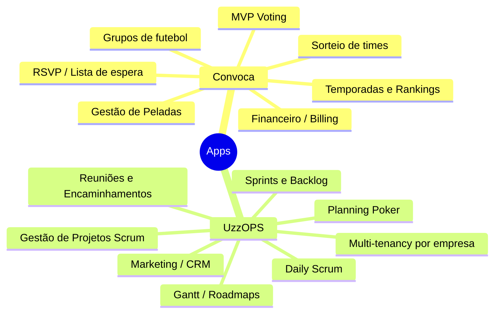
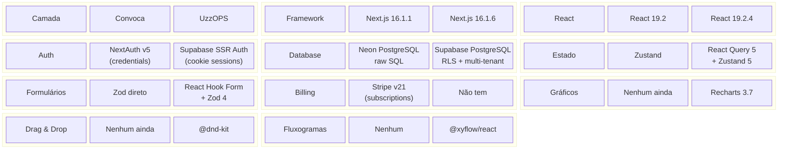
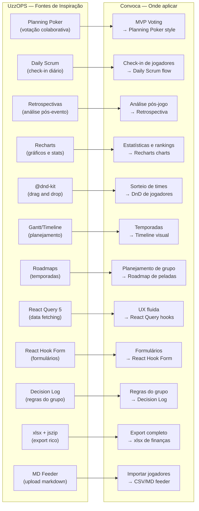
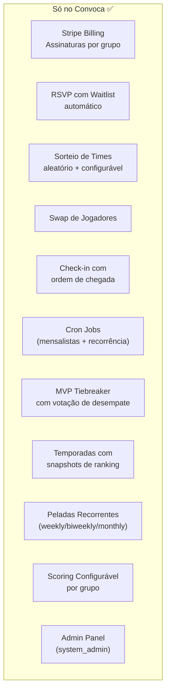
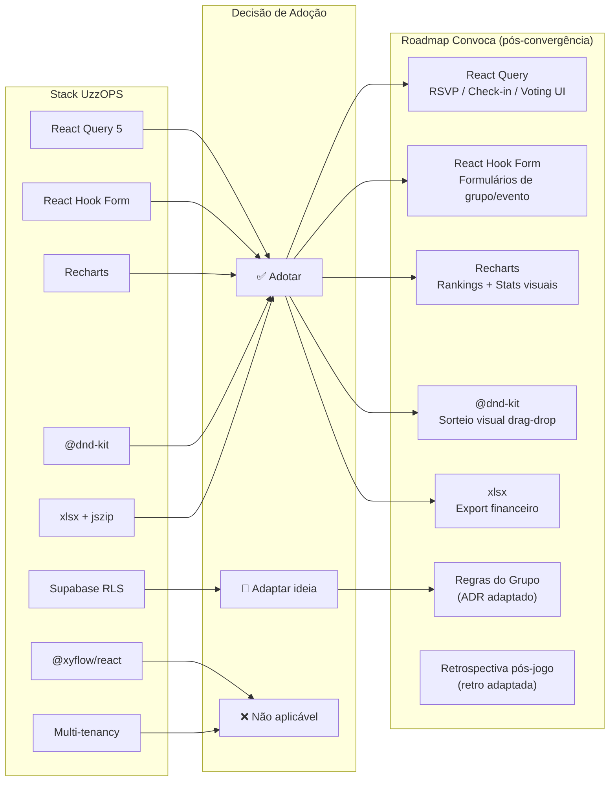
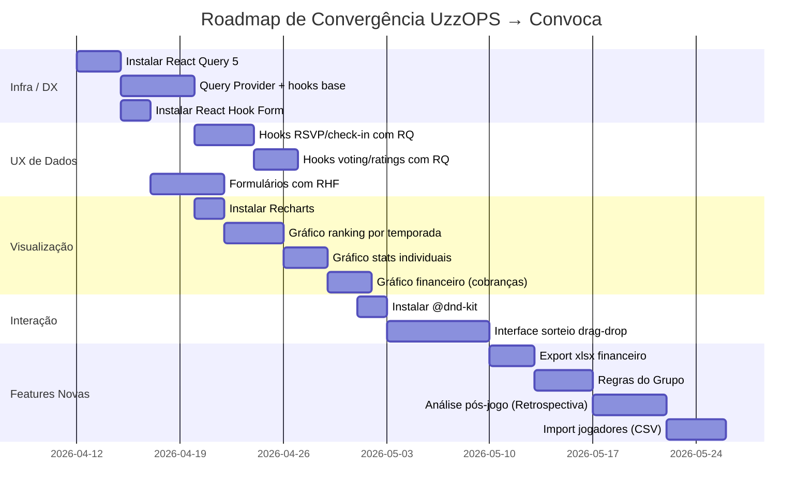
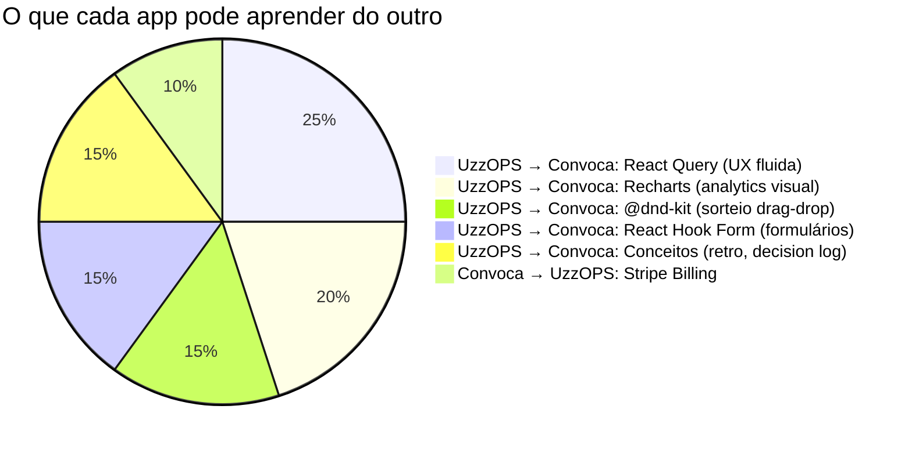

# COMPARATIVO: Convoca vs UzzOPS — Diferenças e Convergência de Ideias

**Data:** 2026-04-11  
**Fonte:** Reverse engineering de ambos os projetos + `.brv/context-tree`

---

## 1. VISÃO GERAL DOS DOIS PRODUTOS



---

## 2. COMPARATIVO DE STACK TÉCNICA



---

## 3. DIFERENÇAS ESTRUTURAIS CHAVE

| Aspecto | Convoca | UzzOPS | Impacto |
|---|---|---|---|
| **Modelo de acesso** | 1 usuário → N grupos | Multi-tenant (empresa → projetos → membros) | Convoca é mais simples, correto para peladas |
| **Segurança de dados** | Auth via `requireAuth()` no handler | RLS (Postgres Row Level Security) em toda tabela | UzzOPS tem isolamento mais robusto |
| **Data fetching (client)** | Server Components + fetch direto | React Query 5 (cache, invalidação, loading states) | UzzOPS tem UX mais fluida em client-side |
| **Formulários** | Zod + validação manual | React Hook Form + Zod (field-level errors, touched) | UzzOPS tem melhor UX de formulário |
| **Visualização** | Tabelas simples | Recharts (gráficos), @xyflow (diagramas) | Convoca sem analytics visuais |
| **Drag & Drop** | Não existe | @dnd-kit (backlog, kanban, sorteio) | Convoca sem DnD |
| **Exportação** | jsPDF | jsPDF + xlsx + jszip | UzzOPS mais completo em export |
| **Complexidade de UI** | ~72 componentes | ~23 subpastas, centenas de componentes | UzzOPS muito mais rico visualmente |
| **API routes** | 61 endpoints | ~95+ endpoints | UzzOPS mais abrangente |
| **Migrations** | ~20 arquivos (sem sequência rígida) | 33 arquivos numerados (003-033) | UzzOPS mais disciplinado |
| **Hooks** | Nenhum (Server Components) | 21 React Query hooks | UzzOPS mais interativo |
| **Cron Jobs** | 2 (Vercel Cron) | Não documentado | Convoca tem automação |
| **Billing** | Stripe completo ✅ | Sem billing | Convoca mais maduro neste aspecto |
| **Email** | Resend (reset de senha) | Não documentado | — |

---

## 4. MÓDULOS DE UZZOPS QUE FAZEM SENTIDO NO CONVOCA



---

## 5. PLANO DE CONVERGÊNCIA — IDEIAS DO UZZOPS PARA O CONVOCA

### 5.1 PRIORIDADE ALTA (Impacto imediato na UX)

#### A. React Query 5 para data fetching client-side
**Problema atual:** Convoca usa Server Components para tudo. Ações como RSVP, check-in, votação requerem page reload ou custom state.

**Solução (UzzOPS-inspired):**
```typescript
// hooks/use-event-attendance.ts
import { useQuery, useMutation, useQueryClient } from "@tanstack/react-query"

export function useEventAttendance(eventId: string) {
  return useQuery({
    queryKey: ["event", eventId, "attendance"],
    queryFn: () => fetch(`/api/events/${eventId}/attendance`).then(r => r.json()),
  })
}

export function useRSVP(eventId: string) {
  const qc = useQueryClient()
  return useMutation({
    mutationFn: (status: "yes" | "no" | "waitlist") =>
      fetch(`/api/events/${eventId}/rsvp`, {
        method: "POST",
        body: JSON.stringify({ status }),
      }),
    onSuccess: () => qc.invalidateQueries({ queryKey: ["event", eventId] }),
  })
}
```

**Arquivos a adicionar:**
- `src/hooks/use-event-attendance.ts`
- `src/hooks/use-group-members.ts`
- `src/hooks/use-rankings.ts`
- `src/providers/query-provider.tsx` (instalar `@tanstack/react-query`)

---

#### B. React Hook Form nos formulários
**Problema atual:** Formulários no Convoca têm validação manual e UX de erro fraca.

**Solução (UzzOPS-inspired):**
```typescript
// components/events/create-event-form.tsx
import { useForm } from "react-hook-form"
import { zodResolver } from "@hookform/resolvers/zod"
import { createEventSchema } from "@/lib/validations"

const form = useForm({
  resolver: zodResolver(createEventSchema),
  defaultValues: { maxPlayers: 10, maxGoalkeepers: 2 },
})

// Field-level errors, touched state, dirty tracking automático
```

**Pacotes a instalar:** `react-hook-form @hookform/resolvers`

---

#### C. Recharts para Estatísticas Visuais
**Problema atual:** Rankings e stats são apenas tabelas de texto. Sem visualização de evolução.

**Solução (UzzOPS-inspired):** Gráficos para:
- Evolução de pontos por temporada (LineChart)
- Distribuição gols/assistências por jogador (BarChart)
- Presença do membro ao longo do tempo (AreaChart)
- Placar de partidas (PieChart)

```typescript
// components/groups/ranking-chart.tsx
import { LineChart, Line, XAxis, YAxis, CartesianGrid, Tooltip, ResponsiveContainer } from "recharts"

export function RankingEvolutionChart({ data }: { data: RankingData[] }) {
  return (
    <ResponsiveContainer width="100%" height={300}>
      <LineChart data={data}>
        <Line type="monotone" dataKey="points" stroke="#22c55e" />
        <XAxis dataKey="season" />
        <YAxis />
        <Tooltip />
      </LineChart>
    </ResponsiveContainer>
  )
}
```

**Pacotes a instalar:** `recharts`

---

### 5.2 PRIORIDADE MÉDIA (Features novas baseadas em UzzOPS)

#### D. DnD Kit para Sorteio Visual de Times

**Inspiração:** UzzOPS usa @dnd-kit para arrastar features entre sprints/colunas kanban.

**Aplicação no Convoca:** Interface visual de sorteio onde admin pode **arrastar jogadores entre times** após o sorteio automático.

```
┌─────────────────┐    ┌─────────────────┐    ┌─────────────────┐
│    Time Azul    │    │  Sem Time       │    │    Time Verde   │
│─────────────────│    │─────────────────│    │─────────────────│
│ 🟢 João (GK)   │    │ ○ Carlos        │    │ 🟢 Ana (GK)    │
│ ○ Pedro         │◄───│ ○ Maria         │───►│ ○ Rafael        │
│ ○ Lucas         │    │                 │    │ ○ Fernanda      │
│ [+ Arrastar]    │    │ [Drag aqui]     │    │ [+ Arrastar]    │
└─────────────────┘    └─────────────────┘    └─────────────────┘
```

Substitui o modal de swap atual (que exige selecionar 2 jogadores) por uma UI de drag-and-drop intuitiva.

**Pacotes a instalar:** `@dnd-kit/core @dnd-kit/sortable @dnd-kit/utilities`

---

#### E. Sistema de Análise Pós-Jogo (Retrospectiva)

**Inspiração:** UzzOPS tem `retrospective_actions` — ações surgidas de retrospectivas de sprint.

**Aplicação no Convoca:** Análise pós-pelada onde o grupo registra:
- O que funcionou bem no jogo
- O que pode melhorar (horário, local, número de jogadores)
- Ações para próximo evento (ex: "confirmar quadra com antecedência")

```sql
-- Nova tabela
CREATE TABLE IF NOT EXISTS event_retrospectives (
  id UUID PRIMARY KEY DEFAULT uuid_generate_v4(),
  event_id UUID NOT NULL REFERENCES events(id) ON DELETE CASCADE,
  type VARCHAR(20) CHECK (type IN ('good', 'improve', 'action')),
  content TEXT NOT NULL,
  created_by UUID REFERENCES users(id) ON DELETE SET NULL,
  created_at TIMESTAMP DEFAULT NOW()
);
```

---

#### F. Planning Poker → "Votação de Presença Estratégica"

**Inspiração:** UzzOPS tem Planning Poker para estimar esforço de features com votação em tempo real.

**Adaptação para Convoca:** Para peladas com vagas limitadas e disputadas, um sistema de **prioridade de vaga** por votação do grupo — membros votam em quem deve ter prioridade de vaga quando o evento está cheio (ex: quem participou menos recentemente).

---

#### G. Export Excel de Financeiro

**Inspiração:** UzzOPS exporta xlsx + jszip.

**Aplicação no Convoca:** Exportar relatório financeiro completo:
- Cobranças por membro
- Despesas do grupo
- Saldo da carteira
- Histórico de pagamentos

Hoje o Convoca só tem export PDF via jsPDF. Adicionar xlsx seria muito mais útil para o tesoureiro do grupo.

**Pacotes a instalar:** `xlsx`

---

#### H. Decision Log → "Regras do Grupo"

**Inspiração:** UzzOPS tem `decision_log` (ADRs) para registrar decisões arquiteturais.

**Adaptação:** Convoca poderia ter um **"Regras da Pelada"** — espaço onde o admin documenta as regras combinadas do grupo (valores, critérios de desempate, horário de confirmação, política de faltas, etc.)

```sql
CREATE TABLE IF NOT EXISTS group_rules (
  id UUID PRIMARY KEY DEFAULT uuid_generate_v4(),
  group_id UUID NOT NULL REFERENCES groups(id) ON DELETE CASCADE,
  title VARCHAR(200) NOT NULL,
  content TEXT NOT NULL,
  created_by UUID REFERENCES users(id) ON DELETE SET NULL,
  created_at TIMESTAMP DEFAULT NOW(),
  updated_at TIMESTAMP DEFAULT NOW()
);
```

---

#### I. MD Feeder → Import de Jogadores

**Inspiração:** UzzOPS permite upload de arquivo Markdown para importar dados (md_imports, md_items).

**Adaptação:** Convoca poderia importar lista de jogadores via CSV/Excel — útil para grupos que já têm uma planilha de membros e querem migrar para o app sem cadastrar um por um.

---

### 5.3 PRIORIDADE BAIXA (Futuro / Phase 3+)

#### J. Timeline Visual de Temporadas (estilo Gantt)

**Inspiração:** UzzOPS tem Gantt com múltiplas timelines (gantt_stages, gantt_tasks, gantt_milestones).

**Adaptação:** Visualização de temporadas do grupo em timeline — quando cada temporada começa/termina, partidas planejadas, marcos (torneios, confraternizações).

#### K. Roadmap de Peladas

**Inspiração:** UzzOPS tem roadmaps de produto com itens planejados.

**Adaptação:** "Planejamento de temporada" — o admin pode planejar visualmente quantas peladas serão feitas, em quais datas, com metas (ex: "jogar 20 vezes este semestre").

---

## 6. O QUE CONVOCA TEM QUE UZZOPS NÃO TEM



Estes módulos são **diferenciais exclusivos do Convoca** — nativos do domínio de peladas. O UzzOPS não tem e não precisaria ter.

---

## 7. DIAGRAMA DE CONVERGÊNCIA TÉCNICA



---

## 8. ROADMAP DE IMPLEMENTAÇÃO (Priorizado)



---

## 9. RESUMO EXECUTIVO



### TL;DR

| | Convoca | UzzOPS |
|---|---|---|
| **Domínio** | Gestão de peladas | Gestão de projetos Scrum |
| **Ponto forte** | Billing, Cron, Sorteio, Recorrências | UX rica, React Query, Gráficos, DnD |
| **Gap maior** | Sem React Query, sem gráficos, sem DnD | Sem billing, sem cron jobs |
| **Stack compartilhada** | Next.js, React 19, TypeScript, Tailwind, shadcn/ui, Zod, Zustand, pnpm |
| **O que migrar** | React Query + Recharts + @dnd-kit + React Hook Form | Stripe + Cron patterns |
| **O que NÃO migrar** | Multi-tenancy (desnecessário), @xyflow (sem caso de uso) | — |

---

*Comparativo gerado por reverse engineering em 2026-04-11.*
