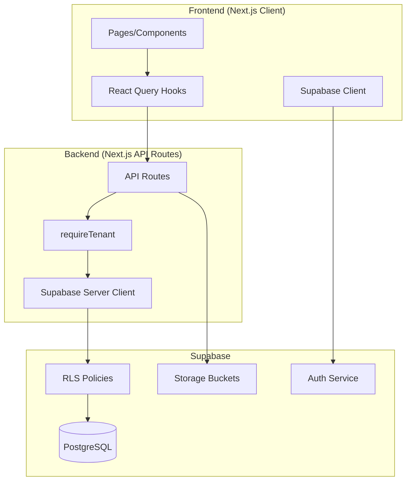
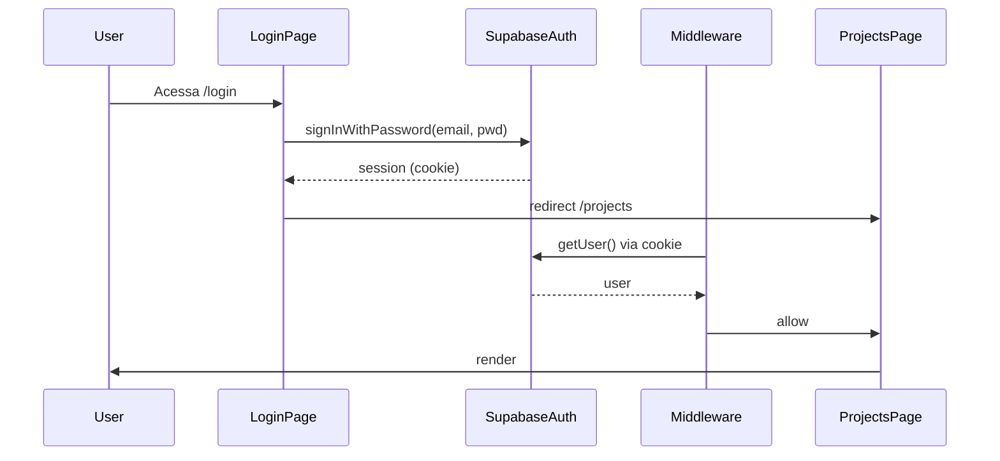
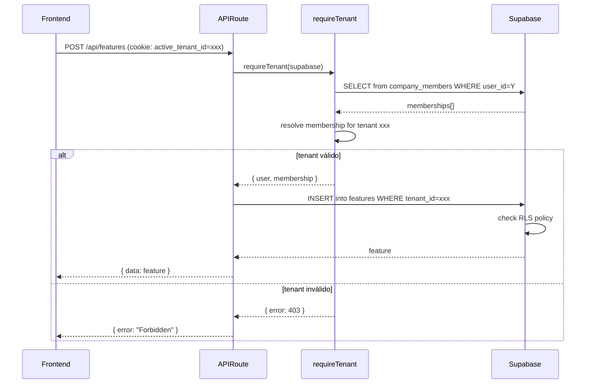

# PROMPT: Checkpoint Completo do Projeto UzzOPS

**Versão:** 1.0
**Data:** 2026-03-20
**Uso:** Forneça este prompt para uma IA gerar documentação completa de reverse engineering do UzzOPS

---

## PAPEL E OBJETIVO

Você é um **analista de engenharia de software + arquiteto especialista**, com foco em "reverse engineering" de aplicações Next.js/React a partir do código-fonte.

**Objetivo:** Gerar um **CHECKPOINT DE DOCUMENTAÇÃO COMPLETO** do projeto **UzzOPS** (Sistema de Gerenciamento de Projetos da UzzApp) a partir do REPOSITÓRIO ATUAL em `C:\Projetos Uzz.Ai\UzzOPS - UzzApp`.

**Data do checkpoint:** {{DATA_ATUAL}} (formato: YYYY-MM-DD)

**REGRA DE OURO:** Use EXCLUSIVAMENTE o código e arquivos SQL/migrations como fonte de verdade. Qualquer documentação existente pode estar DESATUALIZADA. Se usar docs antigas, marque explicitamente como "LEGADO/possivelmente desatualizado".

---

## CONTEXTO TÉCNICO CONFIRMADO DO UZZOPS

### Stack Completo

```yaml
Frontend:
  framework: Next.js 16.1.6 (App Router, React Server Components)
  react: 19.2.4
  typescript: 5.9.3 (strict mode)
  ui: shadcn/ui (Radix UI primitives)
  styling: Tailwind CSS 4.1.18
  state: TanStack React Query 5.90.20 + Zustand 5.0.11
  forms: React Hook Form 7.71.1 + Zod 4.3.6
  dnd: "@dnd-kit/* (core, sortable, utilities)"
  charts: Recharts 3.7.0
  flow: "@xyflow/react 12.10.0"
  icons: lucide-react 0.563.0
  markdown: react-markdown + remark-gfm + rehype-raw

Backend:
  runtime: Node.js (Next.js serverless API Routes)
  database: Supabase PostgreSQL (SSR mode)
  auth: "@supabase/ssr 0.8.0 (cookie-based sessions)"
  client: "@supabase/supabase-js 2.95.3"
  exports: jspdf, jspdf-autotable, xlsx, jszip
  md_parsing: gray-matter 4.0.3

Database:
  provider: Supabase PostgreSQL
  migrations: 33 arquivos (003 até 033) em database/migrations/
  rls: Row Level Security habilitado em TODAS as tabelas
  tenancy: Multi-tenant via tenant_id (company_members join)
  backups: backups/*.sql (último: data_20260216_151127.sql)

Package Manager:
  manager: pnpm 10.28.0 (OBRIGATÓRIO - não usar npm/yarn)
```

### Estrutura de Diretórios Conhecida

```
C:\Projetos Uzz.Ai\UzzOPS - UzzApp/
├── src/
│   ├── app/
│   │   ├── (auth)/              # Route group: login, register, pending
│   │   ├── projects/
│   │   │   ├── page.tsx
│   │   │   └── [projectId]/     # 19+ páginas dinâmicas por projeto
│   │   ├── api/                 # ~95+ API Routes
│   │   ├── layout.tsx
│   │   └── page.tsx
│   ├── components/              # ~23 subpastas (ui, shared, dashboard, features, etc.)
│   ├── hooks/                   # 21 React Query hooks
│   ├── lib/
│   │   ├── supabase/
│   │   │   ├── server.ts
│   │   │   └── client.ts
│   │   ├── tenant.ts            # requireAuth, requireTenant, requireAdmin
│   │   └── tenant-context.ts
│   ├── types/
│   │   ├── database.ts          # Tipos auto-gerados do Supabase
│   │   └── index.ts             # 470+ linhas de tipos da aplicação
│   ├── styles/
│   └── proxy.ts
├── database/
│   ├── migrations/              # 33 migrations (003-033)
│   └── seeds/                   # (se existir)
├── backups/                     # Backups SQL do Supabase
├── checkpoints/                 # Checkpoints de documentação
├── package.json
├── tsconfig.json
├── next.config.ts
├── tailwind.config.ts
├── CLAUDE.md                    # Instruções para IA
└── README.md
```

### Módulos Funcionais Conhecidos

O UzzOPS possui os seguintes módulos (use como guia para exploração):

**Core:**
- Autenticação/Autorização (Supabase Auth + RLS)
- Multi-tenancy (tenants, profiles, company_members)
- Projetos (projects)

**Dev/Scrum:**
- Features/Histórias/Bugs (features, feature_attachments)
- Sprints (sprints, sprint_features, sprint_scope_changes)
- Risks (risks) - matriz GUT
- Team (team_members)
- Retrospectives (retrospective_actions)
- Planning Poker (planning_poker_sessions, votes, results)
- Daily Scrum (daily_scrum_logs, daily_feature_mentions)

**Quality/Metrics:**
- MVP Board (features com is_mvp)
- DoD Evolutivo (dod_levels, dod_history)
- Metrics (baseline_metrics, sprint_burndown_snapshots)
- Progress Tracking (progress tracking tables)

**Backlog/Planning:**
- Backlog Mind Map (feature_clusters, feature_cluster_members)
- Dependencies (feature_dependencies)
- Epic Decomposition (epic_decomposition)

**Marketing:**
- Campaigns (marketing_campaigns)
- Channels (marketing_channels)
- Content (marketing_content)
- Publications (marketing_publications)
- Assets (marketing_assets, content_assets)

**CRM:**
- Clients (uzzapp_clients)
- Contacts (client_contacts)

**Cronogramas/Governance:**
- Charters (product_charters)
- OST (outcome_trees, outcome_opportunities, outcome_solutions)
- Hypotheses (product_hypotheses, hypothesis_tests)
- Roadmaps (product_roadmaps, roadmap_items)
- Decision Log/ADR (decision_log)
- Forecasts (product_forecasts)
- Pilots (product_pilots)
- Changelog (product_changelog)

**Gantt/Timeline:**
- Gantt (gantt_stages, gantt_tasks, gantt_milestones) - com timeline_key para multi-gantt
- Execution Cycles (execution_cycles)

**Reuniões:**
- Reuniões (reuniao_records) - com upload de Markdown
- Encaminhamentos (reuniao_encaminhamentos)

**Import/Export:**
- MD Feeder (md_imports, md_items)
- Export (export_history)

**Feedback:**
- User Feedback (user_feedback)

**Settings:**
- Project Settings (project_settings)

---

## MISSÃO: O QUE VOCÊ DEVE FAZER (PASSO A PASSO)

### FASE 1: INVENTÁRIO COMPLETO (Varredura Rápida)

#### 1.1) Árvore de Diretórios

```bash
# Execute e salve em 01_REPO_TREE.txt
find . -type d \( -name node_modules -o -name .next -o -name dist -o -name build -o -name coverage -o -name .git \) -prune -o -type d -print | sort
```

Identifique e documente:
- Todas as pastas em `src/` (app, components, hooks, lib, types, styles, etc.)
- Estrutura de `database/` (migrations, seeds)
- Estrutura de `checkpoints/`
- Estrutura de `backups/`
- Outros diretórios relevantes

#### 1.2) Dependências e Configurações

Leia e documente em **03_DEPENDENCIES.md**:
- `package.json` → scripts, dependencies, devDependencies, packageManager
- `tsconfig.json` → compilerOptions (especialmente strict, paths)
- `next.config.ts` → configurações do Next.js
- `tailwind.config.ts` → tema customizado
- `.env.example` ou documentação de env vars (apenas nomes, SEM valores)
- `jest.config.js`, `eslint.config.js`, `prettier.config.js` (se existirem)

Produza:
- Tabela de dependências principais com versões
- Árvore de dependências críticas (quem depende de quem)
- Scripts disponíveis e para que servem
- Configurações importantes (TypeScript strict, aliases, etc.)

#### 1.3) Build e Deploy

Documente em **02_BUILD_RUNBOOK.md**:
- Como instalar dependências: `pnpm install`
- Como rodar local: `pnpm dev`
- Como buildar: `pnpm build`
- Como testar: `pnpm test`, `pnpm test:watch`, `pnpm test:coverage`
- Como lintar: `pnpm lint`
- Como formatar: `pnpm prettier --write "src/**/*.{ts,tsx}"`
- Variáveis de ambiente necessárias (nomes)
- Como conectar ao Supabase local/remoto
- Como rodar migrations (se documentado)
- Deploy (inferir: provavelmente Vercel auto-deploy)

---

### FASE 2: MAPEAMENTO DE ROTAS (App Router)

#### 2.1) Páginas (Page Routes)

Para CADA arquivo `src/app/**/page.tsx`:

**Documente em 05_ROUTES_FROM_CODE.md:**

| Rota | Arquivo | Server/Client | Layouts | Auth Guard | Componentes Principais | Queries/Mutations | Notas |
|------|---------|---------------|---------|------------|------------------------|-------------------|-------|
| `/` | `src/app/page.tsx` | Server | root layout | ✓ | ... | ... | Redirect para /projects |
| `/login` | `src/app/(auth)/login/page.tsx` | Client | (auth) layout | ✗ | LoginForm | Supabase Auth | Route group sem sidebar |
| `/projects` | `src/app/projects/page.tsx` | Server | root layout | ✓ | ProjectList | GET /api/projects | ... |
| `/projects/[projectId]/dashboard` | ... | ... | ... | ... | ... | ... | ... |
| ... | ... | ... | ... | ... | ... | ... | ... |

Para cada rota, analise:
1. **Path final** (substituindo [projectId] etc. por exemplo)
2. **Tipo:** Server Component ou Client Component ("use client")
3. **Layouts aplicados:** cadeia de layout.tsx ascendente (root → intermediários → leaf)
4. **Guards:** middleware de auth, checks de tenant, validação de projectId
5. **Componentes principais:** quais componentes de `src/components/` são usados
6. **Data fetching:**
   - React Query hooks usados (ex: `useFeatures`, `useSprints`)
   - API routes chamadas (ex: `GET /api/projects/[id]/overview`)
   - Supabase queries diretas (se houver em Server Components)
7. **Navegação:** links para outras páginas (via Link, router.push)

#### 2.2) API Routes

Para CADA arquivo `src/app/api/**/route.ts`:

**Documente em 05_ROUTES_FROM_CODE.md (seção separada):**

| Endpoint | Métodos | Auth | Tenant | Input | Output | Tabelas | Side Effects | Erros |
|----------|---------|------|--------|-------|--------|---------|--------------|-------|
| `GET /api/features` | GET | ✓ | ✓ | query: projectId, filters | { data: Feature[] } | features | - | 401, 403, 409 |
| `POST /api/features` | POST | ✓ | ✓ | body: NewFeature | { data: Feature } | features | - | 400, 401, 403 |
| `GET /api/features/[id]` | GET | ✓ | ✓ | params: id | { data: Feature } | features | - | 404 |
| `PUT /api/features/[id]` | PUT | ✓ | ✓ | body: FeatureUpdate | { data: Feature } | features | - | 404 |
| ... | ... | ... | ... | ... | ... | ... | ... | ... |

Para cada endpoint, extraia:
1. **Path e método(s)** (GET/POST/PUT/PATCH/DELETE)
2. **Autenticação:** usa `requireAuth`, `requireTenant`, `requireAdmin`?
3. **Tenant enforcement:** verifica tenant_id?
4. **Input:**
   - Query params (ex: `?projectId=...`)
   - Body (ex: `{ name, description, ... }`)
   - Path params (ex: `[id]`)
   - Headers (ex: `x-tenant-id`)
5. **Output:**
   - Shape: `{ data?, error?, message? }`
   - Status codes retornados (200, 201, 400, 401, 403, 404, 409, 500)
6. **Validação:** usa Zod schemas?
7. **Tabelas afetadas:** quais tabelas do Supabase são lidas/escritas
8. **Side effects:**
   - Invalidação de cache
   - Notificações
   - Webhooks
   - Storage (upload/delete de arquivos)
   - Chamadas a serviços externos
9. **Erros possíveis:** lista de erros e quando ocorrem

#### 2.3) Layouts

Para CADA `layout.tsx`:

Documente:
- Path do layout
- O que ele adiciona (sidebar, topbar, providers, etc.)
- Rotas que usam este layout
- Guards/checks aplicados

---

### FASE 3: COMPONENTES E UI

#### 3.1) Catálogo de Componentes

**Documente em 06_UI_COMPONENTS_CATALOG.md:**

Organize por pasta:

**src/components/ui/** (shadcn/ui base):
- Lista de componentes (Button, Dialog, Select, etc.)
- Origem (Radix UI)

**src/components/shared/**:
- Sidebar, Topbar, UserMenu, ProjectSelector, etc.
- Funcionalidade de cada um

**src/components/[módulo]/**:
Para cada módulo (dashboard, features, sprints, risks, team, marketing, clients, cronogramas, gantt, reunioes, etc.):
- Lista de componentes
- Propósito de cada componente
- Componentes complexos: inputs, outputs, estado interno
- Dependências entre componentes

Exemplo:

```markdown
### src/components/features/

- **FeatureTable.tsx**
  - Propósito: Tabela de features com filtros, ordenação, paginação
  - Props: `features: Feature[]`, `onEdit`, `onDelete`
  - Usa: shadcn Table, Checkbox, Badge
  - Estado: filtros locais (status, priority, version)

- **FeatureCreateModal.tsx**
  - Propósito: Modal para criar nova feature
  - Usa: React Hook Form + Zod, useCreateFeature hook
  - Validações: name (required), description, priority, etc.
  - Submit: POST /api/features
```

---

### FASE 4: DATA ACCESS (SUPABASE + API)

#### 4.1) Mapeamento de Queries/Mutations

**Documente em 07_DATA_ACCESS_MAP.md:**

**PARTE A: Por Tela (Page)**

Para cada página, liste:
- Hooks React Query usados
- Queries executadas (SELECT)
- Mutations executadas (INSERT/UPDATE/DELETE)
- Tabelas acessadas
- Filtros aplicados (tenant_id, project_id, etc.)
- **RISCOS:** queries sem filtro de tenant, N+1 queries, queries sem índice

Exemplo:

```markdown
### /projects/[projectId]/features

**Hooks:**
- `useFeatures(projectId, filters)` → GET /api/features

**Queries (via API):**
- `GET /api/features?projectId=X&status=Y`
  - Tabelas: features
  - Filtros: tenant_id (via RLS), project_id, status, version, priority
  - Retorno: Feature[]

**Mutations:**
- `useCreateFeature()` → POST /api/features
- `useUpdateFeature(id)` → PUT /api/features/[id]
- `useDeleteFeature(id)` → DELETE /api/features/[id]

**Riscos:**
- ✅ Tenant filtrado via RLS
- ✅ Índices em (tenant_id, project_id, status)
```

**PARTE B: Por Tabela**

Para cada tabela do banco, liste:
- Arquivos que fazem SELECT
- Arquivos que fazem INSERT
- Arquivos que fazem UPDATE
- Arquivos que fazem DELETE
- Filtros típicos aplicados
- Índices existentes (consultar migrations)
- RLS policies (resumir)

Exemplo:

```markdown
### Tabela: features

**SELECT:**
- `src/app/api/features/route.ts:GET` (lista)
- `src/app/api/features/[id]/route.ts:GET` (single)
- `src/app/api/sprints/[id]/features/route.ts:GET` (features de um sprint)

**INSERT:**
- `src/app/api/features/route.ts:POST`

**UPDATE:**
- `src/app/api/features/[id]/route.ts:PUT`
- `src/app/api/features/[id]/decompose/route.ts:POST` (atualiza is_epic, decomposed_at)

**DELETE:**
- `src/app/api/features/[id]/route.ts:DELETE`

**Filtros típicos:**
- tenant_id (sempre, via RLS)
- project_id (sempre)
- status, priority, version (opcional, para filtros)
- sprint_id (via join com sprint_features)

**Índices:**
- PRIMARY KEY (id)
- idx_features_tenant_project (tenant_id, project_id)
- idx_features_status (tenant_id, project_id, status)

**RLS:**
- SELECT: tenant via company_members
- INSERT/UPDATE/DELETE: tenant via company_members
```

#### 4.2) Hooks React Query

**Documente em 08_HOOKS_CATALOG.md:**

Para cada arquivo em `src/hooks/use*.ts`:
- Nome do hook
- Queries exportadas (ex: `useFeatures`, `useFeature`)
- Mutations exportadas (ex: `useCreateFeature`, `useUpdateFeature`, `useDeleteFeature`)
- Query keys usadas
- Stale time, refetch policies
- Invalidation strategy (quais keys invalida no onSuccess)
- Exemplo de uso

---

### FASE 5: BANCO DE DADOS (SCHEMA + RLS)

#### 5.1) Schema Consolidado

**Documente em 08_SUPABASE_SCHEMA_FROM_MIGRATIONS.md:**

Leia TODAS as migrations em `database/migrations/` (003-033).

Para cada tabela, extraia e documente:

```markdown
### Tabela: features

**Migration:** 006_fix_missing_columns.sql (e outras)

**Colunas:**
| Nome | Tipo | Nullable | Default | FK | Check | Descrição |
|------|------|----------|---------|----|----|-----------|
| id | UUID | NO | gen_random_uuid() | - | - | PK |
| tenant_id | UUID | NO | - | tenants(id) CASCADE | - | Multi-tenant |
| project_id | UUID | NO | - | projects(id) CASCADE | - | Projeto |
| name | TEXT | NO | - | - | length >= 3 | Nome da feature |
| description | TEXT | YES | - | - | - | Descrição |
| status | TEXT | NO | 'backlog' | - | IN (...) | Status |
| priority | TEXT | NO | 'P2' | - | IN (P0,P1,P2,P3) | Prioridade |
| version | TEXT | YES | - | - | IN (MVP,V1,V2,V3,V4) | Versão |
| is_mvp | BOOLEAN | NO | false | - | - | Flag MVP |
| is_epic | BOOLEAN | NO | false | - | - | Flag Épico |
| is_spike | BOOLEAN | NO | false | - | - | Flag Spike |
| work_item_type | TEXT | NO | 'feature' | - | IN (feature, bug) | Tipo |
| ... | ... | ... | ... | ... | ... | ... |

**Índices:**
- PRIMARY KEY: id
- idx_features_tenant_project: (tenant_id, project_id)
- idx_features_status: (tenant_id, project_id, status)
- idx_features_version: (tenant_id, project_id, version)
- idx_features_is_mvp: (tenant_id, project_id) WHERE is_mvp = true
- idx_features_is_epic: (tenant_id, project_id) WHERE is_epic = true

**Foreign Keys:**
- tenant_id → tenants(id) ON DELETE CASCADE
- project_id → projects(id) ON DELETE CASCADE
- sprint_id → sprints(id) ON DELETE SET NULL (se existir)

**Triggers/Functions:** (se existir)
- updated_at trigger

**Observações:**
- Suporta features, bugs, épicos e spikes
- INVEST checklist (JSONB)
- Acceptance criteria
- Custom DoD items (array)
```

Faça isso para TODAS as tabelas (50+).

#### 5.2) RLS Policies

**Documente em 09_RLS_POLICIES_FROM_SQL.md:**

Para cada tabela com RLS, extraia TODAS as policies das migrations (especialmente 014_fix_all_rls_policies.sql e 015_harden_permissions_and_tenant_context.sql).

Formato:

```markdown
### Tabela: features

**RLS:** ENABLED

**Policies:**

#### 1. tenant_isolation_features_select
- **Operation:** SELECT
- **Role:** authenticated
- **USING:**
  ```sql
  tenant_id IN (
    SELECT tenant_id
    FROM company_members
    WHERE user_id = auth.uid()
      AND status = 'active'
  )
  ```
- **Tradução:** User só vê features do(s) tenant(s) onde é membro ativo.

#### 2. tenant_isolation_features_insert
- **Operation:** INSERT
- **Role:** authenticated
- **WITH CHECK:**
  ```sql
  tenant_id IN (
    SELECT tenant_id
    FROM company_members
    WHERE user_id = auth.uid()
      AND status = 'active'
  )
  ```
- **Tradução:** User só pode inserir features em tenant onde é membro ativo.

#### 3. tenant_isolation_features_update
- **Operation:** UPDATE
- **Role:** authenticated
- **USING + WITH CHECK:** (mesmo de cima)
- **Tradução:** User só pode atualizar features do seu tenant.

#### 4. tenant_isolation_features_delete
- **Operation:** DELETE
- **Role:** authenticated
- **USING:** (mesmo de cima)
- **Tradução:** User só pode deletar features do seu tenant.

**Grants:**
- `GRANT SELECT, INSERT, UPDATE, DELETE ON features TO authenticated;`

**Observações:**
- RLS enforcement via company_members (não usa tenants direto)
- Status do membro deve ser 'active'
- Sem check de role (admin/member) para operações básicas
```

---

### FASE 6: TENANCY E CONTEXTO

#### 6.1) Multi-Tenant Architecture

**Documente em 10_TENANCY_ENFORCEMENT.md:**

**Modelo de Tenancy:**

```markdown
## Modelo de Dados

1. **auth.users** (Supabase Auth)
   - id (UUID)
   - email
   - ...

2. **profiles** (public)
   - id (UUID, PK)
   - user_id (UUID, FK → auth.users)
   - name, avatar_url, etc.

3. **tenants** (public)
   - id (UUID, PK)
   - name (empresa/organização)
   - ...

4. **company_members** (public)
   - id (UUID, PK)
   - tenant_id (UUID, FK → tenants)
   - user_id (UUID, FK → auth.users)
   - role (admin | member | viewer)
   - status (active | pending | inactive)
   - joined_at

5. **projects** (public)
   - id (UUID, PK)
   - tenant_id (UUID, FK → tenants)
   - name
   - ...

6. Todas as outras tabelas têm `tenant_id` e FK para `tenants`.

## Fluxo de Tenant Context

### 1. Definição do Tenant Ativo

**Frontend:**
- Cookie: `active_tenant_id`
- Header: `x-tenant-id` ou `x-active-tenant-id`

**Backend (API Routes):**
```typescript
// src/lib/tenant.ts

async function resolveRequestedTenantId() {
  // 1. Tenta header
  const fromHeader = headers().get('x-tenant-id') ?? headers().get('x-active-tenant-id')
  if (fromHeader) return fromHeader

  // 2. Tenta cookie
  const fromCookie = cookies().get('active_tenant_id')?.value ?? cookies().get('tenant_id')?.value
  if (fromCookie) return fromCookie

  return null
}
```

### 2. Validação do Tenant

```typescript
// src/lib/tenant.ts

async function requireTenant(supabase, options) {
  // 1. Autentica usuário
  const { user } = await requireAuth(supabase)
  if (!user) return { error: 401 }

  // 2. Busca tenant solicitado
  const requestedTenantId = options?.tenantId ?? await resolveRequestedTenantId()

  // 3. Lista memberships ativas do user
  const memberships = await supabase
    .from('company_members')
    .select('tenant_id, role')
    .eq('user_id', user.id)
    .eq('status', 'active')

  // 4. Resolve contexto
  if (!requestedTenantId && memberships.length > 1) {
    return { error: 409, code: 'TENANT_CONTEXT_REQUIRED' }
  }

  const membership = memberships.find(m => m.tenant_id === requestedTenantId) ?? memberships[0]

  if (!membership) {
    return { error: 403, code: 'TENANT_NOT_ALLOWED' }
  }

  return { user, membership, error: null }
}
```

### 3. Uso em API Routes

**Exemplo: GET /api/features**

```typescript
export async function GET(request: Request) {
  const supabase = await createClient()

  // Valida auth + tenant
  const { user, membership, error } = await requireTenant(supabase)
  if (error) return error

  const { tenant_id } = membership
  const url = new URL(request.url)
  const projectId = url.searchParams.get('projectId')

  // Query com filtro de tenant
  const { data, error: dbError } = await supabase
    .from('features')
    .select('*')
    .eq('tenant_id', tenant_id)  // ← Filtro explícito (além de RLS)
    .eq('project_id', projectId)

  return NextResponse.json({ data })
}
```

### 4. RLS Enforcement

**Exemplo: features table**

```sql
CREATE POLICY "tenant_isolation_features_select"
  ON features FOR SELECT TO authenticated
  USING (
    tenant_id IN (
      SELECT tenant_id
      FROM company_members
      WHERE user_id = auth.uid()
        AND status = 'active'
    )
  );
```

**Caminho completo do tenant:**

```
[Frontend]
  ↓ Cookie: active_tenant_id=xxx
  ↓ Header: x-tenant-id=xxx
[API Route]
  ↓ requireTenant(supabase) → { membership: { tenant_id } }
  ↓ Query: .eq('tenant_id', membership.tenant_id)
[Supabase]
  ↓ RLS Policy: verifica se auth.uid() é membro ativo do tenant_id
  ↓ Retorna somente rows do tenant
[API Route]
  ↓ NextResponse.json({ data })
[Frontend]
  ↓ React Query atualiza cache
  ↓ UI renderiza dados
```

## Códigos de Erro

| Status | Code | Descrição | Como resolver |
|--------|------|-----------|---------------|
| 401 | - | Unauthorized | User não autenticado. Redirecionar para /login. |
| 403 | TENANT_NOT_ALLOWED | User não é membro ativo do tenant solicitado | Mudar tenant ativo ou verificar memberships. |
| 409 | TENANT_CONTEXT_REQUIRED | User tem múltiplos tenants mas nenhum está ativo | Definir active_tenant_id cookie ou x-tenant-id header. |

## Invariantes de Segurança

✅ **TODAS as queries de leitura/escrita DEVEM:**
1. Passar por `requireTenant()` ou `requireAuth()`
2. Filtrar explicitamente por `tenant_id` (defesa em profundidade, além de RLS)
3. Validar que `project_id` pertence ao `tenant_id` (se aplicável)

✅ **TODAS as tabelas (exceto tenants, profiles) DEVEM:**
1. Ter coluna `tenant_id UUID NOT NULL`
2. Ter FK para `tenants(id) ON DELETE CASCADE`
3. Ter RLS habilitado
4. Ter policies de SELECT/INSERT/UPDATE/DELETE que checam `company_members`

✅ **TODAS as policies RLS DEVEM:**
1. Usar `company_members` join (não `tenants` direto)
2. Checar `status = 'active'`
3. Para operações críticas (ex: delete project), checar `role = 'admin'`

## Testes Manuais (Checklist)

- [ ] User A (tenant X) NÃO consegue ver features do tenant Y
- [ ] User B (membro de X e Y) consegue ver features de ambos, mas precisa definir active_tenant_id
- [ ] User C (sem memberships) recebe 403
- [ ] User D (pending member) recebe 403 (status != 'active')
- [ ] Admin do tenant X consegue deletar projetos de X
- [ ] Member do tenant X NÃO consegue deletar projetos de X (se houver check de admin)
```

---

### FASE 7: INTEGRAÇÕES E SIDE EFFECTS

#### 7.1) Webhooks, Jobs, Cron

**Documente em 11_WEBHOOKS_JOBS_INTEGRATIONS.md:**

Procure por:

1. **Webhook handlers:**
   - Arquivos com `/api/*/webhook*`
   - Validação de assinatura (ex: Stripe, GitHub)
   - Payload esperado
   - Side effects (criar/atualizar registros)

2. **Cron jobs:**
   - `vercel.json` com cron config
   - `.github/workflows/` com scheduled actions
   - Rotas `/api/cron/*`

3. **Supabase Edge Functions:**
   - Procure em `supabase/functions/`
   - Quando são invocados (triggers, webhooks, HTTP)

4. **Integrações externas:**
   - Busque imports de SDKs (Slack, SendGrid, Stripe, etc.)
   - Chamadas a APIs externas
   - Envio de emails, notificações push

5. **Storage (Supabase):**
   - Buckets criados (ex: `marketing-assets`, `feedback-screenshots`)
   - Upload/download flows
   - Políticas de acesso

**Exemplo de documentação:**

```markdown
### Marketing Assets Upload

**Trigger:** User faz upload de imagem/vídeo na página `/marketing/acervo`

**Fluxo:**
1. Frontend: `useUploadAsset()` mutation
2. POST /api/marketing/assets/upload
   - Multipart form-data
   - Valida tipo de arquivo (image/*, video/*)
   - Valida tamanho (max 50MB)
3. Upload para Supabase Storage bucket `marketing-assets`
   - Path: `{tenant_id}/{project_id}/{filename}`
4. Cria registro em `marketing_assets`:
   - name, type, file_url, file_path, size_bytes
5. Retorna { data: asset }

**Policies (Storage):**
- `tenant_upload_marketing_assets`: autenticado pode fazer upload se tenant_id no path = tenant do user
- `tenant_read_marketing_assets`: autenticado pode ler se tenant_id no path = tenant do user

**Riscos:**
- ⚠️ Validar extensão de arquivo (evitar upload de scripts)
- ⚠️ Sanitizar filename (evitar path traversal)
```

#### 7.2) MD Feeder (Import/Export de Markdown)

**Documente fluxo completo:**

```markdown
### MD Feeder: Import de Markdown

**Propósito:** Permitir importação em massa de features, sprints, execution cycles, cronograma items a partir de arquivos Markdown.

**Fluxo:**

1. **Upload:**
   - User acessa `/projects/[projectId]/imports/history`
   - Clica "Importar MD"
   - Seleciona arquivo `.md`
   - POST /api/import/md/upload
     - Multipart form-data
     - Parse com `gray-matter` (extrai frontmatter + content)
     - Cria registro em `md_imports` (status: 'pending')
     - Parse content para identificar items
     - Cria registros em `md_items` (status: 'preview')
   - Retorna { data: { import_id, preview: items[] } }

2. **Preview:**
   - User vê preview dos items a serem importados
   - GET /api/import/md/[import_id]
   - Retorna { data: { import, items } }

3. **Confirmação:**
   - User confirma import
   - POST /api/import/md/[import_id]/confirm
   - Para cada item em `md_items`:
     - Cria registro na tabela destino (features, sprints, execution_cycles, etc.)
     - Atualiza `md_items.imported_to_id`
   - Atualiza `md_imports.status = 'completed'`
   - Retorna { data: { imported_count } }

**Tabelas:**
- `md_imports`: histórico de imports
- `md_items`: items parseados, type: 'feature' | 'sprint' | 'execution_cycle' | 'cronograma_item'

**Migrations:**
- 022_md_feeder_foundation.sql
- 024_md_item_type_check_hotfix.sql
- 028_md_feeder_cronogramas_types.sql
- 032_md_feeder_execution_cycle_type.sql

**Formatos suportados:**
- Features: frontmatter com name, description, priority, version, etc.
- Sprints: frontmatter com name, goal, start_date, end_date
- Execution Cycles: frontmatter com code, name, type, dates
- Cronograma Items: frontmatter com fields específicos de governance
```

---

### FASE 8: OBSERVABILIDADE E OPERAÇÃO

#### 8.1) Logging e Errors

**Documente em 12_ERRORS_EDGE_CASES.md:**

1. **Sistema de logging:**
   - Usa `console.log`, `console.error`?
   - Usa logger estruturado (winston, pino)?
   - Integração com Sentry, LogRocket, Datadog?

2. **Error handling:**
   - Try/catch em API routes
   - Error boundaries no frontend
   - Toasts de erro (sonner)

3. **Edge cases conhecidos:**
   - Sprint goal com menos de 10 chars (CHECK constraint)
   - Force override em sprint ativo
   - Tenant context required
   - Concurrent edits

**Exemplo:**

```markdown
### Edge Case: Sprint Goal Validation

**Problema:** Sprint goal deve ter no mínimo 10 caracteres (CHECK constraint no DB).

**Migration:** 003_sprint_essentials.sql:30
```sql
ALTER TABLE sprints ADD CONSTRAINT sprint_goal_min_length CHECK (length(goal) >= 10);
```

**Fluxo:**
1. User tenta criar/atualizar sprint com goal curto
2. POST /api/sprints ou PUT /api/sprints/[id]
3. Supabase rejeita com erro de CHECK constraint
4. API route captura erro
5. Retorna { error: "Sprint goal deve ter no mínimo 10 caracteres", code: "INVALID_GOAL" }
6. Frontend mostra toast de erro

**Como testar:**
1. Criar sprint com goal = "test"
2. Verificar erro 400 com mensagem clara
```

#### 8.2) Testes

**Documente em 13_TESTS_COVERAGE_MAP.md:**

1. **Framework de testes:**
   - Jest configurado? (package.json:11-13)
   - Cobertura atual: `pnpm test:coverage`

2. **Tipos de testes:**
   - Unit tests (componentes isolados)
   - Integration tests (API routes + DB)
   - E2E tests (Playwright, Cypress?)

3. **Cobertura por módulo:**
   - Features: X% cobertura
   - Sprints: Y% cobertura
   - Auth/Tenancy: Z% cobertura

4. **Mocking:**
   - Supabase client mockado?
   - API routes mockadas no frontend?

**Exemplo:**

```markdown
### Cobertura Atual

**Configuração:**
- Framework: Jest 30.2.0 + ts-jest 29.4.5
- Config: jest.config.js (se existir)

**Estatísticas:**
- Total files: ~200
- Files with tests: ~2 (1%)
- Overall coverage: <5%

**Arquivos testados:**
- src/lib/tenant.test.ts (exemplo, verificar se existe)

**Gaps críticos (sem testes):**
- ❌ API routes (0% cobertura)
- ❌ Hooks React Query (0% cobertura)
- ❌ Componentes (0% cobertura)
- ❌ RLS policies (0% validação automatizada)

**Recomendações:**
1. Priorizar testes de tenancy (crítico para segurança)
2. Testes de API routes (contratos)
3. Testes de componentes com usuário simulado
```

---

### FASE 9: DÍVIDA TÉCNICA E RISCOS

#### 9.1) Tech Debt

**Documente em 14_TECH_DEBT_FINDINGS.md:**

Procure por:

1. **TODOs e FIXMEs:**
   ```bash
   grep -r "TODO\|FIXME\|HACK\|XXX" src/ --include="*.ts" --include="*.tsx"
   ```

2. **Duplicação de código:**
   - Componentes similares que poderiam ser unificados
   - Lógica repetida em múltiplos API routes

3. **Arquivos muito grandes:**
   - Arquivos com mais de 500 linhas
   - Hooks com mais de 1000 linhas (ex: useMarketing.ts - 20K lines)

4. **Dependências circulares:**
   - Imports que criam ciclos

5. **Type safety:**
   - Uso de `any`
   - Type assertions desnecessárias (`as unknown as X`)

6. **Performance:**
   - N+1 queries
   - Queries sem índices
   - Re-renders desnecessários

7. **Segurança:**
   - Queries sem filtro de tenant
   - Input sem validação
   - XSS, SQL injection risks

**Exemplo de output:**

```markdown
## Tech Debt Findings

### 1. Arquivo Muito Grande

**Arquivo:** `src/hooks/useMarketing.ts`
**Tamanho:** 20,900 linhas
**Problema:** Hook monolítico com ~20 queries e ~30 mutations
**Impacto:** Difícil manutenção, slow HMR, complexidade alta
**Recomendação:** Quebrar em múltiplos hooks:
- `useMarketingCampaigns.ts`
- `useMarketingContent.ts`
- `useMarketingAssets.ts`
- `useMarketingPublications.ts`

### 2. Duplicação: Modal de Criação

**Arquivos:**
- `src/components/features/FeatureCreateModal.tsx`
- `src/components/sprints/SprintCreateModal.tsx`
- `src/components/risks/RiskCreateModal.tsx`

**Problema:** Lógica repetida de form + validation + mutation + toast
**Recomendação:** Criar hook genérico `useCreateModal` ou componente `<CreateModal>` reutilizável

### 3. TODOs Críticos

**Total:** 47 TODOs encontrados

**Top 5:**
1. `src/app/api/features/[id]/decompose/route.ts:23` → "TODO: implementar AI suggestions"
2. `src/lib/tenant.ts:89` → "TODO: cachear memberships para reduzir queries"
3. `src/components/gantt/GanttTimeline.tsx:156` → "FIXME: performance issue com 1000+ tasks"
4. `src/hooks/useClients.ts:234` → "TODO: paginação backend (atualmente client-side)"
5. `src/app/api/marketing/assets/upload/route.ts:45` → "TODO: validar tipo MIME real (não apenas extensão)"

### 4. Riscos de Segurança

#### 4.1. Upload sem Validação de MIME Type Real
**Arquivo:** `src/app/api/marketing/assets/upload/route.ts`
**Linha:** 45
**Problema:** Valida apenas extensão de arquivo (`.jpg`, `.png`), não o MIME type real
**Risco:** Bypass de validação (renomear `script.js` para `script.jpg`)
**Mitigação:** Usar biblioteca que valida MIME type lendo primeiros bytes do arquivo

#### 4.2. Possible N+1 Query
**Arquivo:** `src/app/projects/[projectId]/dashboard/page.tsx`
**Problema:** Busca features, depois para cada feature busca attachments (loop)
**Mitigação:** Usar join ou batch query com `$in`

### 5. Type Safety Issues

**Total `any` encontrados:** 23
**Top 3:**
1. `src/types/index.ts:382` → `stakeholders_json: unknown[]` (poderia ser tipado)
2. `src/components/cronogramas/ChronoTreeView.tsx:89` → `data: any` (árvore não tipada)
3. `src/hooks/useGantt.ts:234` → `task: any` (falta tipo GanttTask)
```

---

### FASE 10: DIAGRAMAS E MAPAS VISUAIS

**Documente em 04_ARCHITECTURE_FROM_CODE.md:**

Crie diagramas Mermaid:

#### 10.1) Arquitetura Geral



#### 10.2) Fluxo de Autenticação



#### 10.3) Fluxo de Tenant Context



#### 10.4) Mapa Feature → Rotas → Endpoints → Tabelas

```markdown
## Feature Map

### Feature: Gestão de Features (Dev)

**Páginas:**
- `/projects/[projectId]/features` → lista de features
- `/projects/[projectId]/features/[id]` → detalhe da feature
- `/projects/[projectId]/mvp-board` → board de features MVP
- `/projects/[projectId]/backlog-map` → mind map de features

**API Endpoints:**
- `GET /api/features?projectId=X` → lista
- `POST /api/features` → criar
- `GET /api/features/[id]` → buscar
- `PUT /api/features/[id]` → atualizar
- `DELETE /api/features/[id]` → deletar
- `POST /api/features/[id]/decompose` → decompor épico
- `GET /api/features/[id]/suggest-decomposition` → sugestões AI
- `POST /api/features/[id]/dependencies` → criar dependência
- `POST /api/features/[id]/move-to-cluster` → mover para cluster
- `POST /api/features/[id]/attachments` → upload anexo

**Tabelas Supabase:**
- `features` (main)
- `feature_attachments`
- `feature_dependencies`
- `feature_clusters`
- `feature_cluster_members`
- `epic_decomposition`
- `sprint_features` (many-to-many com sprints)

**Componentes Principais:**
- `FeatureTable`
- `FeatureCreateModal`
- `FeatureEditModal`
- `FeatureDeleteDialog`
- `FeatureDetailView`
- `BacklogMapView` (XYFlow)
- `MvpBoard` (Kanban)

**Hooks:**
- `useFeatures(projectId, filters)`
- `useFeature(id)`
- `useCreateFeature()`
- `useUpdateFeature(id)`
- `useDeleteFeature(id)`
- `useDecomposeEpic(id)`
- `useBacklogMap(projectId)`

**Fluxo Crítico: Criar Feature**
1. User clica "Nova Feature" em `/features`
2. Modal abre (`FeatureCreateModal`)
3. User preenche form (React Hook Form + Zod)
4. Submit → `useCreateFeature()` mutation
5. POST /api/features { name, description, priority, project_id, tenant_id }
6. API route valida tenant via `requireTenant()`
7. API route valida body com Zod
8. INSERT into features
9. RLS check (user é membro ativo do tenant?)
10. Retorna { data: feature }
11. React Query invalida ['features', filters]
12. Lista de features re-fetch
13. Modal fecha, toast "Feature criada com sucesso"
```

---

## FORMATO DE SAÍDA (ENTREGÁVEIS)

Crie a pasta de checkpoint:
```
C:\Projetos Uzz.Ai\UzzOPS - UzzApp\checkpoints\{{DATA_CHECKPOINT}}_uzzops\
```

Arquivos obrigatórios:

```
00_MANIFEST.json
01_REPO_TREE.txt
02_BUILD_RUNBOOK.md
03_DEPENDENCIES.md
04_ARCHITECTURE_FROM_CODE.md
05_ROUTES_FROM_CODE.md
06_UI_COMPONENTS_CATALOG.md
07_DATA_ACCESS_MAP.md
08_SUPABASE_SCHEMA_FROM_MIGRATIONS.md
09_RLS_POLICIES_FROM_SQL.md
10_TENANCY_ENFORCEMENT.md
11_WEBHOOKS_JOBS_INTEGRATIONS.md
12_ERRORS_EDGE_CASES.md
13_TESTS_COVERAGE_MAP.md
14_TECH_DEBT_FINDINGS.md
99_AI_CONTEXT_PACK.md
```

### Conteúdo do MANIFEST.json

```json
{
  "checkpoint_date": "{{DATA_CHECKPOINT}}",
  "generated_at": "{{TIMESTAMP_ISO}}",
  "repository": "UzzOPS - UzzApp",
  "repository_path": "C:\\Projetos Uzz.Ai\\UzzOPS - UzzApp",
  "commit_hash": "{{GIT_COMMIT_HASH ou N/A}}",
  "branch": "{{GIT_BRANCH ou N/A}}",
  "versions": {
    "next": "16.1.6",
    "react": "19.2.4",
    "typescript": "5.9.3",
    "supabase": "2.95.3",
    "react-query": "5.90.20"
  },
  "stats": {
    "total_files": {{COUNT}},
    "total_lines": {{COUNT}},
    "pages": {{COUNT}},
    "api_routes": {{COUNT}},
    "components": {{COUNT}},
    "hooks": {{COUNT}},
    "migrations": 33,
    "tables": {{COUNT}}
  },
  "files_generated": [
    "00_MANIFEST.json",
    "01_REPO_TREE.txt",
    "02_BUILD_RUNBOOK.md",
    "03_DEPENDENCIES.md",
    "04_ARCHITECTURE_FROM_CODE.md",
    "05_ROUTES_FROM_CODE.md",
    "06_UI_COMPONENTS_CATALOG.md",
    "07_DATA_ACCESS_MAP.md",
    "08_SUPABASE_SCHEMA_FROM_MIGRATIONS.md",
    "09_RLS_POLICIES_FROM_SQL.md",
    "10_TENANCY_ENFORCEMENT.md",
    "11_WEBHOOKS_JOBS_INTEGRATIONS.md",
    "12_ERRORS_EDGE_CASES.md",
    "13_TESTS_COVERAGE_MAP.md",
    "14_TECH_DEBT_FINDINGS.md",
    "99_AI_CONTEXT_PACK.md"
  ],
  "notes": "Checkpoint gerado via reverse engineering do código-fonte. Migrations 003-033 analisadas. Backups até 2026-02-16 (defasados)."
}
```

---

## REGRAS IMPORTANTES

### 1. Fonte de Verdade

✅ **SEMPRE priorizar:**
- Código TypeScript/React em `src/`
- Migrations SQL em `database/migrations/`
- `package.json`, `tsconfig.json`

❌ **NUNCA assumir ou inventar:**
- Se não encontrar algo, escreva: "NÃO ENCONTRADO no código/migrations"
- Se inferir algo, marque: "INFERÊNCIA (não confirmado no código)"

### 2. Evidências

**TODA afirmação importante DEVE citar:**
```
**Evidência:** `src/lib/tenant.ts:46-59` → função requireAuth()
```

Exemplo bom:
```markdown
O sistema usa cookies para armazenar o tenant ativo.

**Evidências:**
- `src/lib/tenant.ts:23` → `cookies().get('active_tenant_id')?.value`
- `src/lib/tenant.ts:24` → fallback para `cookies().get('tenant_id')?.value`
```

Exemplo ruim:
```markdown
O sistema provavelmente usa cookies para o tenant.
(sem evidência específica)
```

### 3. Precisão vs Beleza

Prefira:
- ✅ Tabelas, listas, trechos de código
- ✅ Caminhos exatos de arquivos
- ✅ Números de linha
- ✅ Trechos de SQL/TypeScript literal

Evite:
- ❌ Descrições vagas ("o sistema tem algumas tabelas...")
- ❌ Generalização sem detalhes ("usa Supabase para tudo")

### 4. Perguntas em Aberto

Ao final de CADA arquivo de documentação, inclua seção:

```markdown
## Perguntas em Aberto

1. **Middleware de Auth:** Não foi encontrado `src/middleware.ts`. Como o Next.js protege rotas? Via layout checks? Via API route validation apenas?

2. **Realtime:** Não foi encontrado uso de Supabase Realtime (`.subscribe()`). O sistema usa polling ou não tem updates em tempo real?

3. **Edge Functions:** Não encontradas em `supabase/functions/`. Nenhuma lógica serverless além de API routes?

4. **Webhooks externos:** Não encontrados handlers de webhook de terceiros (Stripe, etc.). Sistema não integra pagamentos/notificações externas?

5. **CI/CD:** Não encontrado `.github/workflows/` ou `vercel.json` com config de deploy. Como é feito deploy? Manual? Auto via Vercel?
```

---

## COMO EXECUTAR

### Passo 1: Preparação

1. Abra o terminal no diretório do projeto:
   ```bash
   cd "C:\Projetos Uzz.Ai\UzzOPS - UzzApp"
   ```

2. Verifique que tem acesso a:
   - `src/` (código)
   - `database/migrations/` (schema)
   - `backups/` (backups SQL)
   - `package.json`, `tsconfig.json`, etc.

### Passo 2: Geração Sequencial

Execute as fases NA ORDEM:

1. **FASE 1:** Inventário
   - 01_REPO_TREE.txt
   - 03_DEPENDENCIES.md
   - 02_BUILD_RUNBOOK.md

2. **FASE 2:** Rotas
   - 05_ROUTES_FROM_CODE.md (páginas + API routes)

3. **FASE 3:** Componentes
   - 06_UI_COMPONENTS_CATALOG.md

4. **FASE 4:** Data Access
   - 07_DATA_ACCESS_MAP.md
   - 08_HOOKS_CATALOG.md (se criar)

5. **FASE 5:** Banco
   - 08_SUPABASE_SCHEMA_FROM_MIGRATIONS.md
   - 09_RLS_POLICIES_FROM_SQL.md

6. **FASE 6:** Tenancy
   - 10_TENANCY_ENFORCEMENT.md

7. **FASE 7:** Integrações
   - 11_WEBHOOKS_JOBS_INTEGRATIONS.md

8. **FASE 8:** Observabilidade
   - 12_ERRORS_EDGE_CASES.md
   - 13_TESTS_COVERAGE_MAP.md

9. **FASE 9:** Tech Debt
   - 14_TECH_DEBT_FINDINGS.md

10. **FASE 10:** Diagramas
    - 04_ARCHITECTURE_FROM_CODE.md

11. **FINAL:** Resumo
    - 99_AI_CONTEXT_PACK.md (resumo executivo para outra IA)
    - 00_MANIFEST.json (último, com stats finais)

### Passo 3: Validação

Antes de finalizar, verifique:

- [ ] Todos os 15+ arquivos foram criados
- [ ] MANIFEST.json tem stats corretos
- [ ] Todas as tabelas do banco estão documentadas (50+)
- [ ] Todas as páginas estão mapeadas (40+)
- [ ] Todos os API routes estão mapeados (95+)
- [ ] Todas as RLS policies estão documentadas
- [ ] Diagramas Mermaid renderizam corretamente
- [ ] Evidências (arquivo:linha) citadas para afirmações importantes
- [ ] "Perguntas em Aberto" listadas em cada arquivo

---

## EXEMPLO DE PROMPT PARA IA

```
Você vai gerar um checkpoint completo do projeto UzzOPS seguindo o documento "PROMPT_CHECKPOINT_UZZOPS.md".

DATA DO CHECKPOINT: 2026-03-20

Comece pela FASE 1 (Inventário):
1. Gere 01_REPO_TREE.txt listando toda a estrutura de diretórios
2. Gere 03_DEPENDENCIES.md analisando package.json e configs
3. Gere 02_BUILD_RUNBOOK.md documentando como rodar o projeto

Após concluir FASE 1, me avise e aguarde aprovação para prosseguir para FASE 2.

IMPORTANTE:
- Use SOMENTE o código como fonte de verdade
- Cite evidências: arquivo:linha
- Não invente: se não encontrar, escreva "NÃO ENCONTRADO"
- Siga exatamente o formato especificado no prompt
```

---

## RESULTADOS ESPERADOS

Ao final, você terá:

1. **Documentação completa** de ~10.000+ linhas cobrindo 100% do sistema
2. **Mapa visual** de arquitetura, fluxos, tenancy
3. **Catálogo completo** de rotas, endpoints, componentes, hooks, tabelas
4. **Schema consolidado** com todas as 33 migrations
5. **RLS policies** documentadas e traduzidas para regras humanas
6. **Tech debt** identificado e priorizado
7. **Testes:** gaps de cobertura mapeados
8. **Resumo executivo** (99_AI_CONTEXT_PACK.md) para outra IA começar a trabalhar imediatamente

**Benefícios:**
- Onboarding de novo dev/IA: <30 min (vs dias)
- Troubleshooting: evidências claras de como o sistema funciona
- Refactoring seguro: mapa completo de dependências
- Compliance/Audit: documentação auditável e rastreável

---

**FIM DO PROMPT CHECKPOINT UZZOPS**

---

## METADADOS

```yaml
version: 1.0
created: 2026-03-20
author: UzzAI Team
project: UzzOPS
repository: C:\Projetos Uzz.Ai\UzzOPS - UzzApp
usage: Forneça este prompt para uma IA (Claude, ChatGPT, etc.) gerar checkpoint completo
estimated_time: 2-4 horas (depende do modelo de IA)
output_size: ~10.000-15.000 linhas de documentação
```
