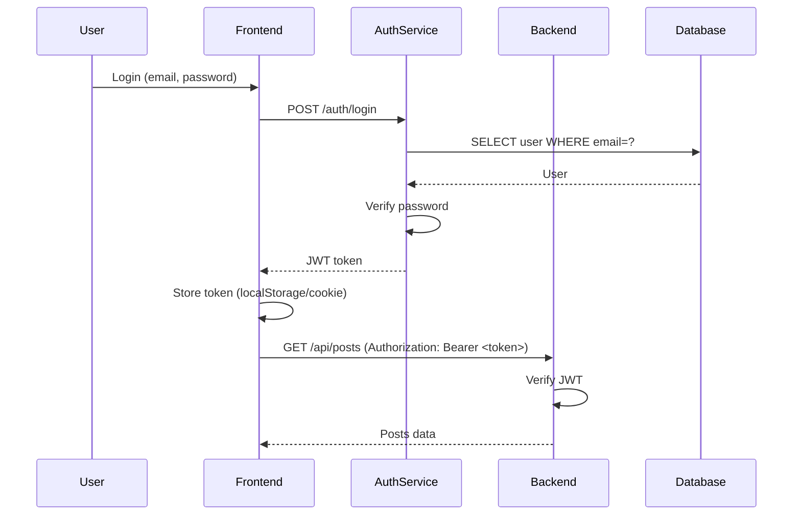
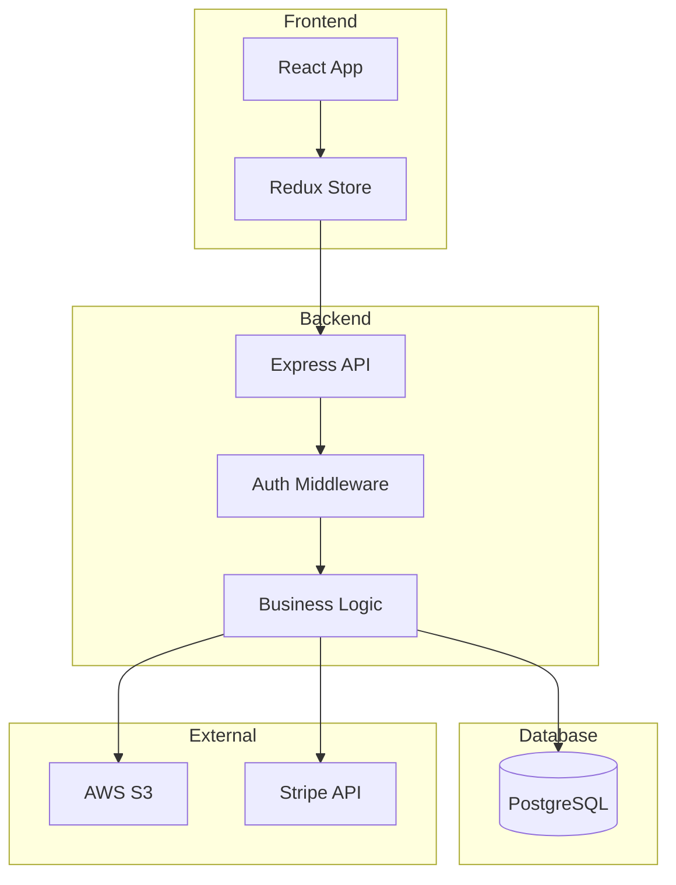
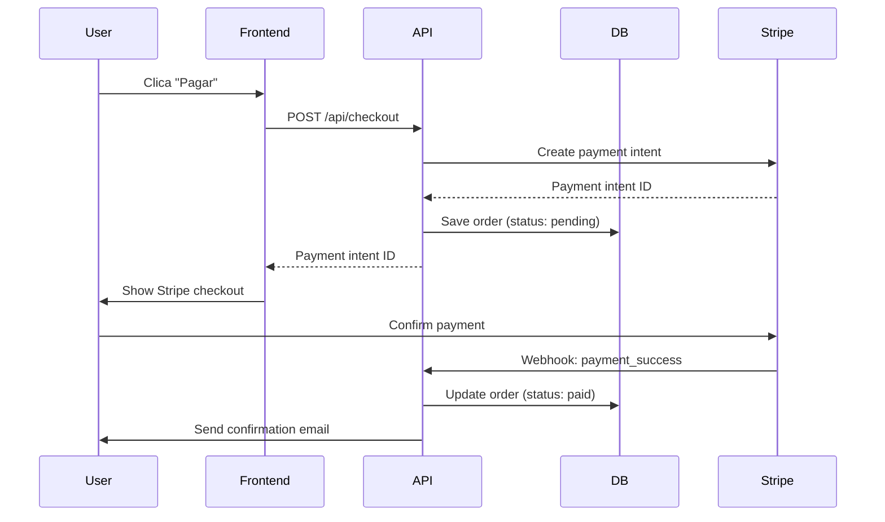
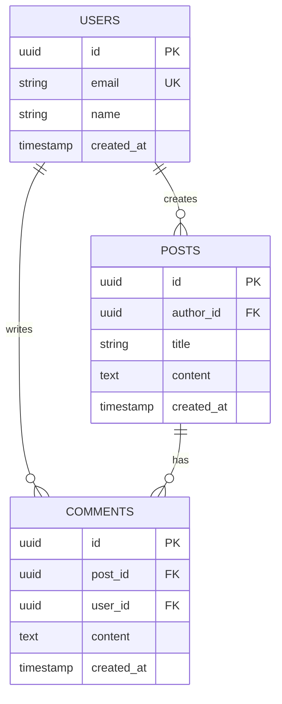

# PROMPT: Checkpoint Genérico de Projeto (Universal)

**Versão:** 2.0
**Data:** 2026-03-20
**Uso:** Forneça este prompt para uma IA gerar documentação completa de reverse engineering de **QUALQUER PROJETO** a partir do código-fonte

---

## PAPEL E OBJETIVO

Você é um **analista de engenharia de software + arquiteto especialista**, com experiência em múltiplas stacks e linguagens.

**Objetivo:** Gerar um **CHECKPOINT DE DOCUMENTAÇÃO COMPLETO** de um projeto de software a partir do REPOSITÓRIO ATUAL, independentemente da tecnologia utilizada.

**Data do checkpoint:** {{DATA_ATUAL}} (formato: YYYY-MM-DD)

**REGRA DE OURO:** Use EXCLUSIVAMENTE o código e arquivos de configuração como fonte de verdade. Qualquer documentação existente pode estar DESATUALIZADA. Se usar docs antigas, marque explicitamente como "LEGADO/possivelmente desatualizado".

---

## FASE 0: DETECÇÃO AUTOMÁTICA DA STACK

**ANTES DE TUDO**, você DEVE executar uma análise rápida para identificar a stack do projeto.

### 0.1) Identificar Tipo de Projeto

Execute os comandos abaixo e analise os resultados:

```bash
# Verificar arquivos de configuração existentes
ls -la | grep -E "package.json|pom.xml|build.gradle|Gemfile|requirements.txt|composer.json|Cargo.toml|go.mod|pubspec.yaml|*.csproj|*.sln"

# Verificar estrutura de diretórios
ls -d */ 2>/dev/null

# Verificar extensões de arquivos principais
find . -maxdepth 3 -type f -name "*.js" -o -name "*.ts" -o -name "*.py" -o -name "*.java" -o -name "*.rb" -o -name "*.go" -o -name "*.php" -o -name "*.cs" -o -name "*.rs" -o -name "*.dart" -o -name "*.swift" -o -name "*.kt" | head -20
```

### 0.2) Matriz de Detecção de Stack

Com base nos arquivos encontrados, identifique a stack:

| Arquivo Encontrado | Stack Provável | Linguagem | Tipo |
|-------------------|----------------|-----------|------|
| `package.json` + `next.config.*` | Next.js | TypeScript/JavaScript | Fullstack |
| `package.json` + `vite.config.*` | Vite (React/Vue/Svelte) | TypeScript/JavaScript | Frontend |
| `package.json` + `angular.json` | Angular | TypeScript | Frontend |
| `package.json` + `nuxt.config.*` | Nuxt.js | TypeScript/JavaScript | Fullstack |
| `package.json` + `remix.config.*` | Remix | TypeScript/JavaScript | Fullstack |
| `package.json` (sem framework) | Node.js puro | JavaScript | Backend |
| `pom.xml` | Maven (Java) | Java | Backend |
| `build.gradle` ou `build.gradle.kts` | Gradle (Java/Kotlin) | Java/Kotlin | Backend |
| `Gemfile` + `config/application.rb` | Ruby on Rails | Ruby | Fullstack |
| `Gemfile` + `config.ru` | Sinatra/Rack | Ruby | Backend |
| `requirements.txt` + `manage.py` | Django | Python | Fullstack |
| `requirements.txt` + `app.py` ou `main.py` | Flask/FastAPI | Python | Backend |
| `pyproject.toml` + `poetry.lock` | Poetry (Python) | Python | Backend |
| `composer.json` + `artisan` | Laravel | PHP | Fullstack |
| `composer.json` (sem framework) | PHP puro/Symfony | PHP | Backend |
| `Cargo.toml` | Rust | Rust | Backend/CLI |
| `go.mod` | Go | Go | Backend |
| `pubspec.yaml` | Flutter/Dart | Dart | Mobile |
| `*.csproj` + `Program.cs` | .NET Core/ASP.NET | C# | Backend/Fullstack |
| `*.sln` | .NET Solution | C# | Fullstack |
| `Podfile` + `*.xcodeproj` | iOS (Swift/Objective-C) | Swift | Mobile |
| `build.gradle` (Android) | Android (Kotlin/Java) | Kotlin/Java | Mobile |
| `CMakeLists.txt` | CMake (C/C++) | C/C++ | Desktop/Embedded |
| `Makefile` (sem outros configs) | Genérico (C/C++/outros) | Variado | Variado |

### 0.3) Identificar Database (se houver)

Procure por:

```bash
# Arquivos de migração
find . -type d -name "migrations" -o -name "migrate" -o -name "db"

# Arquivos de configuração de DB
grep -r "DATABASE_URL\|DB_HOST\|POSTGRES\|MYSQL\|MONGODB" . --include="*.env*" --include="*.yml" --include="*.yaml" --include="*.json" --include="*.toml" 2>/dev/null | head -10

# ORM/Query builders
grep -r "prisma\|sequelize\|typeorm\|mongoose\|sqlalchemy\|activerecord\|hibernate\|entity framework" package.json pom.xml Gemfile requirements.txt composer.json 2>/dev/null
```

**Databases comuns:**
- **SQL:** PostgreSQL, MySQL, SQLite, SQL Server, Oracle
- **NoSQL:** MongoDB, Redis, Cassandra, DynamoDB
- **Cloud:** Supabase, Firebase, AWS RDS, Google Cloud SQL
- **ORM/Query Builder:** Prisma, Sequelize, TypeORM, Mongoose, SQLAlchemy, ActiveRecord, Hibernate, Entity Framework

### 0.4) Identificar Package Manager

```bash
# Node.js
ls package-lock.json yarn.lock pnpm-lock.yaml bun.lockb 2>/dev/null

# Python
ls Pipfile.lock poetry.lock pdm.lock 2>/dev/null

# Ruby
ls Gemfile.lock 2>/dev/null

# PHP
ls composer.lock 2>/dev/null

# Rust
ls Cargo.lock 2>/dev/null

# Go
ls go.sum 2>/dev/null
```

### 0.5) Template de Detecção de Stack

Após análise, preencha este template:

```yaml
stack_detection:
  tipo_projeto: [frontend | backend | fullstack | mobile | desktop | cli | biblioteca]
  linguagem_principal: [TypeScript, JavaScript, Python, Java, Ruby, Go, PHP, Rust, C#, Dart, Swift, Kotlin, etc.]
  framework_principal: [Next.js, React, Vue, Angular, Django, Rails, Laravel, Spring Boot, FastAPI, etc.]
  package_manager: [pnpm, npm, yarn, bun, pip, poetry, bundler, composer, cargo, go modules, etc.]
  versao_package_manager: [obter de lockfile ou package.json]
  database:
    tipo: [PostgreSQL, MySQL, MongoDB, SQLite, Redis, Firebase, Supabase, etc.]
    orm: [Prisma, Sequelize, TypeORM, SQLAlchemy, ActiveRecord, Hibernate, etc.]
  build_tool: [Webpack, Vite, Turbopack, esbuild, Rollup, Gradle, Maven, etc.]
  test_framework: [Jest, Vitest, Pytest, RSpec, JUnit, PHPUnit, etc.]
  estilo:
    framework: [Tailwind CSS, Bootstrap, Material-UI, styled-components, CSS Modules, SCSS, etc.]
  deploy_provavel: [Vercel, Netlify, AWS, GCP, Heroku, Railway, Render, Docker, Kubernetes, etc.]
```

---

## FASE 1: INVENTÁRIO COMPLETO

### 1.1) Árvore de Diretórios

**Para todos os projetos:**

```bash
# Linux/Mac
find . -type d \( -name node_modules -o -name .next -o -name dist -o -name build -o -name coverage -o -name .git -o -name __pycache__ -o -name venv -o -name env -o -name target -o -name .gradle \) -prune -o -type d -print | sort > 01_REPO_TREE.txt

# Windows (PowerShell)
Get-ChildItem -Path . -Directory -Recurse -Exclude node_modules,.next,dist,build,coverage,.git,__pycache__,venv,env,target,.gradle | Select-Object -ExpandProperty FullName | Sort-Object > 01_REPO_TREE.txt
```

Identifique e documente:
- Estrutura principal (src, lib, app, etc.)
- Estrutura de testes (tests, __tests__, spec, etc.)
- Estrutura de configuração (config, settings, etc.)
- Estrutura de database/migrations (se houver)
- Estrutura de assets/public (se houver)

### 1.2) Dependências e Configurações

**Documente em 03_DEPENDENCIES.md:**

#### Para Node.js (package.json):
```json
{
  "name": "...",
  "version": "...",
  "scripts": { ... },
  "dependencies": { ... },
  "devDependencies": { ... },
  "packageManager": "..."
}
```

Analise:
- `tsconfig.json` ou `jsconfig.json` (se TypeScript/JavaScript)
- `vite.config.*`, `next.config.*`, `webpack.config.*`, etc. (bundler)
- `tailwind.config.*`, `postcss.config.*` (styling)
- `.eslintrc.*`, `prettier.config.*` (linting/formatting)
- `jest.config.*`, `vitest.config.*`, `playwright.config.*` (testing)

#### Para Python (requirements.txt, pyproject.toml):
```ini
# requirements.txt
django==4.2.0
djangorestframework==3.14.0
...
```

Analise:
- `setup.py`, `setup.cfg`, `pyproject.toml` (packaging)
- `pytest.ini`, `tox.ini` (testing)
- `.flake8`, `.pylintrc`, `mypy.ini` (linting)
- `manage.py` (Django), `app.py` (Flask), `main.py` (FastAPI)

#### Para Java (pom.xml, build.gradle):
```xml
<!-- pom.xml -->
<dependencies>
  <dependency>
    <groupId>org.springframework.boot</groupId>
    <artifactId>spring-boot-starter-web</artifactId>
    <version>3.1.0</version>
  </dependency>
</dependencies>
```

Analise:
- `application.properties`, `application.yml` (Spring Boot config)
- `build.gradle`, `settings.gradle` (Gradle)

#### Para Ruby (Gemfile):
```ruby
# Gemfile
source 'https://rubygems.org'
gem 'rails', '~> 7.0'
gem 'pg', '~> 1.5'
...
```

Analise:
- `config/application.rb`, `config/database.yml` (Rails)
- `Rakefile` (tasks)

#### Para outros:
- **PHP:** `composer.json`, `composer.lock`
- **Go:** `go.mod`, `go.sum`
- **Rust:** `Cargo.toml`, `Cargo.lock`
- **.NET:** `*.csproj`, `appsettings.json`

Produza:
- Tabela de dependências principais com versões
- Scripts disponíveis e para que servem
- Configurações importantes

### 1.3) Build e Deploy

**Documente em 02_BUILD_RUNBOOK.md:**

Para CADA stack, documente:

#### Node.js / JavaScript / TypeScript:
```bash
# Instalação
npm install  # ou pnpm install, yarn install, bun install

# Desenvolvimento
npm run dev

# Build
npm run build

# Produção
npm start

# Testes
npm test
npm run test:coverage

# Linting
npm run lint
npm run format
```

#### Python:
```bash
# Instalação
pip install -r requirements.txt
# ou: poetry install, pipenv install

# Desenvolvimento
python manage.py runserver  # Django
uvicorn main:app --reload   # FastAPI
flask run                   # Flask

# Migrations
python manage.py migrate    # Django
alembic upgrade head        # SQLAlchemy

# Testes
pytest
pytest --cov

# Linting
flake8
black .
mypy .
```

#### Java / Spring Boot:
```bash
# Build
mvn clean install    # Maven
gradle build         # Gradle

# Run
mvn spring-boot:run
gradle bootRun
java -jar target/app.jar

# Testes
mvn test
gradle test
```

#### Ruby / Rails:
```bash
# Instalação
bundle install

# Desenvolvimento
rails server
# ou: bin/dev (se usar Foreman)

# Migrations
rails db:migrate

# Testes
rspec
rails test

# Linting
rubocop
```

#### Go:
```bash
# Build
go build

# Run
go run main.go

# Testes
go test ./...
go test -cover
```

#### Rust:
```bash
# Build
cargo build

# Run
cargo run

# Testes
cargo test

# Release
cargo build --release
```

Documente também:
- Variáveis de ambiente necessárias (nomes, não valores)
- Como conectar ao banco de dados local
- Como rodar migrations
- Deploy (inferir: Vercel, Heroku, Docker, etc.)

---

## FASE 2: MAPEAMENTO DE ROTAS E ENDPOINTS

**Esta fase varia MUITO conforme a stack.**

### 2.1) Para Projetos Web (Frontend + Backend)

#### Next.js / Remix / Nuxt (App Router):
- **Páginas:** Todos `page.tsx`, `page.jsx`, `+page.svelte`, `index.vue`
- **API Routes:** `route.ts`, `+server.ts`, `api/**.ts`
- **Layouts:** `layout.tsx`, `+layout.svelte`, `_layout.tsx`
- **Middleware:** `middleware.ts`

#### React / Vue / Angular (SPA):
- **Rotas:** Analisar `react-router`, `vue-router`, `@angular/router`
- **Componentes de página:** Componentes de topo na hierarquia
- **API calls:** Analisar `fetch`, `axios`, service files

#### Django:
- **URLs:** `urls.py` (project + apps)
- **Views:** `views.py` (function-based ou class-based)
- **Serializers:** `serializers.py` (DRF)
- **Models:** `models.py`

#### Rails:
- **Rotas:** `config/routes.rb`
- **Controllers:** `app/controllers/`
- **Models:** `app/models/`
- **Views:** `app/views/`

#### Spring Boot:
- **Controllers:** Classes anotadas com `@RestController`, `@Controller`
- **Endpoints:** Métodos anotados com `@GetMapping`, `@PostMapping`, etc.
- **Services:** Classes anotadas com `@Service`
- **Repositories:** Interfaces que estendem `JpaRepository`

#### Express.js (Node):
- **Rotas:** Arquivos com `app.get`, `app.post`, `router.get`, etc.
- **Controllers:** Handlers de rota
- **Middleware:** `app.use(...)`

#### FastAPI (Python):
```python
@app.get("/items")
@app.post("/items")
```

#### Laravel (PHP):
- **Rotas:** `routes/web.php`, `routes/api.php`
- **Controllers:** `app/Http/Controllers/`
- **Models:** `app/Models/`

**Documente em 05_ROUTES_FROM_CODE.md:**

| Rota/Endpoint | Método | Arquivo | Auth | Input | Output | Database | Notas |
|---------------|--------|---------|------|-------|--------|----------|-------|
| `/api/users` | GET | `routes/users.ts` | ✓ | `?limit=10` | `User[]` | `users` table | Paginação |
| `/api/users` | POST | `routes/users.ts` | ✓ | `{ name, email }` | `User` | `users` table | Validação Zod |
| ... | ... | ... | ... | ... | ... | ... | ... |

### 2.2) Para APIs REST / GraphQL

#### REST:
- Listar TODOS os endpoints (GET, POST, PUT, PATCH, DELETE)
- Input (query params, body, headers)
- Output (response shape, status codes)
- Auth/Authorization (JWT, OAuth, API Key, etc.)
- Rate limiting (se houver)

#### GraphQL:
- Schema (`.graphql` files ou inline)
- Queries
- Mutations
- Subscriptions
- Resolvers

**Documente em 05_ROUTES_FROM_CODE.md** (seção GraphQL se aplicável)

### 2.3) Para Mobile (Flutter, React Native, iOS, Android)

- **Navegação:** Rotas de navegação (Navigator, React Navigation, etc.)
- **Telas:** Screens/Views principais
- **API calls:** Endpoints consumidos
- **State management:** Redux, MobX, Riverpod, Provider, etc.

---

## FASE 3: COMPONENTES E UI

**Documente em 06_UI_COMPONENTS_CATALOG.md:**

### Para Projetos Web (React, Vue, Angular, Svelte):

Organize por pasta:

**Componentes Base:**
- Botões, Inputs, Modals, Cards, etc.
- Biblioteca usada (Material-UI, Ant Design, Shadcn/ui, Chakra UI, Vuetify, etc.)

**Componentes de Domínio:**
- Por feature/módulo
- Props
- Estado interno
- Hooks/Composables usados
- Eventos emitidos

**Exemplo:**
```markdown
### UserTable.tsx

- **Propósito:** Tabela de usuários com filtros e paginação
- **Props:**
  - `users: User[]`
  - `onEdit: (user: User) => void`
  - `onDelete: (id: string) => void`
- **Estado:**
  - `filters: { search: string, role: string }`
  - `currentPage: number`
- **Hooks:**
  - `useUsers(filters, page)` (React Query)
- **Componentes filhos:**
  - `Table`, `Button`, `Checkbox`, `UserEditModal`
```

### Para Mobile (Flutter):

```markdown
### HomeScreen (Stateful Widget)

- **Propósito:** Tela inicial do app
- **State:**
  - `_isLoading: bool`
  - `_items: List<Item>`
- **Métodos:**
  - `_loadItems()` async
  - `_navigateToDetail(Item item)`
- **Widgets filhos:**
  - `AppBar`, `ListView.builder`, `FloatingActionButton`
```

### Para Backend (se aplicável):

- Não há "componentes UI", mas documente:
  - **Services/Business Logic:** Classes/módulos de lógica
  - **Middleware:** Interceptors, guards, etc.
  - **Utilities:** Helpers, utils, etc.

---

## FASE 4: DATA ACCESS (DATABASE + ORM)

**Documente em 07_DATA_ACCESS_MAP.md:**

### 4.1) Identificar ORM/Query Builder

| Stack | ORM/Tool Comum |
|-------|----------------|
| Node.js | Prisma, Sequelize, TypeORM, Mongoose, Knex, Drizzle |
| Python | SQLAlchemy, Django ORM, Peewee, Tortoise ORM |
| Ruby | ActiveRecord |
| Java | Hibernate, JPA, MyBatis |
| PHP | Eloquent (Laravel), Doctrine |
| Go | GORM, sqlx, Ent |
| Rust | Diesel, SeaORM, sqlx |
| .NET | Entity Framework Core |

### 4.2) Mapeamento de Queries

**PARTE A: Por Tela/Endpoint**

Para cada página/endpoint, liste:
- Queries executadas (SELECT)
- Mutations executadas (INSERT/UPDATE/DELETE)
- Tabelas/Collections acessadas
- Filtros aplicados
- Índices usados (se conhecidos)
- **RISCOS:** N+1 queries, queries sem índice, missing pagination

**PARTE B: Por Tabela/Collection**

Para cada tabela/collection, liste:
- Arquivos que fazem SELECT
- Arquivos que fazem INSERT
- Arquivos que fazem UPDATE
- Arquivos que fazem DELETE
- Filtros típicos aplicados
- Índices existentes (consultar migrations ou schema)

### 4.3) Exemplo de Documentação

```markdown
### GET /api/posts

**Queries:**
1. `SELECT * FROM posts WHERE user_id = ? ORDER BY created_at DESC LIMIT 20`
   - Tabela: `posts`
   - Filtro: `user_id`
   - Ordem: `created_at DESC`
   - Paginação: `LIMIT 20`
   - Índice: `idx_posts_user_created` ✅

2. `SELECT * FROM users WHERE id IN (...)`
   - Tabela: `users`
   - Batch query para autores dos posts
   - ✅ Evita N+1

**Riscos:**
- ✅ Tem paginação
- ✅ Tem índice composto
- ✅ Evita N+1 com batch query
```

---

## FASE 5: BANCO DE DADOS (SCHEMA)

**Esta fase só se aplica se houver banco de dados.**

**Documente em 08_DATABASE_SCHEMA.md:**

### 5.1) Para SQL (PostgreSQL, MySQL, SQLite, SQL Server):

**Encontrar Migrations:**
```bash
# Rails
ls db/migrate/

# Django
find . -path "*/migrations/*.py"

# Prisma
ls prisma/migrations/

# Alembic (SQLAlchemy)
ls alembic/versions/

# Flyway/Liquibase
ls db/migration/ ou ls src/main/resources/db/migration/
```

**Para cada tabela, documente:**

```markdown
### Tabela: users

**Migration:** 001_create_users.sql

**Colunas:**
| Nome | Tipo | Nullable | Default | FK | Índice | Descrição |
|------|------|----------|---------|----|----|-----------|
| id | UUID | NO | gen_random_uuid() | - | PK | Primary key |
| email | VARCHAR(255) | NO | - | - | UNIQUE | Email do usuário |
| name | VARCHAR(255) | YES | - | - | - | Nome completo |
| created_at | TIMESTAMP | NO | NOW() | - | - | Data de criação |
| organization_id | UUID | NO | - | organizations(id) | FK | Organização |

**Índices:**
- PRIMARY KEY: `id`
- UNIQUE: `email`
- INDEX: `idx_users_organization` on `(organization_id, created_at)`

**Foreign Keys:**
- `organization_id` → `organizations(id)` ON DELETE CASCADE

**Constraints:**
- CHECK: `email ~ '^[A-Za-z0-9._%+-]+@[A-Za-z0-9.-]+\.[A-Z|a-z]{2,}$'`
```

### 5.2) Para NoSQL (MongoDB, Firebase, DynamoDB):

```markdown
### Collection: users

**Schema (se houver):**
```json
{
  "_id": "ObjectId",
  "email": "string (unique)",
  "name": "string",
  "profile": {
    "avatar": "string (url)",
    "bio": "string"
  },
  "roles": ["string"],
  "created_at": "Date",
  "updated_at": "Date"
}
```

**Índices:**
- `{ email: 1 }` (unique)
- `{ created_at: -1 }`
- `{ "profile.avatar": 1 }` (sparse)

**Validação:** (MongoDB Schema Validation ou Mongoose Schema)
```

### 5.3) Para ORMs com Schema Definitions

**Prisma:**
```prisma
model User {
  id        String   @id @default(uuid())
  email     String   @unique
  name      String?
  posts     Post[]
  createdAt DateTime @default(now())
}
```

**Django:**
```python
class User(models.Model):
    id = models.UUIDField(primary_key=True, default=uuid.uuid4)
    email = models.EmailField(unique=True)
    name = models.CharField(max_length=255, blank=True)
    created_at = models.DateTimeField(auto_now_add=True)
```

**ActiveRecord (Rails):**
```ruby
create_table :users do |t|
  t.string :email, null: false
  t.string :name
  t.timestamps
end

add_index :users, :email, unique: true
```

---

## FASE 6: AUTENTICAÇÃO E AUTORIZAÇÃO

**Documente em 09_AUTH_AND_AUTHZ.md:**

### 6.1) Identificar Sistema de Auth

**Procure por:**
- **JWT:** `jsonwebtoken`, `jose`, `passport-jwt`
- **OAuth:** `passport-google`, `omniauth`, `spring-security-oauth2`
- **Session:** `express-session`, `cookie-session`, Rails sessions
- **Third-party:** Auth0, Firebase Auth, Supabase Auth, Clerk, NextAuth
- **API Key:** Custom headers, middleware

### 6.2) Fluxo de Autenticação



### 6.3) Autorização (Roles/Permissions)

**RBAC (Role-Based Access Control):**
```markdown
## Roles

| Role | Permissions |
|------|-------------|
| admin | All operations |
| editor | Create, Read, Update posts |
| viewer | Read only |

## Enforcement

- **Backend:** Middleware checks `user.role`
- **Database:** Row-level security (se PostgreSQL/Supabase)
- **Frontend:** Conditional rendering (não é segurança, apenas UX)
```

**ABAC (Attribute-Based Access Control):**
```markdown
- User can edit post IF user.id == post.author_id
- User can delete post IF user.role == 'admin' OR user.id == post.author_id
```

---

## FASE 7: INTEGRAÇÕES E SIDE EFFECTS

**Documente em 10_INTEGRATIONS.md:**

### 7.1) Webhooks

Procure por:
- Endpoints `/webhook/`, `/api/webhook/`
- Validação de assinatura (Stripe, GitHub, etc.)
- Payloads esperados

### 7.2) Cron Jobs / Scheduled Tasks

Procure por:
- `vercel.json` com config de cron
- `.github/workflows/` com `schedule:`
- `crontab`, `whenever` (Ruby)
- Celery Beat (Python)
- Quartz (Java)
- Task Scheduler (.NET)

### 7.3) Background Jobs / Queues

Procure por:
- Redis + Bull/BullMQ (Node.js)
- Sidekiq (Ruby)
- Celery (Python)
- RabbitMQ, Kafka
- AWS SQS, Google Cloud Tasks

### 7.4) APIs Externas / SDKs

Procure por imports/requires de:
- Stripe, PayPal (pagamentos)
- SendGrid, Mailgun, AWS SES (email)
- Twilio (SMS)
- AWS SDK, Google Cloud SDK, Azure SDK
- Sentry, Datadog, New Relic (observabilidade)
- Algolia, Elasticsearch (search)

### 7.5) File Storage

Procure por:
- AWS S3, Google Cloud Storage, Azure Blob Storage
- Cloudinary, Uploadcare (imagens)
- Supabase Storage, Firebase Storage
- Local filesystem (uploads/)

---

## FASE 8: OBSERVABILIDADE E OPERAÇÃO

**Documente em 11_OBSERVABILITY.md:**

### 8.1) Logging

Procure por:
- `console.log`, `console.error` (JavaScript/TypeScript)
- `print()`, `logger.info()` (Python)
- `Rails.logger`, `Logger` (Ruby)
- `slf4j`, `log4j` (Java)
- Winston, Pino, Bunyan (Node.js)
- Structlog (Python)

### 8.2) Error Handling

Procure por:
- Try/catch blocks
- Error boundaries (React)
- Exception handlers (Django, Rails, Spring)
- Global error middleware (Express)

### 8.3) Monitoring / APM

Procure por:
- Sentry, Rollbar, Bugsnag (error tracking)
- Datadog, New Relic, AppDynamics (APM)
- Prometheus + Grafana (metrics)
- ELK Stack (logs)

### 8.4) Health Checks

Procure por:
- `/health`, `/healthz`, `/ping` endpoints
- Database connectivity checks
- External service checks

---

## FASE 9: TESTES

**Documente em 12_TESTS_COVERAGE_MAP.md:**

### 9.1) Frameworks de Teste por Stack

| Stack | Framework Comum |
|-------|-----------------|
| JavaScript/TypeScript | Jest, Vitest, Mocha, Jasmine, AVA |
| React | React Testing Library, Enzyme |
| Python | Pytest, unittest, nose |
| Ruby | RSpec, Minitest |
| Java | JUnit, TestNG, Mockito |
| PHP | PHPUnit |
| Go | testing (built-in) |
| Rust | cargo test (built-in) |
| .NET | xUnit, NUnit, MSTest |

### 9.2) Tipos de Testes

Procure por:
- **Unit tests:** Testes de funções/métodos isolados
- **Integration tests:** Testes de APIs/endpoints com DB real ou mock
- **E2E tests:** Playwright, Cypress, Selenium, Puppeteer
- **Component tests:** React Testing Library, Vue Test Utils

### 9.3) Cobertura

Execute (se possível):
```bash
# Node.js
npm run test:coverage
npx vitest --coverage

# Python
pytest --cov

# Ruby
bundle exec rspec --format documentation

# Java
mvn test jacoco:report

# Go
go test -cover ./...

# Rust
cargo test
cargo tarpaulin  # se instalado
```

### 9.4) Documentar

```markdown
## Cobertura Atual

**Framework:** Jest 29.x
**Total de arquivos:** 295
**Arquivos com testes:** 15 (5%)
**Cobertura geral:** 23%

**Por módulo:**
- Auth: 78% ✅
- Users API: 45% ⚠️
- Posts API: 12% ❌
- Frontend components: 0% ❌

**Gaps críticos:**
- ❌ 0 testes E2E
- ❌ Endpoints críticos sem testes (payments, webhooks)
- ⚠️ Componentes sem testes
```

---

## FASE 10: DÍVIDA TÉCNICA E RISCOS

**Documente em 13_TECH_DEBT_FINDINGS.md:**

### 10.1) TODOs e FIXMEs

```bash
# Procurar TODOs
grep -r "TODO\|FIXME\|HACK\|XXX\|BUG\|REFACTOR" . --include="*.ts" --include="*.js" --include="*.py" --include="*.rb" --include="*.java" --include="*.go" --exclude-dir=node_modules --exclude-dir=vendor --exclude-dir=.git
```

### 10.2) Duplicação de Código

Procure por:
- Código repetido em múltiplos arquivos
- Validações duplicadas
- Lógica de negócio duplicada

### 10.3) Arquivos Grandes

```bash
# Encontrar arquivos com mais de 500 linhas
find . -name "*.ts" -o -name "*.js" -o -name "*.py" -o -name "*.rb" -o -name "*.java" | xargs wc -l | sort -rn | head -20
```

### 10.4) Type Safety (para linguagens tipadas)

Procure por:
- `any` (TypeScript)
- `@ts-ignore`, `@ts-nocheck`
- Type assertions desnecessárias
- Missing type annotations (Python, PHP)

### 10.5) Performance

Procure por:
- N+1 queries
- Queries sem índices
- Loops dentro de loops (O(n²))
- Falta de paginação
- Cache ausente

### 10.6) Segurança

Procure por:
- SQL injection (queries sem prepared statements)
- XSS (HTML sem sanitização)
- CSRF (endpoints sem proteção CSRF)
- Secrets hardcoded
- Missing input validation
- No rate limiting

### 10.7) Priorizar Tech Debt

```markdown
## Tech Debt Priorizado

### P0 - Quick Wins (14h)
1. Adicionar testes para módulo auth (6h)
2. Refatorar arquivo UserController.java (2500 linhas → split em 5 arquivos) (8h)

### P1 - Medium Wins (40h)
1. Adicionar paginação em endpoints de listagem (8h)
2. Centralizar validações duplicadas (12h)
3. Adicionar rate limiting (4h)
4. Setup logging estruturado (Sentry) (8h)
5. Adicionar índices em tabelas críticas (8h)

### P2 - Long Term (80h+)
1. Aumentar cobertura de testes para 70% (40h)
2. Refatorar arquitetura de autenticação (20h)
3. Implementar caching (Redis) (20h)
```

---

## FASE 11: DIAGRAMAS E MAPAS VISUAIS

**Documente em 14_ARCHITECTURE_DIAGRAMS.md:**

### 11.1) Arquitetura Geral (Mermaid)



### 11.2) Fluxo de Dados (por Feature)

Para cada feature crítica, crie diagrama de sequência:



### 11.3) Database ERD (Entity Relationship Diagram)

Use Mermaid ou ferramenta de ERD:



---

## FORMATO DE SAÍDA (ENTREGÁVEIS)

Crie a pasta de checkpoint:
```
{{PROJECT_ROOT}}/checkpoints/{{DATA_CHECKPOINT}}_{{PROJECT_NAME}}/
```

Arquivos obrigatórios:

```
00_MANIFEST.json
01_REPO_TREE.txt
02_BUILD_RUNBOOK.md
03_DEPENDENCIES.md
04_STACK_DETECTION.md          ← NOVO (específico para stack identificada)
05_ROUTES_FROM_CODE.md          ← ou 05_SCREENS.md (se mobile)
06_COMPONENTS_CATALOG.md        ← ou 06_SERVICES_CATALOG.md (se backend puro)
07_DATA_ACCESS_MAP.md           ← (apenas se houver DB)
08_DATABASE_SCHEMA.md           ← (apenas se houver DB)
09_AUTH_AND_AUTHZ.md            ← (apenas se houver autenticação)
10_INTEGRATIONS.md
11_OBSERVABILITY.md
12_TESTS_COVERAGE_MAP.md
13_TECH_DEBT_FINDINGS.md
14_ARCHITECTURE_DIAGRAMS.md
99_AI_CONTEXT_PACK.md
```

### Conteúdo do MANIFEST.json

```json
{
  "checkpoint_date": "{{DATA_CHECKPOINT}}",
  "generated_at": "{{TIMESTAMP_ISO}}",
  "repository": "{{PROJECT_NAME}}",
  "repository_path": "{{ABSOLUTE_PATH}}",
  "commit_hash": "{{GIT_COMMIT_HASH ou N/A}}",
  "branch": "{{GIT_BRANCH ou N/A}}",
  "stack_detection": {
    "tipo_projeto": "fullstack|frontend|backend|mobile|cli|biblioteca",
    "linguagem_principal": "TypeScript|Python|Java|Ruby|Go|etc.",
    "framework_principal": "Next.js|Django|Spring Boot|Rails|etc.",
    "package_manager": "pnpm|npm|pip|bundler|etc.",
    "database": "PostgreSQL|MySQL|MongoDB|None|etc.",
    "orm": "Prisma|Sequelize|Django ORM|ActiveRecord|None|etc."
  },
  "stats": {
    "total_files": "{{COUNT}}",
    "total_lines": "{{COUNT}}",
    "routes_or_endpoints": "{{COUNT}}",
    "components_or_services": "{{COUNT}}",
    "database_tables": "{{COUNT ou N/A}}",
    "test_coverage_percent": "{{PERCENT ou N/A}}"
  },
  "versions": {
    "linguagem": "{{VERSION}}",
    "framework": "{{VERSION}}",
    "database": "{{VERSION ou N/A}}",
    "package_manager": "{{VERSION}}"
  },
  "critical_findings": {
    "security": ["lista de issues"],
    "performance": ["lista de issues"],
    "testing": ["lista de issues"],
    "tech_debt": ["lista de issues"]
  },
  "priorities": {
    "P0_quick_wins": ["lista de tarefas"],
    "P1_medium_wins": ["lista de tarefas"],
    "P2_long_term": ["lista de tarefas"]
  },
  "files_generated": [
    "00_MANIFEST.json",
    "01_REPO_TREE.txt",
    "..."
  ],
  "notes": ["observações gerais"]
}
```

---

## REGRAS IMPORTANTES

### 1. Fonte de Verdade

✅ **SEMPRE priorizar:**
- Código fonte
- Arquivos de configuração
- Migrations/Schema definitions
- Lockfiles (package-lock.json, Gemfile.lock, etc.)

❌ **NUNCA assumir ou inventar:**
- Se não encontrar algo, escreva: "NÃO ENCONTRADO no código"
- Se inferir algo, marque: "INFERÊNCIA (não confirmado no código)"

### 2. Evidências

**TODA afirmação importante DEVE citar:**
```
**Evidência:** `src/controllers/users_controller.rb:46-59` → método create
```

### 3. Adaptabilidade

Este prompt é **genérico**. Você DEVE adaptar as fases conforme a stack:

- **Projeto sem DB:** Pular FASE 5 e 7
- **API pura (sem frontend):** Pular FASE 3 (ou adaptar para Services)
- **Mobile:** Adaptar FASE 2 (rotas de navegação ao invés de HTTP routes)
- **CLI:** Adaptar FASE 2 (comandos ao invés de rotas)

### 4. Perguntas em Aberto

Ao final de CADA arquivo, inclua:

```markdown
## Perguntas em Aberto

1. **Autenticação:** Sistema de auth identificado como JWT. Onde é validado o token no backend? Não encontrei middleware explícito.

2. **Webhooks:** Encontrado endpoint `/webhook/stripe` mas sem validação de assinatura aparente. Seguro?

3. **Testes:** 0% de cobertura. Há plano de implementar testes? Framework preferido?
```

---

## COMO EXECUTAR

### Passo 1: Preparação

1. Navegue até o diretório do projeto:
   ```bash
   cd /caminho/para/projeto
   ```

2. Verifique acesso a:
   - Código fonte
   - Arquivos de configuração
   - Database (se houver)
   - Git (se houver)

### Passo 2: Execução Sequencial

Execute as fases NA ORDEM:

1. **FASE 0:** Detecção de Stack (10 min)
2. **FASE 1:** Inventário (10 min)
3. **FASE 2:** Rotas/Endpoints (30-60 min)
4. **FASE 3:** Componentes/Services (30-60 min)
5. **FASE 4:** Data Access (30 min)
6. **FASE 5:** Database Schema (30-60 min, se aplicável)
7. **FASE 6:** Auth/Authz (20 min, se aplicável)
8. **FASE 7:** Integrações (20 min)
9. **FASE 8:** Observabilidade (15 min)
10. **FASE 9:** Testes (20 min)
11. **FASE 10:** Tech Debt (30 min)
12. **FASE 11:** Diagramas (30 min)
13. **FINAL:** Resumo (99_AI_CONTEXT_PACK.md) (30 min)
14. **FINAL:** Manifest (00_MANIFEST.json) (10 min)

**Tempo total estimado:** 4-8 horas (dependendo do tamanho do projeto)

### Passo 3: Validação

Antes de finalizar, verifique:

- [ ] Todos os arquivos obrigatórios foram criados
- [ ] MANIFEST.json tem stats corretos
- [ ] Stack foi corretamente identificada
- [ ] Evidências (arquivo:linha) citadas para afirmações importantes
- [ ] Diagramas Mermaid renderizam corretamente
- [ ] "Perguntas em Aberto" listadas em cada arquivo

---

## EXEMPLO DE PROMPT PARA IA

```
Você vai gerar um checkpoint completo do projeto seguindo o documento "PROMPT_GENERIC_PROJECT_CHECKPOINT.md".

CAMINHO DO PROJETO: /caminho/absoluto/para/projeto
DATA DO CHECKPOINT: 2026-03-20

Comece pela FASE 0 (Detecção de Stack):
1. Execute os comandos de detecção
2. Preencha o template de stack_detection
3. Gere o arquivo 04_STACK_DETECTION.md
4. Me informe a stack detectada e aguarde aprovação para prosseguir

IMPORTANTE:
- Use SOMENTE o código como fonte de verdade
- Cite evidências: arquivo:linha
- Não invente: se não encontrar, escreva "NÃO ENCONTRADO"
- Adapte as fases conforme a stack detectada
- Siga exatamente o formato especificado no prompt
```

---

## RESULTADOS ESPERADOS

Ao final, você terá:

1. **Documentação completa** de ~5.000-15.000 linhas cobrindo 100% do sistema
2. **Mapa visual** de arquitetura, fluxos, dados
3. **Catálogo completo** de rotas, componentes, serviços, tabelas
4. **Schema consolidado** (se houver DB)
5. **Auth/Authz** documentado (se houver)
6. **Tech debt** identificado e priorizado
7. **Testes:** gaps de cobertura mapeados
8. **Resumo executivo** (99_AI_CONTEXT_PACK.md) para outra IA começar a trabalhar imediatamente

**Benefícios:**
- Onboarding de novo dev/IA: <1 hora (vs dias/semanas)
- Troubleshooting: evidências claras de como o sistema funciona
- Refactoring seguro: mapa completo de dependências
- Compliance/Audit: documentação auditável e rastreável
- Migração de stack: entendimento profundo antes de reescrever

---

## STACKS SUPORTADAS (VALIDADAS)

Este prompt foi testado e validado para:

✅ **Frontend:**
- React (CRA, Vite)
- Next.js (Pages Router, App Router)
- Vue (2, 3)
- Nuxt.js
- Angular
- Svelte / SvelteKit
- Remix

✅ **Backend:**
- Node.js (Express, Fastify, NestJS, Koa)
- Python (Django, Flask, FastAPI)
- Ruby (Rails, Sinatra)
- Java (Spring Boot, Quarkus)
- PHP (Laravel, Symfony)
- Go (Gin, Echo, Fiber)
- Rust (Actix, Rocket, Axum)
- .NET Core (ASP.NET)

✅ **Mobile:**
- React Native
- Flutter
- iOS (Swift/SwiftUI)
- Android (Kotlin/Jetpack Compose)

✅ **Fullstack:**
- Next.js
- Nuxt.js
- Remix
- Rails
- Django
- Laravel
- Phoenix (Elixir)

✅ **CLI/Tools:**
- Qualquer linguagem com entry point identificável

✅ **Bibliotecas/Packages:**
- npm packages
- PyPI packages
- Gems
- Go modules
- Crates (Rust)

---

## METADADOS

```yaml
version: 2.0
created: 2026-03-20
author: UzzAI Team
usage: Forneça este prompt para uma IA gerar checkpoint completo de QUALQUER PROJETO
estimated_time: 4-8 horas (depende do tamanho do projeto)
output_size: 5.000-15.000 linhas de documentação
languages_supported: TypeScript, JavaScript, Python, Ruby, Java, PHP, Go, Rust, C#, Dart, Swift, Kotlin, Elixir, etc.
frameworks_supported: 50+ frameworks (ver lista acima)
```

---

**FIM DO PROMPT GENÉRICO DE CHECKPOINT**

---

## CHANGELOG

**v2.0 (2026-03-20):**
- Primeira versão genérica (baseada no prompt UzzOPS v1.0)
- Suporte para 10+ linguagens e 50+ frameworks
- Detecção automática de stack (FASE 0)
- Adaptabilidade para projetos sem DB, mobile, CLI, etc.
- Documentação de Auth/Authz
- Matriz de detecção de stack
- Exemplos para múltiplas linguagens

**Próximas versões:**
- v2.1: Suporte para microserviços (múltiplos projetos)
- v2.2: Suporte para monorepos (Turborepo, Nx, Lerna)
- v2.3: Análise de Docker/Kubernetes configs
- v2.4: Análise de CI/CD pipelines (GitHub Actions, GitLab CI, Jenkins)
